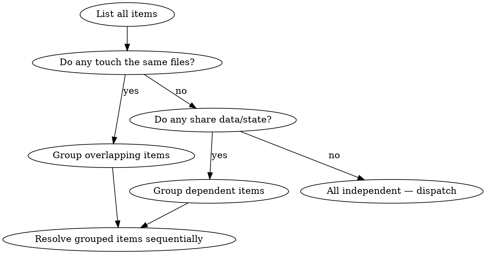

# Resolve in Parallel

## Overview

Batch-resolve independent items concurrently by dispatching one agent per item, then collecting and integrating results. This is a coordination pattern that builds on the dispatching-parallel-agents skill.

## When to Use

- Multiple independent PR review comments to address
- Multiple independent test failures to fix
- Multiple independent backlog items to implement
- Multiple independent review findings to resolve

**Key requirement:** Items must be truly independent — fixing one should not affect the fix for another.

## Process

### Step 1: Collect Items

Gather all items to resolve. For each item, note:
- What needs to be done
- Which files are involved
- Dependencies on other items (if any)

### Step 2: Verify Independence

Check that items are truly independent:



**Independence criteria:**
- No two items modify the same file
- No item depends on the output of another
- No shared mutable state between items
- Order of resolution doesn't matter

If items overlap, group the dependent ones and resolve each group sequentially.

### Step 3: Dispatch Agents

For each independent item (or independent group), dispatch an agent:

```
Task: Resolve [item description]

Context:
- File(s) involved: [paths]
- What needs to change: [specific change]
- Constraints: Only modify [specific files]. Do not touch other code.

Return: Summary of changes made, files modified, and verification result.
```

Use the appropriate agent type for the work:
- PR comments → **pr-comment-resolver** agent
- Test failures → general-purpose agent with debugging instructions
- Backlog items → general-purpose agent with implementation instructions

### Step 4: Collect Results

When all agents return:
1. Read each agent's summary
2. Note which files were modified by each agent
3. Check for unexpected file overlaps (agents modifying files not in their scope)

### Step 5: Verify No Conflicts

```bash
# Check that no file was modified by multiple agents
# (This should not happen if independence was verified correctly)
git diff --name-only
```

If conflicts exist:
- Identify which agents' changes conflict
- Resolve conflicts manually
- Re-verify the affected changes

### Step 6: Integration Test

After all changes are integrated:
```bash
# Run the full test suite
[test command]

# Run the build
[build command]
```

If any tests fail after integration, investigate whether the parallel changes introduced an interaction bug.

## Quick Reference

| Item Type | Agent to Dispatch | Key Constraint |
|-----------|------------------|----------------|
| PR comment | pr-comment-resolver | One comment per agent |
| Test failure | general-purpose | One test file per agent |
| Backlog item | general-purpose | One item per agent |
| Review finding | pr-comment-resolver | One finding per agent |

## Common Mistakes

**Assuming independence without checking** — Two items that look independent might both modify the same utility function. Always verify file overlap before dispatching.

**Too many agents at once** — Diminishing returns past 4-5 parallel agents. If you have 10+ items, batch them into groups of 4-5.

**Skipping integration testing** — Individual fixes can pass their own tests but break something when combined. Always run the full suite after integration.

**Not constraining agent scope** — Tell each agent exactly which files it can modify. Without constraints, agents may make "helpful" changes outside their scope that conflict with other agents.
