<p align="center">
  
</p>

<p align="center">
  <strong>Production-grade scaffolding for AI-assisted software development with Claude Code</strong>
</p>

<p align="center">
  <a href="#how-does-this-compare">Compare</a> ·
  <a href="#quick-start">Quick Start</a> ·
  <a href="#what-you-get">What You Get</a> ·
  <a href="#workflow">Workflow</a> ·
  <a href="#autonomous-pipeline-ship">Ship</a> ·
  <a href="#agent-teams--swarms">Agent Teams</a> ·
  <a href="#skills-reference">Skills</a> ·
  <a href="#agents-reference">Agents</a> ·
  <a href="#commands-reference">Commands</a> ·
  <a href="#customization">Customization</a> ·
  <a href="#error-recovery">Error Recovery</a>
</p>

---

## Why This Template?

Most AI coding sessions start from scratch: no conventions, no memory, no workflow. Each session reinvents the wheel. This template fixes that.

It gives Claude Code a **structured operating system** — a set of skills, agents, commands, and documentation patterns that compound across sessions. The result: higher quality code, fewer regressions, and a codebase that gets easier to work on over time.

**The core philosophy:**

> *Each unit of engineering work should make subsequent units easier — not harder.*

## How Does This Compare?

Before committing to any tool, it helps to understand the landscape. We evaluated the 8 most popular Claude Code plugins, frameworks, and orchestration tools — through direct repository inspection, not marketing claims.

<p align="center">
  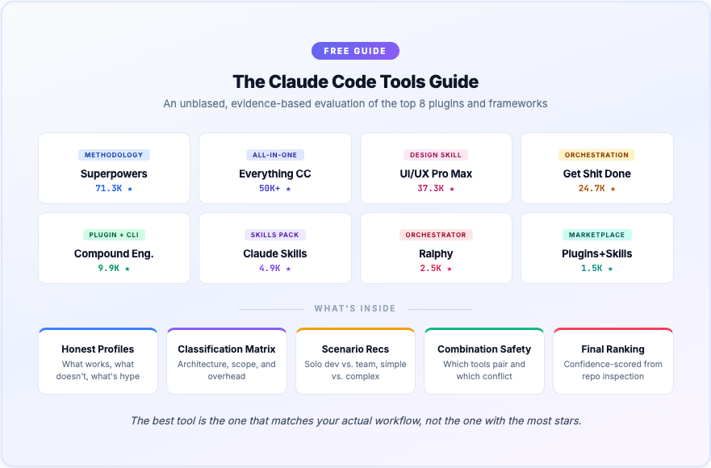
</p>

**[Download the free guide (PDF)](ebook/claude-code-tools-guide.pdf)** — covers tool profiles, a classification matrix, scenario-based recommendations, combination safety, and a confidence-scored final ranking.

> *The best tool is the one that matches your actual workflow, not the one with the most stars.*

## Quick Start

### Option 1: One-line install into an existing project

```bash
curl -fsSL https://raw.githubusercontent.com/Ninety2UA/claude-code-blueprint/main/install.sh | bash -s -- /path/to/your/project
```

### Option 2: Clone and customize

```bash
git clone https://github.com/Ninety2UA/claude-code-blueprint.git my-project
cd my-project
rm -rf .git && git init
```

### Option 3: Install only the AI configuration

```bash
# Add just .claude/ (skills, agents, commands) to an existing project
curl -fsSL https://raw.githubusercontent.com/Ninety2UA/claude-code-blueprint/main/install.sh | bash -s -- --claude-only .
```

### First session

```bash
claude          # Start Claude Code
> /init         # Interactive project setup — fills in GOALS, CONVENTIONS, STATUS
> /plan         # Brainstorm and plan your first feature
```

## What You Get

<p align="center">
  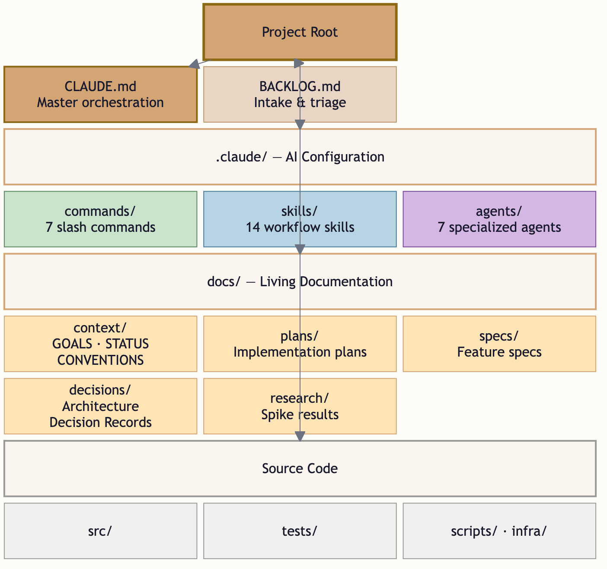
</p>

### Project structure

```
your-project/
├── .claude/
│   ├── commands/       # 24 slash commands (/plan, /ship, /review-swarm, /orchestrate, /team, ...)
│   ├── skills/         # 34 workflow skills (TDD, wave-orchestration, swarms, iterative-refinement, ...)
│   ├── agents/         # 26 specialized agents (team-lead, reviewer, security, perf, ...)
│   └── hooks/          # 5 lifecycle hooks (session-start, context-monitor, ship-loop, quality gates)
├── docs/
│   ├── context/        # GOALS.md · STATUS.md · CONVENTIONS.md · STATE.md
│   ├── plans/          # Implementation plans
│   ├── specs/          # Feature specifications
│   ├── decisions/      # Architecture Decision Records
│   ├── research/       # Spike results & evaluations
│   └── solutions/      # Institutional knowledge (created by /compound)
├── src/                # Your application code
├── tests/              # Your test suite
├── scripts/            # Automation & utility scripts
├── infra/              # Deployment & infrastructure
├── CLAUDE.md           # Master orchestration — Claude reads this first
├── BACKLOG.md          # Idea & bug capture inbox
└── blueprint.local.md  # Per-project agent config (gitignored)
```

### What each piece does

| Component | Purpose |
|-----------|---------|
| **CLAUDE.md** | Master configuration that Claude reads at session start. Contains behavioral rules, session continuity, agent team hierarchy, skill triggers, and project-specific learnings. |
| **Skills** | Workflow modules that activate at specific points — TDD, debugging, code review, wave orchestration, swarm coordination, knowledge compounding. They enforce quality gates automatically. |
| **Agents** | Specialized subprocesses dispatched for focused analysis — security audits, performance reviews, architecture evaluation. Organized into teams (review swarm, research swarm, execution waves). Each gets a fresh 200K context. |
| **Commands** | User-facing slash commands (`/plan`, `/review-swarm`, `/orchestrate`, `/compound`) that invoke the right skills with the right context. |
| **docs/context/** | Living project state — goals, current status, conventions, execution state. Updated every session by `/wrap`. |
| **docs/solutions/** | Institutional knowledge — solved problems documented by `/compound` and searched by `/plan` before future work. |
| **BACKLOG.md** | Quick-capture inbox for ideas, bugs, and tasks. Triaged by `/backlog` into prioritized work. |
| **blueprint.local.md** | Per-project agent configuration — choose which review/research agents are relevant for your tech stack. Gitignored so each developer can customize. |

## Workflow

<p align="center">
  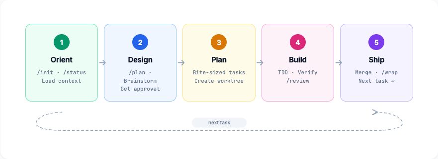
</p>

### The development loop

Every feature follows this flow:

<p align="center">
  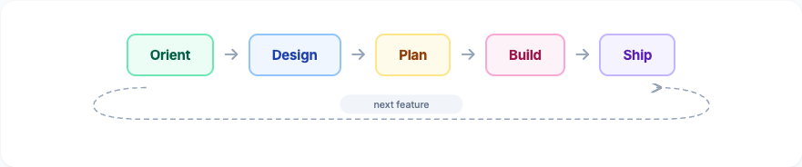
</p>

**1. Orient** — Load context with `/status` or set up with `/init`

**2. Design** — Brainstorm options with `/plan`. Present tradeoffs. Get human approval before any code is written.

**3. Plan** — Break approved design into bite-sized tasks (2-5 min each) with exact file paths, code snippets, and test strategies.

**4. Build** — Execute using TDD (red-green-refactor). Verify with evidence. Dispatch code review agents.

**5. Ship** — Merge the branch. Update all documentation with `/wrap`. Capture learnings for next session.

### Lightweight workflow for small changes

Not everything needs the full 5-step flow. Bug fixes with obvious root causes, typo fixes, config changes, and adding tests for existing behavior can use a shortcut:

<p align="center">
  
</p>

The boundary is clear: if you're touching 4+ files, adding a new API, or unsure of the approach, use the full workflow. See CLAUDE.md for the complete criteria.

### Autonomous pipeline: `/ship`

<p align="center">
  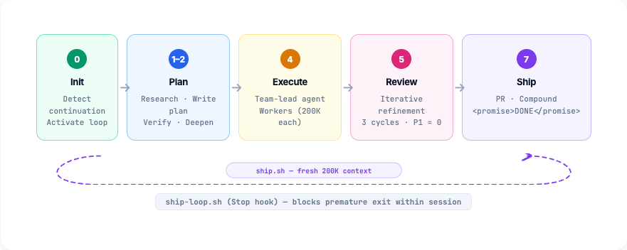
</p>

For well-defined features you want to fire and forget, `/ship` runs the entire development lifecycle autonomously — zero checkpoints, zero user input. It plans, researches, executes via a dedicated team-lead agent, iteratively reviews (3 cycles by default), and opens a PR.

```bash
# Inside Claude — interactive mode (single session)
> /ship add JWT authentication with refresh tokens

# From terminal — external loop mode (fresh 200K context per iteration)
./scripts/ship.sh "add JWT authentication with refresh tokens" --max 10
```

**Two loop mechanisms handle context exhaustion:**

| Mechanism | Where it runs | Context reset | Purpose |
|-----------|--------------|---------------|---------|
| **`ship-loop.sh`** (Stop hook) | Inside Claude session | No (same session) | Blocks premature exit — Claude gives up too early |
| **`scripts/ship.sh`** (bash loop) | Outside, in terminal | Yes (fresh process) | Handles context exhaustion — spawns fresh 200K per iteration |

The external loop (`ship.sh`) is inspired by [Ralph](https://github.com/snarktank/ralph) — each iteration is a brand new Claude process with clean context. State persists via git commits, plan files, and progress tracking. The inner Stop hook guards against Claude stopping before `<promise>DONE</promise>` is output within a single session.

**Pipeline comparison:**

| Pipeline | Checkpoints | Review | Best for |
|----------|-------------|--------|----------|
| `/build` | Between every stage | Single pass | Human-guided features |
| `/ship` (interactive) | None | 3 iterative cycles | Single-context fire-and-forget |
| `ship.sh` (external) | None | 3 iterative cycles | Large features, context exhaustion |
| `/quick` | None | None | Trivial changes (< 3 files) |

### Quality gates

<p align="center">
  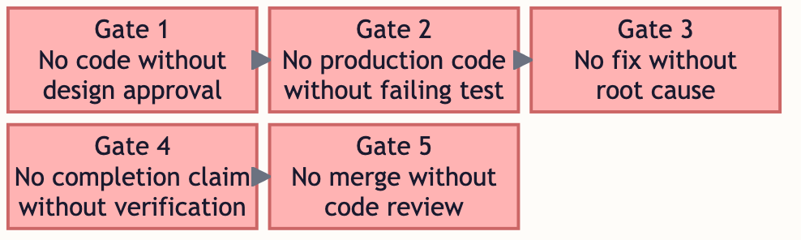
</p>

Five non-negotiable checkpoints enforce quality at every stage:

| Gate | Rule | Enforced By |
|------|------|-------------|
| **1** | No code without design approval | `brainstorming` skill |
| **2** | No production code without a failing test first | `test-driven-development` skill |
| **3** | No fix without root cause investigation | `systematic-debugging` skill |
| **4** | No completion claim without fresh verification evidence | `verification-before-completion` skill |
| **5** | No merge without code review | `requesting-code-review` skill |

These aren't suggestions — they're hard gates. Claude will stop and course-correct if any gate is skipped.

## Agent Teams & Swarms

Agents are organized into coordinated teams for multi-agent workflows. Four orchestration patterns are built in:

### Review Swarm (`/review-swarm`)

Dispatches 6-10 specialized reviewers in parallel, each analyzing the same code from a different angle. A findings-synthesizer merges all results into one prioritized report (P1/P2/P3).

<p align="center">
  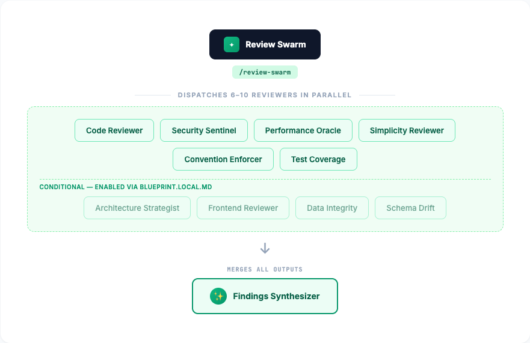
</p>

### Research Swarm (`/deep-research`)

Spawns 5 research agents in parallel before planning, then synthesizes findings into a unified research brief.

<p align="center">
  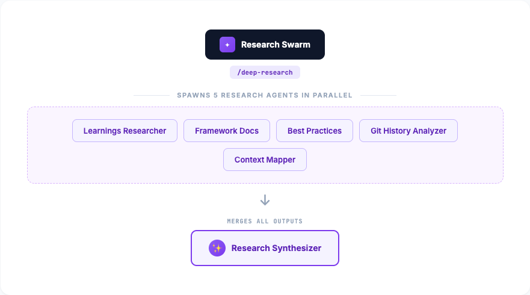
</p>

### Wave Orchestration (`/orchestrate`)

Groups plan tasks by dependency into waves. Independent tasks within each wave run in parallel; an integration-verifier validates between waves.

<p align="center">
  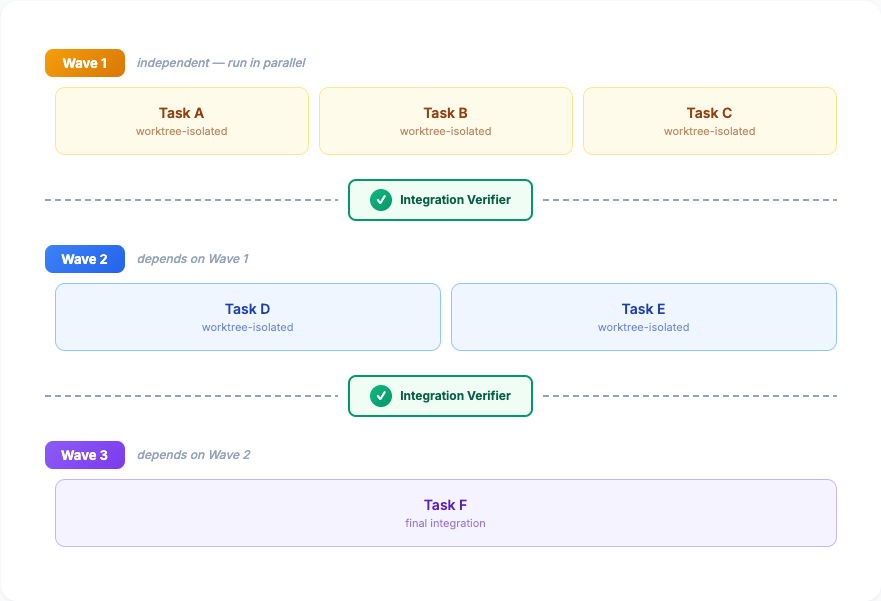
</p>

### Agent Teams (`/team`) — Experimental

For complex multi-file implementations where teammates need to discuss and coordinate, Agent Teams spawns fully independent Claude Code instances with a shared task list and messaging system.

<p align="center">
  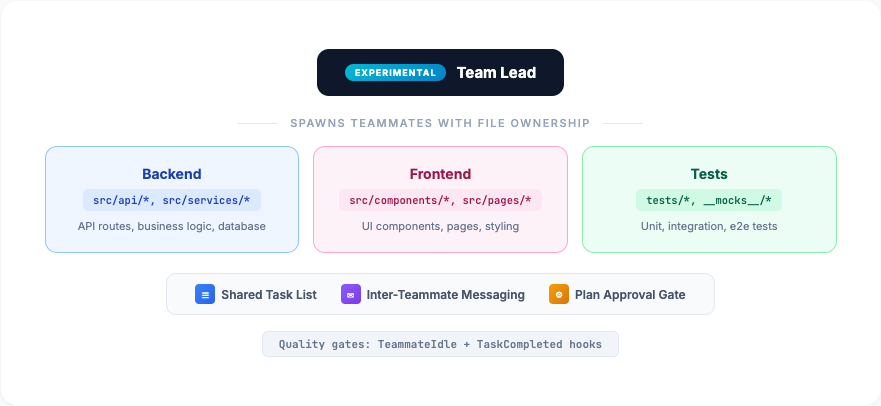
</p>

**When to use which:**

| Pattern | Best For | Key Feature |
|---------|----------|-------------|
| **Swarms** (`/review-swarm`, `/deep-research`) | Parallel analysis — same code, different lenses | Read-only, synthesizer merges outputs |
| **Waves** (`/orchestrate`) | Dependency-ordered implementation | Worktree isolation, integration verification |
| **Agent Teams** (`/team`) | Collaborative multi-file implementation | Shared task list, inter-teammate messaging |

Agent Teams is an experimental Claude Code feature. Enable it with `CLAUDE_CODE_EXPERIMENTAL_AGENT_TEAMS: "1"` in settings.json. The typical workflow combines all patterns: `/deep-research` (swarm) → `/plan` → `/team` (agent teams) → `/review-swarm` (swarm).

### Knowledge Loop (`/compound`)

Each solved problem becomes searchable institutional knowledge. Future `/plan` and `/deep-research` commands automatically consult past solutions.

<p align="center">
  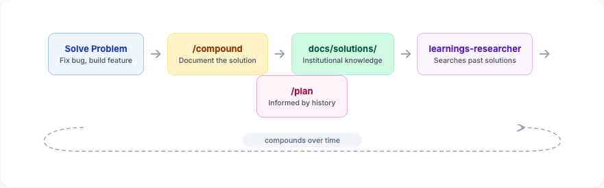
</p>

### Per-Project Configuration

Edit `blueprint.local.md` to enable/disable agents for your stack. No need for Rails reviewers on a Python project.

## Skills Reference

<p align="center">
  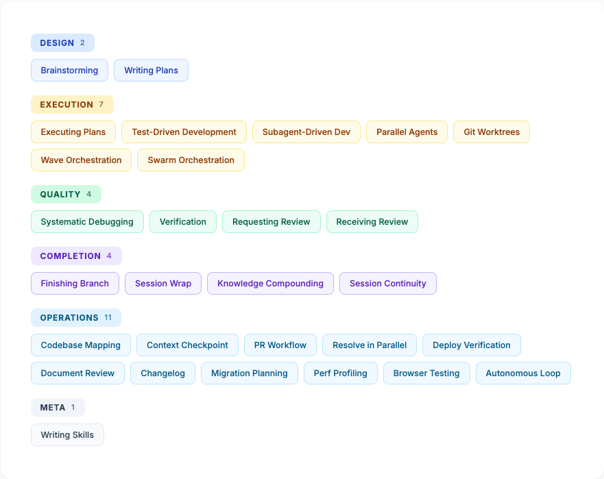
</p>

Skills are workflow modules that activate at specific development phases. They contain detailed instructions, flowcharts, and examples that guide Claude through each step.

### Design phase

| Skill | What it does | Trigger |
|-------|-------------|---------|
| **brainstorming** | Explores 3+ design options with tradeoff analysis before any creative work | `/plan` or before any new feature |
| **writing-plans** | Converts approved design into implementation plan with bite-sized tasks | After design approval |
| **spike-exploration** | Timeboxed investigation to answer a specific technical question before committing to an approach | Significant technical uncertainty |
| **scope-cutting** | Systematically separates must-haves from nice-to-haves using MoSCoW classification | Feature too large or deadline at risk |

### Execution phase

| Skill | What it does | Trigger |
|-------|-------------|---------|
| **executing-plans** | Executes plans in batches with review checkpoints | Separate session from planning |
| **test-driven-development** | Enforces red-green-refactor for all code changes | Before any code implementation |
| **subagent-driven-development** | Dispatches fresh subagent per task with two-stage review | In-session plan execution |
| **dispatching-parallel-agents** | Runs independent investigations concurrently | 2+ independent failure domains |
| **using-git-worktrees** | Creates isolated git workspace for feature work | Before major features |

### Quality phase

| Skill | What it does | Trigger |
|-------|-------------|---------|
| **systematic-debugging** | Root cause investigation before any fix is attempted | Any bug or test failure |
| **verification-before-completion** | Requires fresh evidence before claiming work is done | Before any success claim |
| **requesting-code-review** | Dispatches code-reviewer agent for automated review | After completing a task |
| **receiving-code-review** | Evaluates review feedback technically, not defensively | When review feedback arrives |

### Completion phase

| Skill | What it does | Trigger |
|-------|-------------|---------|
| **finishing-a-development-branch** | Structured merge workflow with options for squash, rebase, or merge | After all tests pass |
| **session-wrap** | Documents work done, updates all project docs, captures learnings | `/wrap` or end of session |

### Operations phase

| Skill | What it does | Trigger |
|-------|-------------|---------|
| **codebase-mapping** | Maps unfamiliar codebase into structured documentation | `/map` or before modifying unfamiliar code |
| **context-checkpoint** | Mid-session state capture — lighter than `/wrap` | `/pause` or before risky operations |
| **pr-workflow** | End-to-end PR lifecycle — create, self-review, handle feedback | `/pr` or when creating pull requests |
| **resolve-in-parallel** | Batch-resolves independent items concurrently | 2+ independent items to fix |
| **deployment-verification** | Go/no-go pre-deploy checklist across 8 areas | Before any production deployment |
| **document-review** | Structured three-pass critique (accuracy, clarity, completeness) | When reviewing specs, plans, or docs |
| **changelog-generation** | Release notes from git history in Keep a Changelog format | `/changelog` or preparing a release |
| **migration-planning** | Safe migration plans with rollback procedures | Database/API/dependency migrations |
| **performance-profiling** | Profile-driven investigation — measure before optimizing | When something is "slow" |
| **browser-testing** | Verify UI changes via Playwright MCP browser tools | After UI changes need visual verification |
| **autonomous-loop** | Iterate through plan tasks with retry, backoff, circuit breaker (3 no-progress / 5 same-error) | Autonomous plan execution — "just do it all" |
| **iterative-refinement** | Review→fix→review cycles with 3 convergence modes (fast/deep/perfect), early exit on convergence | `/ship` Stage 5, `/build --iterate N` |
| **dependency-management** | Evaluates, adds, upgrades, and removes dependencies with safety gates | Adding, upgrading, or auditing dependencies |

### Orchestration phase

| Skill | What it does | Trigger |
|-------|-------------|---------|
| **wave-orchestration** | Groups tasks by dependency into waves, parallel within waves, integration verification between | `/orchestrate` or plans with mixed dependencies |
| **swarm-orchestration** | Coordinates multiple specialized agents analyzing the same input in parallel | `/review-swarm`, `/deep-research`, or custom swarms |
| **agent-teams** | Collaborative multi-file implementation with shared task list and messaging (experimental) | `/team` or complex cross-layer features |
| **knowledge-compounding** | Documents solved problems as searchable institutional knowledge in docs/solutions/ | `/compound` or after solving non-trivial problems |
| **session-continuity** | Manages STATE.md for execution tracking across session boundaries | `/pause`, `/resume`, or during wave orchestration |

### Meta

| Skill | What it does | Trigger |
|-------|-------------|---------|
| **writing-skills** | Creates and tests new skills using TDD for documentation | When creating new skills |

## Agents Reference

<p align="center">
  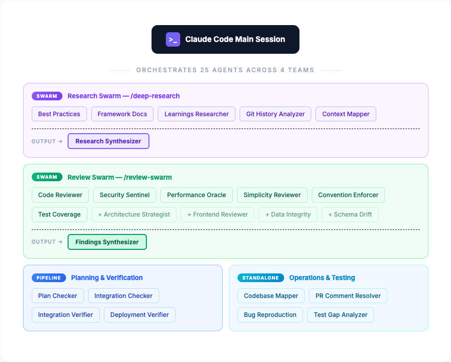
</p>

Agents are specialized subprocesses dispatched via Claude's Task tool. Each agent gets a fresh 200K-token context window focused entirely on its domain.

| Agent | Domain | When to dispatch |
|-------|--------|-----------------|
| **code-reviewer** | Standards, correctness, plan compliance | After completing a major step or before merge |
| **architecture-strategist** | Structural patterns, service boundaries | When reviewing PRs, adding services, refactoring |
| **security-sentinel** | OWASP, auth flows, vulnerability scanning | Before deployment, after auth/payment/API work |
| **code-simplicity-reviewer** | YAGNI violations, over-engineering | After implementation is complete |
| **performance-oracle** | Bottlenecks, N+1 queries, algorithmic complexity | After features are built, on performance concerns |
| **best-practices-researcher** | Industry standards, library documentation | When needing external guidance |
| **git-history-analyzer** | Code evolution, pattern archaeology | When understanding why code is the way it is |
| **learnings-researcher** | Past solutions, decisions, patterns | Before planning — searches docs/ for prior art |
| **plan-checker** | Plan validation, gap detection | After writing a plan, before execution |
| **integration-checker** | Component wiring, connection validation | After implementation — verifies components connect |
| **bug-reproduction-validator** | Bug reproduction, fix verification | When debugging — validates repro steps and fixes |
| **codebase-mapper** | Architecture, conventions, stack analysis | Onboarding to unfamiliar code or before modifying it |
| **pr-comment-resolver** | Targeted PR comment resolution | Processing review feedback — one comment per agent |
| **test-gap-analyzer** | Coverage gaps, test generation | Improving coverage or before major refactors |
| **research-synthesizer** | Multi-agent output consolidation | After parallel research — unifies findings |
| **deployment-verifier** | Deployment readiness verification | Before deploying — checks 8 critical areas |
| **schema-drift-detector** | Unrelated schema/migration changes | Reviewing PRs — catches scope creep in data layer |
| **frontend-reviewer** | UI/UX code quality review | Reviewing frontend code — a11y, responsive, perf |
| **convention-enforcer** | CONVENTIONS.md compliance checking | Reviewing code against project standards |
| **data-integrity-guardian** | Migration safety, transactions, rollback plans | PRs with migrations, schema changes, data transforms |
| **test-coverage-reviewer** | Test quality, assertion meaningfulness, edge cases | After implementation — verifies tests actually validate behavior |
| **framework-docs-researcher** | Current framework docs for installed versions | Before planning features that use specific framework APIs |
| **codebase-context-mapper** | Focused impact map for a specific change | Before planning — maps files and dependencies a change will touch |
| **integration-verifier** | Cross-task integration verification | After wave completion — ensures parallel implementations work together |
| **findings-synthesizer** | Review swarm output consolidation | After `/review-swarm` — de-duplicates and prioritizes all findings |
| **team-lead** | Dedicated orchestrator (200K fresh context) | Coordinates `/orchestrate` and `/team` — delegates to workers, monitors progress, reviews, signs off |

### How agents work

Agents run in isolation with their own 200K context window. They can be dispatched individually or as coordinated swarms:

**Single dispatch** — one agent, one focused job:
```
Main Session → Task("security-sentinel: audit auth endpoints") → findings → act on results
```

**Swarm dispatch** — multiple agents, same input, different lenses:
```
Main Session
├── code-reviewer          → findings ─┐
├── security-sentinel      → findings  │
├── performance-oracle     → findings  ├── findings-synthesizer → unified report
├── convention-enforcer    → findings  │
└── test-coverage-reviewer → findings ─┘
```

**Wave dispatch** — parallel within waves, worktree-isolated, sequential between:
```
Wave 1: implementer-A + implementer-B (parallel, worktree-isolated) → integration-verifier
Wave 2: implementer-C (depends on Wave 1)                           → integration-verifier
```

**Agent team dispatch** — collaborative instances with shared task list:
```
Team Lead → spawns teammates with file ownership boundaries
├── Teammate A (owns src/api/*)     ─┐
├── Teammate B (owns src/ui/*)       ├── shared tasks + messaging
└── Teammate C (owns tests/*)       ─┘
    Quality gates: TeammateIdle + TaskCompleted hooks
```

## Commands Reference

Commands are user-facing shortcuts that invoke the right skills with the right context.

| Command | What it does |
|---------|-------------|
| **`/init`** | Interactive project setup. Fills in CONVENTIONS.md, GOALS.md, STATUS.md through a guided conversation. |
| **`/plan`** | Brainstorming session. Explores design options, presents tradeoffs, gets approval, then creates implementation plan. |
| **`/build`** | Full-cycle supervised pipeline with checkpoints between every stage. Supports `--iterate N` for iterative review and `--team` for team-lead dispatch. |
| **`/ship`** | Fully autonomous pipeline — zero checkpoints, fire-and-forget. Plans, executes via team-lead, iteratively reviews (3 cycles), and opens a PR. |
| **`/deepen`** | Enrich an existing plan with parallel research agents. Dispatches all configured researchers in parallel, then merges findings into the plan. |
| **`/review`** | Dispatches code-reviewer agent against your current changes. |
| **`/review-swarm`** | Multi-agent parallel review — dispatches 6-10 specialized reviewers, synthesizes findings into prioritized P1/P2/P3 report. |
| **`/deep-research`** | Multi-agent parallel research — spawns 5 research agents, synthesizes into unified brief for planning. |
| **`/compound`** | Document a solved problem for future reference. Creates searchable entry in docs/solutions/. |
| **`/orchestrate`** | Wave-based parallel execution — groups plan tasks by dependency, runs independent tasks in parallel per wave. |
| **`/team`** | Spawn an Agent Team for collaborative multi-file implementation with shared task list and messaging (experimental). |
| **`/status`** | Shows current project state, goal alignment, blockers, and suggests next actions. |
| **`/debug [issue]`** | Root cause investigation. Gathers evidence, forms hypotheses, tests them systematically. |
| **`/backlog`** | Triages inbox items in BACKLOG.md into prioritized tasks using GOALS.md context. |
| **`/wrap`** | End-of-session documentation. Updates CLAUDE.md session continuity, STATUS.md, and captures learnings. |
| **`/pr`** | Create, manage, or respond to pull requests. Full PR lifecycle. |
| **`/map`** | Map an unfamiliar codebase into structured documentation before modifying it. |
| **`/resume`** | Resume work from where the last session left off. Loads context and orients you. |
| **`/pause`** | Quick mid-session checkpoint. Captures state without full `/wrap`. |
| **`/quick`** | Fast-track a small, well-understood change with TDD and verification gates. |
| **`/changelog`** | Generate release notes from git history using Keep a Changelog format. |
| **`/add-tests`** | Analyze test coverage gaps and generate tests for untested code paths. |
| **`/health`** | Comprehensive project health check — build, tests, lint, deps, conventions, docs, backlog, git. |

### Typical session flow

**Supervised (human in the loop):**
```bash
claude
> /resume                            # Reload context from last session
> /deep-research add OAuth2 login    # Research before planning (5 agents in parallel)
> /plan add OAuth2 login             # Design + plan based on research findings
> /orchestrate                       # Execute with wave-based parallelism
>   # OR: /team                      # Execute with collaborative Agent Team
> /review-swarm                      # Multi-agent review (6-10 reviewers in parallel)
> /compound OAuth2 session handling  # Document the solution for future reference
> /wrap                              # Document everything for next session
```

**Autonomous (fire and forget):**
```bash
# Inside Claude — single session
claude
> /ship add OAuth2 login with JWT refresh tokens --iterations 5

# From terminal — with context-exhaustion recovery
./scripts/ship.sh "add OAuth2 login with JWT refresh tokens" --max 10 --swarm
```

## Customization

### Adapting to your project

After installation, run `/init` to configure:

- **GOALS.md** — Your 3-5 project objectives and priority framework
- **CONVENTIONS.md** — Your tech stack, naming conventions, file structure patterns
- **STATUS.md** — Current project state, known issues, recent work

### Adding your own skills

Skills live in `.claude/skills/your-skill-name/SKILL.md`. The template includes a `writing-skills` skill that uses TDD to create and test new skills:

```bash
claude
> Create a new skill for database migration workflows
# Claude will use the writing-skills skill to:
# 1. Write a failing test scenario
# 2. Create the skill
# 3. Verify it handles the test scenario correctly
```

### Adding your own agents

Agents live in `.claude/agents/your-agent-name.md`. Create a markdown file with YAML frontmatter and a system prompt:

```markdown
---
name: your-agent-name
description: "When to use this agent. Be specific so Claude knows when to delegate."
model: inherit
tools: [Read, Glob, Grep, Bash]
---

You are a [role] specializing in [domain].

## Process
1. [Step-by-step instructions]

## Output Format
[How findings should be structured]

## Rules
- [Operational guardrails]
```

**Key frontmatter fields:**

| Field | Purpose | Example |
|-------|---------|---------|
| `tools` | Restrict which tools the agent can use (principle of least privilege) | `[Read, Glob, Grep, Bash]` for read-only; add `Edit, Write` for agents that modify code |
| `model` | Override the model (`sonnet`, `opus`, `haiku`, or `inherit`) | `inherit` to use the session's model |
| `isolation` | Set to `worktree` for agents that modify files in parallel | Used by `pr-comment-resolver` |
| `maxTurns` | Limit agentic turns to prevent runaway token consumption | `20` for focused tasks |

### Adjusting quality gates

Quality gates are encoded in the skill files. To relax a gate (e.g., skip code review for docs-only changes), edit the corresponding skill's `SKILL.md` and add your exception criteria.

### Slim install

If you only want specific components:

```bash
# Only the AI configuration (skills, agents, commands)
./install.sh --claude-only

# Only the documentation structure
./install.sh --docs-only

# Preview what would be installed
./install.sh --dry-run
```

## Documentation structure

The template includes **example docs** in each category so you can see the expected format immediately. Delete them when you start your project (they're clearly marked as examples).

| Example file | Shows you how to write |
|-------------|----------------------|
| `docs/decisions/001-example-project-structure.md` | Architecture Decision Records |
| `docs/plans/2026-03-04-example-user-auth.md` | Implementation plans with bite-sized tasks |
| `docs/specs/example-csv-export.md` | Feature specifications with acceptance criteria |
| `docs/research/example-jwt-refresh-strategies.md` | Research docs with findings and recommendations |

The `docs/` directory uses four categories, each with its own lifecycle:

| Directory | Contains | Lifecycle |
|-----------|----------|-----------|
| `docs/context/` | GOALS.md, STATUS.md, CONVENTIONS.md | Updated every session |
| `docs/plans/` | `YYYY-MM-DD-topic.md` implementation plans | Created per feature, archived when done |
| `docs/specs/` | `feature-name.md` specifications | Created before building, stable after approval |
| `docs/decisions/` | `NNN-kebab-case-title.md` ADRs | Created when choosing between options, permanent |
| `docs/research/` | Spike results, tool evaluations | Created during exploration, referenced later |
| `docs/solutions/` | Solved problems, institutional knowledge | Created by `/compound`, searched by `/plan` and `/deep-research` |

## How it works under the hood

### Context loading order

When Claude starts a session, it loads context in this order:

1. **CLAUDE.md** — Behavioral rules, session continuity, agent team hierarchy, skill/agent dispatch tables
2. **docs/context/STATUS.md** — What happened recently, what's in flight
3. **docs/context/STATE.md** — Execution state for resuming in-progress work (wave progress, task completion)
4. **docs/context/GOALS.md** — What we're trying to achieve
5. **docs/context/CONVENTIONS.md** — How we write code here
6. **BACKLOG.md** — What's waiting to be done
7. **docs/solutions/** — Institutional knowledge searched before planning
8. **blueprint.local.md** — Per-project agent configuration
9. **Skills** — Activated contextually based on what's happening
10. **Agents** — Dispatched on-demand for focused analysis (individually or as swarms)

### Context window management

Large features can exhaust Claude's context window. The template has layered defenses:

| Layer | Mechanism | What it does |
|-------|-----------|-------------|
| **Prevention** | Subagent isolation | Each agent gets fresh 200K context; main session only sees results |
| **Detection** | `context-monitor.js` (PostToolUse hook) | Warns at 150 tool calls, escalates at 200, detects analysis paralysis at 8+ consecutive reads |
| **Inner guard** | `ship-loop.sh` (Stop hook) | Blocks premature exit within a session — re-injects the prompt (max 5 retries) |
| **Outer loop** | `scripts/ship.sh` (bash) | Spawns fresh Claude process per iteration — true context reset (max 10, configurable) |
| **Circuit breakers** | `autonomous-loop` skill | Stops after 3 no-progress iterations or 5 identical errors |

The inner guard and outer loop solve different problems: the Stop hook catches Claude quitting early (same session, growing context), while the external bash loop handles genuine context exhaustion (fresh 200K per iteration, state persists via git).

### Session continuity

The `Session Continuity` section in CLAUDE.md acts as a handoff note between sessions:

```markdown
## Session Continuity

**Last session:** 2026-03-04

**What was done:**
- Implemented JWT refresh token rotation
- Added rate limiting middleware
- Fixed Safari redirect loop (root cause: SameSite cookie attribute)

**What's remaining:**
- Integration tests for token refresh edge cases
- Load testing the rate limiter

**Start here:** Run the failing integration tests in tests/auth/refresh.test.ts

**Current state of the code:**
- Build: passing
- Tests: 2 failing (expected — the ones we need to write)
- Uncommitted changes: none
```

This is updated automatically by `/wrap` at the end of each session.

## Error recovery

CLAUDE.md includes built-in guidance for common failure scenarios:

| Situation | Recovery |
|-----------|----------|
| Test fails after code change | Don't iterate blindly — use `systematic-debugging` skill |
| Merge conflict | Read both sides, understand intent, then resolve |
| Broken build after dep update | Pin previous version, BACKLOG the upgrade |
| Corrupted worktree | Create fresh from main, cherry-pick completed commits |
| Agent returns bad results | Verify findings manually before acting |
| Lost uncommitted changes | Check `git stash list`, `git reflog`, `git fsck --lost-found` |

## FAQ

<details>
<summary><strong>Can I use this with an existing project?</strong></summary>

Yes. Use `--claude-only` to add just the `.claude/` directory, or the full install and skip files that already exist with `--no-overwrite`. The template is additive — it doesn't modify your existing code.
</details>

<details>
<summary><strong>Do I need all the skills?</strong></summary>

No. Skills activate contextually. If you never do TDD, the test-driven-development skill won't activate. You can also delete any skill directory you don't want. The template works with any subset.
</details>

<details>
<summary><strong>How do agents differ from skills?</strong></summary>

**Skills** are instructions for the main Claude session — they guide Claude's behavior during your conversation. **Agents** are separate subprocesses dispatched via the Task tool, each with their own 200K context window. Use agents for focused analysis that benefits from isolation (security audits, deep code reviews).
</details>

<details>
<summary><strong>Will this slow down Claude?</strong></summary>

CLAUDE.md adds minimal context. Skills and agents are loaded on-demand, not upfront. The template is designed to be lightweight — most of the intelligence is in the skill files which are only read when triggered.
</details>

<details>
<summary><strong>Can I use this with Claude Code in my IDE?</strong></summary>

Yes. The template works identically in VS Code, JetBrains, and the CLI. Slash commands, skills, and agents are all available in every environment.
</details>

<details>
<summary><strong>How do I update the template after installation?</strong></summary>

Re-run the install script with `--no-overwrite` to get new skills and agents without overwriting your customizations. Or cherry-pick specific files from the repository.
</details>

<details>
<summary><strong>What are the example docs? Should I keep them?</strong></summary>

The template includes example files in `docs/decisions/`, `docs/plans/`, `docs/specs/`, and `docs/research/` showing the expected format for each document type. They're clearly marked as examples. Delete them when you start your own project — they're there to help you understand the structure.
</details>

<details>
<summary><strong>Do small bug fixes need the full brainstorm/plan flow?</strong></summary>

No. The template includes a **lightweight workflow** for small, well-understood changes (< 3 files, obvious root cause). Write a failing test, fix it, verify, commit. See the "Lightweight Workflow" section in CLAUDE.md for the full criteria.
</details>

<details>
<summary><strong>What are agent swarms and when should I use them?</strong></summary>

Agent swarms dispatch multiple specialized agents in parallel on the same input. `/review-swarm` runs 6-10 reviewers simultaneously (security, performance, code quality, etc.) and merges their findings. `/deep-research` runs 5 research agents in parallel before planning. Use swarms for significant changes — they consume more tokens but catch issues a single reviewer would miss. For small changes (< 50 lines), a single `/review` is usually sufficient.
</details>

<details>
<summary><strong>What is wave orchestration?</strong></summary>

Wave orchestration (`/orchestrate`) groups plan tasks by dependency. Independent tasks run in parallel within each "wave," while dependent tasks wait for their prerequisites. An integration-verifier checks that parallel implementations work together between waves. It's the sweet spot between fully sequential execution and fully parallel — maximizing speed without breaking dependency order.
</details>

<details>
<summary><strong>What is knowledge compounding?</strong></summary>

After solving a non-trivial problem, `/compound` saves it as a structured document in `docs/solutions/`. Future `/plan` and `/deep-research` commands automatically search this directory before starting new work. Over time, your project builds institutional knowledge that prevents repeated mistakes and informs better plans.
</details>

<details>
<summary><strong>What are Agent Teams and how do they differ from swarms?</strong></summary>

Agent Teams (`/team`) spawn fully independent Claude Code instances that collaborate through a shared task list and messaging. Unlike swarms (which are read-only subagents reporting analysis back to a controller), Agent Teams are peers that can discuss design decisions, divide file ownership, and coordinate in real time. Use swarms for parallel analysis (review, research) and Agent Teams for collaborative implementation. Agent Teams is an experimental feature — enable with `CLAUDE_CODE_EXPERIMENTAL_AGENT_TEAMS: "1"` in settings.json.
</details>

<details>
<summary><strong>What is /ship and when should I use it?</strong></summary>

`/ship` is the fully autonomous development pipeline — zero checkpoints, fire-and-forget. It plans, researches, executes via a dedicated team-lead agent, iteratively reviews (3 cycles by default), and opens a PR. Use it for well-defined features where you don't need to approve each stage. For large features that may exhaust context, use `scripts/ship.sh` from your terminal — it spawns a fresh Claude process per iteration so each run gets a clean 200K context window. State persists through git commits and plan files.
</details>

<details>
<summary><strong>How does context exhaustion recovery work?</strong></summary>

Two mechanisms work at different layers. **Inside** a session, the `ship-loop.sh` Stop hook blocks premature exit — if Claude tries to stop before `<promise>DONE</promise>` is output, the hook re-injects the prompt (max 5 retries, same context). **Outside** a session, `scripts/ship.sh` is a bash loop that spawns fresh Claude processes — each iteration gets a clean 200K context window, and state persists via git. The external loop is inspired by [Ralph](https://github.com/snarktank/ralph)'s approach to long-running agent loops.
</details>

<details>
<summary><strong>How do I configure which agents run for my project?</strong></summary>

Edit `blueprint.local.md` (gitignored, so each developer can customize). It has YAML frontmatter listing which review and research agents to dispatch. Comment out agents that aren't relevant to your stack — no point running a frontend-reviewer on a CLI tool.
</details>

## Contributing

Contributions are welcome. See [CONTRIBUTING.md](CONTRIBUTING.md) for guidelines.

If you've built a useful skill or agent, consider submitting it for inclusion in the template.

## License

MIT License. See [LICENSE](LICENSE) for details.

---

<p align="center">
  <sub>Built for use with <a href="https://claude.ai/claude-code">Claude Code</a> by Anthropic</sub>
</p>
