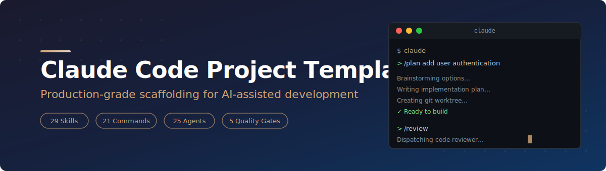

<p align="center">
  
</p>

<p align="center">
  <strong>Production-grade scaffolding for AI-assisted software development with Claude Code</strong>
</p>

<p align="center">
  <a href="#-quick-start">Quick Start</a> ·
  <a href="#-what-you-get">What You Get</a> ·
  <a href="#-workflow">Workflow</a> ·
  <a href="#-skills-reference">Skills</a> ·
  <a href="#-agents-reference">Agents</a> ·
  <a href="#-commands-reference">Commands</a> ·
  <a href="#-customization">Customization</a>
</p>

---

## Why This Template?

Most AI coding sessions start from scratch: no conventions, no memory, no workflow. Each session reinvents the wheel. This template fixes that.

It gives Claude Code a **structured operating system** — a set of skills, agents, commands, and documentation patterns that compound across sessions. The result: higher quality code, fewer regressions, and a codebase that gets easier to work on over time.

**The core philosophy:**

> *Each unit of engineering work should make subsequent units easier — not harder.*

## Quick Start

### Option 1: One-line install into an existing project

```bash
curl -fsSL https://raw.githubusercontent.com/Ninety2UA/claude-code-blueprint/main/install.sh | bash -s -- /path/to/your/project
```

### Option 2: Clone and customize

```bash
git clone https://github.com/Ninety2UA/claude-code-blueprint.git my-project
cd my-project
rm -rf .git && git init
```

### Option 3: Install only the AI configuration

```bash
# Add just .claude/ (skills, agents, commands) to an existing project
curl -fsSL https://raw.githubusercontent.com/Ninety2UA/claude-code-blueprint/main/install.sh | bash -s -- --claude-only .
```

### First session

```bash
claude          # Start Claude Code
> /init         # Interactive project setup — fills in GOALS, CONVENTIONS, STATUS
> /plan         # Brainstorm and plan your first feature
```

## What You Get

<p align="center">
  
</p>

### Project structure

```
your-project/
├── .claude/
│   ├── commands/       # 7 slash commands (/plan, /review, /status, ...)
│   ├── skills/         # 14 workflow skills (TDD, debugging, planning, ...)
│   └── agents/         # 7 specialized agents (reviewer, security, perf, ...)
├── docs/
│   ├── context/        # GOALS.md · STATUS.md · CONVENTIONS.md
│   ├── plans/          # Implementation plans
│   ├── specs/          # Feature specifications
│   ├── decisions/      # Architecture Decision Records
│   └── research/       # Spike results & evaluations
├── src/                # Your application code
├── tests/              # Your test suite
├── scripts/            # Automation & utility scripts
├── infra/              # Deployment & infrastructure
├── CLAUDE.md           # Master orchestration — Claude reads this first
└── BACKLOG.md          # Idea & bug capture inbox
```

### What each piece does

| Component | Purpose |
|-----------|---------|
| **CLAUDE.md** | Master configuration that Claude reads at session start. Contains behavioral rules, session continuity, skill triggers, and project-specific learnings. |
| **Skills** | Workflow modules that activate at specific points — TDD, debugging, code review, planning. They enforce quality gates automatically. |
| **Agents** | Specialized subprocesses dispatched for focused analysis — security audits, performance reviews, architecture evaluation. Each gets a fresh 200K context. |
| **Commands** | User-facing slash commands (`/plan`, `/review`, `/debug`) that invoke the right skills with the right context. |
| **docs/context/** | Living project state — goals, current status, conventions. Updated every session by `/wrap`. |
| **BACKLOG.md** | Quick-capture inbox for ideas, bugs, and tasks. Triaged by `/backlog` into prioritized work. |

## Workflow

<p align="center">
  
</p>

### The development loop

Every feature follows this flow:

```
Orient → Design → Plan → Build → Ship
  ↑                                 │
  └─────────── next task ───────────┘
```

**1. Orient** — Load context with `/status` or set up with `/init`

**2. Design** — Brainstorm options with `/plan`. Present tradeoffs. Get human approval before any code is written.

**3. Plan** — Break approved design into bite-sized tasks (2-5 min each) with exact file paths, code snippets, and test strategies.

**4. Build** — Execute using TDD (red-green-refactor). Verify with evidence. Dispatch code review agents.

**5. Ship** — Merge the branch. Update all documentation with `/wrap`. Capture learnings for next session.

### Quality gates

<p align="center">
  
</p>

Five non-negotiable checkpoints enforce quality at every stage:

| Gate | Rule | Enforced By |
|------|------|-------------|
| **1** | No code without design approval | `brainstorming` skill |
| **2** | No production code without a failing test first | `test-driven-development` skill |
| **3** | No fix without root cause investigation | `systematic-debugging` skill |
| **4** | No completion claim without fresh verification evidence | `verification-before-completion` skill |
| **5** | No merge without code review | `requesting-code-review` skill |

These aren't suggestions — they're hard gates. Claude will stop and course-correct if any gate is skipped.

## Skills Reference

<p align="center">
  
</p>

Skills are workflow modules that activate at specific development phases. They contain detailed instructions, flowcharts, and examples that guide Claude through each step.

### Design phase

| Skill | What it does | Trigger |
|-------|-------------|---------|
| **brainstorming** | Explores 3+ design options with tradeoff analysis before any creative work | `/plan` or before any new feature |
| **writing-plans** | Converts approved design into implementation plan with bite-sized tasks | After design approval |

### Execution phase

| Skill | What it does | Trigger |
|-------|-------------|---------|
| **executing-plans** | Executes plans in batches with review checkpoints | Separate session from planning |
| **test-driven-development** | Enforces red-green-refactor for all code changes | Before any code implementation |
| **subagent-driven-development** | Dispatches fresh subagent per task with two-stage review | In-session plan execution |
| **dispatching-parallel-agents** | Runs independent investigations concurrently | 2+ independent failure domains |
| **using-git-worktrees** | Creates isolated git workspace for feature work | Before major features |

### Quality phase

| Skill | What it does | Trigger |
|-------|-------------|---------|
| **systematic-debugging** | Root cause investigation before any fix is attempted | Any bug or test failure |
| **verification-before-completion** | Requires fresh evidence before claiming work is done | Before any success claim |
| **requesting-code-review** | Dispatches code-reviewer agent for automated review | After completing a task |
| **receiving-code-review** | Evaluates review feedback technically, not defensively | When review feedback arrives |

### Completion phase

| Skill | What it does | Trigger |
|-------|-------------|---------|
| **finishing-a-development-branch** | Structured merge workflow with options for squash, rebase, or merge | After all tests pass |
| **session-wrap** | Documents work done, updates all project docs, captures learnings | `/wrap` or end of session |

### Meta

| Skill | What it does | Trigger |
|-------|-------------|---------|
| **writing-skills** | Creates and tests new skills using TDD for documentation | When creating new skills |

## Agents Reference

<p align="center">
  
</p>

Agents are specialized subprocesses dispatched via Claude's Task tool. Each agent gets a fresh 200K-token context window focused entirely on its domain.

| Agent | Domain | When to dispatch |
|-------|--------|-----------------|
| **code-reviewer** | Standards, correctness, plan compliance | After completing a major step or before merge |
| **architecture-strategist** | Structural patterns, service boundaries | When reviewing PRs, adding services, refactoring |
| **security-sentinel** | OWASP, auth flows, vulnerability scanning | Before deployment, after auth/payment/API work |
| **code-simplicity-reviewer** | YAGNI violations, over-engineering | After implementation is complete |
| **performance-oracle** | Bottlenecks, N+1 queries, algorithmic complexity | After features are built, on performance concerns |
| **best-practices-researcher** | Industry standards, library documentation | When needing external guidance |
| **git-history-analyzer** | Code evolution, pattern archaeology | When understanding why code is the way it is |

### How agents work

```
Main Claude Session
  │
  ├─► dispatch code-reviewer ──► findings ──┐
  ├─► dispatch security-sentinel ──► findings ──┤
  │                                            ▼
  │                                    Review & integrate
  │                                            │
  └──────────── continue building ◄────────────┘
```

Agents run in isolation and return structured findings. The main session integrates their feedback and decides what to act on.

## Commands Reference

Commands are user-facing shortcuts that invoke the right skills with the right context.

| Command | What it does |
|---------|-------------|
| **`/init`** | Interactive project setup. Fills in CONVENTIONS.md, GOALS.md, STATUS.md through a guided conversation. |
| **`/plan`** | Brainstorming session. Explores design options, presents tradeoffs, gets approval, then creates implementation plan. |
| **`/review`** | Dispatches code-reviewer agent against your current changes. |
| **`/status`** | Shows current project state, goal alignment, blockers, and suggests next actions. |
| **`/debug [issue]`** | Root cause investigation. Gathers evidence, forms hypotheses, tests them systematically. |
| **`/backlog`** | Triages inbox items in BACKLOG.md into prioritized tasks using GOALS.md context. |
| **`/wrap`** | End-of-session documentation. Updates CLAUDE.md session continuity, STATUS.md, and captures learnings. |

### Typical session flow

```bash
claude
> /status                        # Where did we leave off?
> /plan add OAuth2 login          # Design before building
> # ... approve design ...
> # ... Claude builds with TDD ...
> /review                         # Automated code review
> /wrap                           # Document everything for next session
```

## Customization

### Adapting to your project

After installation, run `/init` to configure:

- **GOALS.md** — Your 3-5 project objectives and priority framework
- **CONVENTIONS.md** — Your tech stack, naming conventions, file structure patterns
- **STATUS.md** — Current project state, known issues, recent work

### Adding your own skills

Skills live in `.claude/skills/your-skill-name/SKILL.md`. The template includes a `writing-skills` skill that uses TDD to create and test new skills:

```bash
claude
> Create a new skill for database migration workflows
# Claude will use the writing-skills skill to:
# 1. Write a failing test scenario
# 2. Create the skill
# 3. Verify it handles the test scenario correctly
```

### Adding your own agents

Agents live in `.claude/agents/your-agent-name.md`. Create a markdown file with:

```markdown
# Agent Name

## Role
What this agent specializes in.

## Instructions
Detailed instructions for how the agent should analyze code and report findings.

## Output Format
How findings should be structured.
```

### Adjusting quality gates

Quality gates are encoded in the skill files. To relax a gate (e.g., skip code review for docs-only changes), edit the corresponding skill's `SKILL.md` and add your exception criteria.

### Slim install

If you only want specific components:

```bash
# Only the AI configuration (skills, agents, commands)
./install.sh --claude-only

# Only the documentation structure
./install.sh --docs-only

# Preview what would be installed
./install.sh --dry-run
```

## Documentation structure

The `docs/` directory uses four categories, each with its own lifecycle:

| Directory | Contains | Lifecycle |
|-----------|----------|-----------|
| `docs/context/` | GOALS.md, STATUS.md, CONVENTIONS.md | Updated every session |
| `docs/plans/` | `YYYY-MM-DD-topic.md` implementation plans | Created per feature, archived when done |
| `docs/specs/` | `feature-name.md` specifications | Created before building, stable after approval |
| `docs/decisions/` | `NNN-kebab-case-title.md` ADRs | Created when choosing between options, permanent |
| `docs/research/` | Spike results, tool evaluations | Created during exploration, referenced later |

## How it works under the hood

### Context loading order

When Claude starts a session, it loads context in this order:

1. **CLAUDE.md** — Behavioral rules, session continuity, skill/agent dispatch tables
2. **docs/context/STATUS.md** — What happened recently, what's in flight
3. **docs/context/GOALS.md** — What we're trying to achieve
4. **docs/context/CONVENTIONS.md** — How we write code here
5. **BACKLOG.md** — What's waiting to be done
6. **Skills** — Activated contextually based on what's happening
7. **Agents** — Dispatched on-demand for focused analysis

### Session continuity

The `Session Continuity` section in CLAUDE.md acts as a handoff note between sessions:

```markdown
## Session Continuity

**Last session:** 2026-03-04

**What was done:**
- Implemented JWT refresh token rotation
- Added rate limiting middleware
- Fixed Safari redirect loop (root cause: SameSite cookie attribute)

**What's remaining:**
- Integration tests for token refresh edge cases
- Load testing the rate limiter

**Start here:** Run the failing integration tests in tests/auth/refresh.test.ts

**Current state of the code:**
- Build: passing
- Tests: 2 failing (expected — the ones we need to write)
- Uncommitted changes: none
```

This is updated automatically by `/wrap` at the end of each session.

## FAQ

<details>
<summary><strong>Can I use this with an existing project?</strong></summary>

Yes. Use `--claude-only` to add just the `.claude/` directory, or the full install and skip files that already exist with `--no-overwrite`. The template is additive — it doesn't modify your existing code.
</details>

<details>
<summary><strong>Do I need all the skills?</strong></summary>

No. Skills activate contextually. If you never do TDD, the test-driven-development skill won't activate. You can also delete any skill directory you don't want. The template works with any subset.
</details>

<details>
<summary><strong>How do agents differ from skills?</strong></summary>

**Skills** are instructions for the main Claude session — they guide Claude's behavior during your conversation. **Agents** are separate subprocesses dispatched via the Task tool, each with their own 200K context window. Use agents for focused analysis that benefits from isolation (security audits, deep code reviews).
</details>

<details>
<summary><strong>Will this slow down Claude?</strong></summary>

CLAUDE.md adds minimal context. Skills and agents are loaded on-demand, not upfront. The template is designed to be lightweight — most of the intelligence is in the skill files which are only read when triggered.
</details>

<details>
<summary><strong>Can I use this with Claude Code in my IDE?</strong></summary>

Yes. The template works identically in VS Code, JetBrains, and the CLI. Slash commands, skills, and agents are all available in every environment.
</details>

<details>
<summary><strong>How do I update the template after installation?</strong></summary>

Re-run the install script with `--no-overwrite` to get new skills and agents without overwriting your customizations. Or cherry-pick specific files from the repository.
</details>

## Contributing

Contributions are welcome. See [CONTRIBUTING.md](CONTRIBUTING.md) for guidelines.

If you've built a useful skill or agent, consider submitting it for inclusion in the template.

## License

MIT License. See [LICENSE](LICENSE) for details.

---

<p align="center">
  <sub>Built for use with <a href="https://claude.ai/claude-code">Claude Code</a> by Anthropic</sub>
</p>
