<p align="center">
  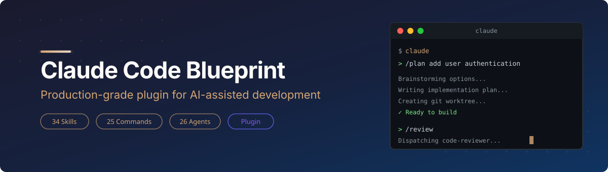
</p>

<p align="center">
  <strong>Production-grade Claude Code plugin for AI-assisted software development</strong>
</p>

<p align="center">
  <a href="#how-does-this-compare">Compare</a> ·
  <a href="#whats-new-in-v30--plugin-mode">What's New</a> ·
  <a href="#quick-start">Quick Start</a> ·
  <a href="#what-you-get">What You Get</a> ·
  <a href="#workflow">Workflow</a> ·
  <a href="#autonomous-pipeline-ship">Ship</a> ·
  <a href="#agent-teams--swarms">Agent Teams</a> ·
  <a href="#skills-reference">Skills</a> ·
  <a href="#agents-reference">Agents</a> ·
  <a href="#commands-reference">Commands</a> ·
  <a href="#customization">Customization</a> ·
  <a href="#error-recovery">Error Recovery</a>
</p>

---

<p align="center">
  
</p>

## Why This Template?

Most AI coding sessions start from scratch: no conventions, no memory, no workflow. Each session reinvents the wheel. This template fixes that.

It gives Claude Code a **structured operating system** — a set of skills, agents, commands, and documentation patterns that compound across sessions. The result: higher quality code, fewer regressions, and a codebase that gets easier to work on over time.

**The core philosophy:**

> *Each unit of engineering work should make subsequent units easier — not harder.*

## How Does This Compare?

Before committing to any tool, it helps to understand the landscape. We've analyzed **16 repos and frameworks** across the Claude Code ecosystem — over 320K combined GitHub stars — through direct source code inspection, not marketing claims.

<p align="center">
  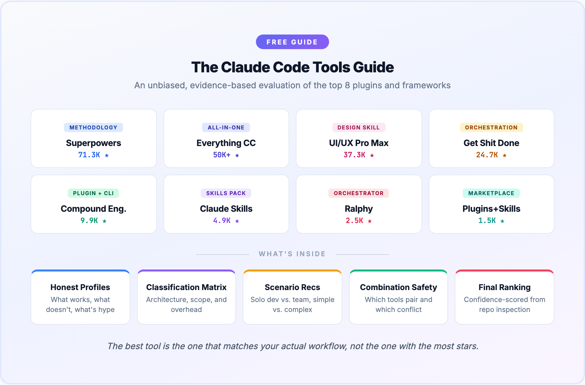
</p>

**[Download the free ecosystem guide (PDF)](ebook/claude-code-tools-guide.pdf)** — covers tool profiles, classification matrices, scenario-based recommendations, combination safety, and confidence-scored final rankings.

> *The best tool is the one that matches your actual workflow, not the one with the most stars.*

## Latest: Ecosystem-Wide Analysis

Every component in Blueprint is informed by what works (and what doesn't) across the broader ecosystem. We analyze repos at the source code level — reading implementation, not just READMEs — and either absorb the best patterns into existing skills and agents, or document exactly why we rejected them.

| Repo / Tool | Stars | Verdict | What We Took |
|---|---|---|---|
| [**gstack**](https://github.com/garrytan/gstack) | 22K | **15 patterns** | Suppressions lists, premise challenge, AI slop detection, confidence tiering, WTF-likelihood scoring |
| [**GSD**](https://github.com/gsd-build/get-shit-done) | 24.7K | **4 patterns** | Interface context in plans, prompt injection guard hook, stub tracking, verification commands |
| [**GSD-2**](https://github.com/gsd-build/gsd-2) | KB | **6 patterns** | Error classification fast-path, degradation detection, structured escalation, assumption tracking |
| [**Anthropic skill-creator**](https://github.com/anthropics/skills) | Official | **3 concepts** | Description trigger testing, structured assertions, iteration strategy by skill type |
| [**Superpowers**](https://github.com/obra/superpowers) | 71K | Patterns adopted | Anti-rationalization guards, TDD quality gates |
| [**Compound Eng.**](https://github.com/EveryInc/compound-engineering-plugin) | 9.9K | Patterns adopted | Parallel review swarm architecture, agent tool restrictions |
| [**Ralphy**](https://github.com/michaelshimeles/ralphy) | 2.5K | Pattern adopted | External bash loop for context-exhaustion recovery |
| [**Ralph**](https://github.com/snarktank/ralph) | 13.5K | Pattern adopted | Original autonomous agent loop that inspired the external ship loop |
| [**claude-mem**](https://github.com/thedotmack/claude-mem) | 39.7K | **Import nothing** | Exhaustive capture conflicts with selective curation philosophy |
| [**claude-squad**](https://github.com/smtg-ai/claude-squad) | 6.5K | **Import nothing** | External process manager — our internal agent approach is strictly more powerful |
| [**OpenCLI**](https://github.com/jackwener/opencli) | v1.3 | **Import nothing** | Browser automation tool — completely different problem domain |
| [**Everything CC**](https://github.com/affaan-m/everything-claude-code) | 50K+ | Reference | Security-first approach, 992 tests |
| [**UI/UX Pro Max**](https://github.com/nextlevelbuilder/ui-ux-pro-max-skill) | 37K | Reference | 100+ reasoning rules |
| [**Claude Skills**](https://github.com/alirezarezvani/claude-skills) | 4.9K | Reference | Progressive disclosure |
| [**Plugins+Skills**](https://github.com/jeremylongshore/claude-code-plugins-plus-skills) | 1.5K | Reference | Community patterns |
| [**oh-my-claudecode**](https://github.com/Yeachan-Heo/oh-my-claudecode) | 21.9K | **3 patterns** | Evidence hierarchy for debugging, ambiguity gating for requirements, deslop pass for AI text cleanup |
| **Multi-Agent Framework** | Doc | **3 patterns** | Worker failure protocol, contradiction resolution, structured escalation |

> **"Import nothing" is a feature, not a failure.** The gravitational pull to adopt *something* from impressive repos is a real bias. Sometimes the right answer after deep analysis is to change nothing — and documenting why is just as valuable as documenting what you imported.

### What's New in v3.0 — Plugin Mode

**Blueprint is now a native Claude Code plugin.** Install once, available in every project — zero engine files in your git history.

```
/plugin marketplace add Ninety2UA/claude-code-blueprint
/plugin install claude-code-blueprint
```

**Key changes:**
- **Plugin architecture** — 26 commands, 34 skills, 26 agents, 6 hooks provided by the plugin, not copied into your project
- **`/start` scaffolding** — project files (CLAUDE.md, docs/, BACKLOG.md) created on demand per project
- **`/migrate-to-plugin`** — new command to transition v2.x projects to plugin mode
- **Cross-references use Skill tool** — commands invoke skills by name instead of reading file paths (required by Claude Code's sandbox)
- **Legacy mode preserved** — `--legacy` flag in install.sh for users who prefer in-project files

### What was new in v2.3

The v2.3 release added **5 new repos** to the analysis and incorporated patterns from two previously-analyzed ones:

- **GSD** (24.7K ★) — 82K-line meta-prompting framework. Imported interface context extraction for plans, a prompt injection guard hook, stub tracking, and verification command guidelines. Rejected the Node.js CLI layer and milestone lifecycle.
- **Anthropic skill-creator** (Official) — Anthropic's own skill factory. Imported description trigger testing, structured assertions, and iteration strategy by skill type. Rejected the blind-comparison eval agents and Python scripting layer.
- **claude-mem** (39.7K ★) — Automatic memory via observer agent + SQLite + ChromaDB. Analyzed in depth, deliberately rejected — exhaustive capture conflicts with Blueprint's selective curation philosophy.
- **claude-squad** (6.5K ★) — Go tmux multiplexer for parallel agents. Analyzed in depth, deliberately rejected — external process manager at the wrong abstraction layer.
- **OpenCLI** (v1.3) — Browser automation CLI via Chrome session reuse. Analyzed in depth, deliberately rejected — completely different problem domain (web scraping, not agent orchestration).
- **Multi-Agent Framework** (conceptual doc) — Hybrid multi-model coordination (Claude + Gemini + Codex). Absorbed worker failure protocol for team-lead, contradiction resolution for synthesizer, and structured escalation format. Rejected multi-model delegation and file-based coordination.
- **gstack** (22K ★) — 15 patterns absorbed including suppressions lists, premise challenge, AI slop detection, and WTF-likelihood risk scoring. See details below.

<details>
<summary><strong>gstack (22K ★) — 15 patterns absorbed</strong></summary>

Fifteen patterns from [gstack](https://github.com/garrytan/gstack) (Garry Tan's "software factory" — 13 role-based skills turning Claude Code into a virtual engineering team) incorporated into existing skills and agents:

**Applied:**

- **Suppressions lists for all reviewer agents** — explicit "DO NOT flag" sections prevent false positives that erode trust. Each reviewer agent now has a calibrated suppressions list (redundancy that aids readability, thresholds that rot as comments, assertions already sufficient, anything already fixed in the diff)
- **Review checklist patterns** — production-battle-tested detection patterns absorbed into relevant agents: TOCTOU races, `find_or_create_by` without unique index, LLM output trust boundaries, enum completeness traced through ALL consumers (reading code outside the diff), time window mismatches, type coercion at serialization boundaries, crypto entropy issues
- **Completeness Principle ("Boil the Lake")** — AI compresses implementation time 10-100x, so the marginal cost of completeness is near-zero. Always prefer the complete implementation. Dual-scale effort estimation (human time vs AI time) embedded in team-lead agent decisions
- **AskUserQuestion format standardization** — consistent 4-step format across agents: re-ground (project + branch), simplify (plain language), recommend with WHY, lettered options with dual effort scales
- **WTF-Likelihood risk scoring** — additive risk score complementing circuit breakers: reverts (+15%), multi-file fixes (+5%), volume after 15 fixes (+1% each), touching unrelated files (+20%). Stops at 20% threshold with 50-change hard cap
- **Premise Challenge + Scope Modes** — brainstorming skill now challenges WHAT to build before planning HOW. Four scope modes: Expansion, Selective Expansion, Hold Scope, Reduction
- **AI Slop detection patterns** — frontend-reviewer now detects telltale AI-generated UI: purple gradients, 3-column icon grids, center-aligned everything, uniform border-radius, generic hero copy. Confidence tiers (HIGH/MEDIUM/LOW) with different actions
- **Confidence tiering in findings synthesis** — findings-synthesizer tags each finding as [HIGH], [MEDIUM], or [LOW] confidence. LOW-confidence findings go in a separate "Verify Manually" section
- **Shadow path tracing** — writing-plans skill traces four paths for every data flow: happy, nil, empty, and error. Unhandled paths become explicit plan tasks
- **Error/Rescue Map** — writing-plans skill requires failure mode tables for every external call
- **Test Coverage Audit patterns** — codepath tracing with quality stars (★★★/★★/★), user flow coverage alongside code path coverage

**Prompt techniques:**

- **Mode commitment** — "Once selected, commit fully. Do not silently drift."
- **Explicit anti-patterns** — negative examples steer model behavior more effectively than positive instructions alone
- **"Never stop for X, only stop for Y"** — explicit lists eliminate ambiguity in autonomous workflows
- **Diagram forcing** — mandatory ASCII diagrams for non-trivial data flows
- **Dual-scale effort** — every effort estimate shows both human team time and AI-assisted time

All patterns woven into existing agents ([security-sentinel](plugins/claude-code-blueprint/agents/security-sentinel.md), [performance-oracle](plugins/claude-code-blueprint/agents/performance-oracle.md), [data-integrity-guardian](plugins/claude-code-blueprint/agents/data-integrity-guardian.md), [code-reviewer](plugins/claude-code-blueprint/agents/code-reviewer.md), [frontend-reviewer](plugins/claude-code-blueprint/agents/frontend-reviewer.md), [findings-synthesizer](plugins/claude-code-blueprint/agents/findings-synthesizer.md), [team-lead](plugins/claude-code-blueprint/agents/team-lead.md)) and skills ([autonomous-loop](plugins/claude-code-blueprint/skills/autonomous-loop/), [brainstorming](plugins/claude-code-blueprint/skills/brainstorming/), [writing-plans](plugins/claude-code-blueprint/skills/writing-plans/)) — no new files were added.

</details>

<details>
<summary><strong>GSD (24.7K ★) — 4 patterns absorbed</strong></summary>

Analyzed [GSD](https://github.com/gsd-build/get-shit-done) — an 82K-line meta-prompting framework with milestone lifecycle, 44 commands, 46 workflows, 16 agents, and a Node.js CLI layer. Key architectural difference: GSD invests in runtime tooling (state management, config, frontmatter CRUD); Blueprint stays zero-dependency markdown-only.

**Imported:**

- **Interface context extraction in plans** — embed types/interfaces from the codebase directly into plans so parallel executors don't waste context exploring the codebase. Highest-value single import — plans are prompts, not documents that become prompts
- **Prompt injection guard hook** — PreToolUse advisory scan for injection patterns and invisible Unicode in docs/ writes ([prompt-guard.js](plugins/claude-code-blueprint/hooks/handlers/prompt-guard.js))
- **Deviation scope boundary + stub tracking** — only auto-fix issues caused by the current task (3-attempt limit); post-execution scan for hardcoded empty values and placeholder text
- **Verification command guideline** — every plan step includes a runnable verification command, not "it works"

**Rejected:** Multi-runtime support (wrong layer), Node.js CLI layer (different architecture), milestone lifecycle (our pipelines suffice), model profiles (per-agent frontmatter is enough), file locking (not needed for our model).

</details>

<details>
<summary><strong>Anthropic Skill-Creator — 3 concepts absorbed</strong></summary>

Analyzed Anthropic's official skill-creator (`github.com/anthropics/skills`) — a skill factory with 3 blind-comparison eval agents, 8 Python scripts, 7 JSON schemas, and HTML eval viewers. Our system is a skill workshop: TDD-driven, pressure-tested, rationalization-resistant.

**Imported:**

- **Description trigger testing** — generate 20 should/shouldn't-trigger queries and iterate on the description string. Fills a gap in our testing methodology
- **Structured assertions** — define specific pass/fail criteria per test instead of freeform "document behavior", making testing quantitative
- **Iteration strategy by skill type** — discipline skills need loophole-closing, technique skills need metaphor reframing, reference skills need organization iteration

**Rejected:** Blind comparison agents, Python scripts, JSON benchmark schemas — factory tooling that adds marginal value over our TDD approach and brings Python dependencies.

</details>

<details>
<summary><strong>GSD-2 Knowledge Base — 6 patterns absorbed</strong></summary>

Six agent-building patterns from the GSD-2 knowledge base ("Building Coding Agents" — synthesized from Claude, GPT, Gemini, Grok):

- **Error classification with fast-path debugging** — syntax errors skip the full 4-phase debugging process; flaky tests are quarantined
- **Degradation detection** — rising difficulty and hot-file signals catch soft deterioration that hard-stall circuit breakers miss
- **Structured escalation format** — 4-part escalation output (what failed, tried, suspected, needed)
- **Assumption tracking** — `### Assumptions` convention with `[cascading]` flags
- **False-positive filtering** — review synthesis includes verification step and "Discarded" section
- **"Never summarize summaries"** — session wraps regenerate from source of truth, preventing drift

</details>

<details>
<summary><strong>Multi-Agent Framework — 3 patterns absorbed</strong></summary>

Analyzed a hybrid multi-model coordination framework (Claude Code as lead + Gemini CLI + Codex CLI). File-based shared state, phased waterfall lifecycle, parallel review with complementary focus split. Key architectural difference: framework optimizes for model diversity (heterogeneous agents via CLI); Blueprint optimizes for prompt diversity (homogeneous agents via native subagents).

**Imported:**

- **Worker failure protocol for team-lead** — retry once with reduced scope → skip and continue → report all skipped tasks. Prevents a single worker failure from stalling the entire pipeline
- **Contradiction resolution rules for findings-synthesizer** — 4-step protocol: same problem → more specific fix; different problems → address both; genuine contradiction → conservative position wins + log reasoning; one approves one flags → flag wins
- **Structured escalation format for iterative-refinement** — when convergence fails, present "both perspectives + my recommendation" with lettered options instead of a flat findings list

**Rejected:** Multi-model delegation via CLI (fragile, adds dependencies, loses native tool access), file-based coordination protocol (I/O overhead unnecessary for same-model systems), assignment heuristic matrix (designed for heterogeneous agents), Phase 0 whole-repo analysis (our 5-agent research swarm is more thorough), CONTRACTS.md (GSD import of interface context extraction is fresher), attribution changelog (git blame already handles this), research skip conditions (already covered by `/quick` and session awareness).

</details>

<details>
<summary><strong>oh-my-claudecode (21.9K ★) — 3 patterns absorbed</strong></summary>

Analyzed [oh-my-claudecode](https://github.com/Yeachan-Heo/oh-my-claudecode) — a multi-agent orchestration plugin with 20 agents, 38+ skills, magic keyword triggers, multi-AI routing (Claude + Gemini + Codex), and MCP bridge infrastructure. Key architectural difference: OMC is feature-maximalist with heavy tooling dependencies (TypeScript, npm, tmux); Blueprint is rigor-maximalist with zero dependencies. 17 OMC features were already covered by our system, 7 were interesting but not needed, 2 were rejected.

**Imported:**

- **Evidence hierarchy for systematic-debugging** — 6-tier credibility ranking (direct reproduction > reproduction script > logs/traces > converging sources > code-path inference > speculation). Prevents treating speculation as fact. Cross-referenced in findings-synthesizer confidence tiering
- **Ambiguity gating for pipeline entry** — dimension-weighted requirement scoring (scope 40%, constraints 30%, criteria 30%) with 0.8 clarity threshold. Gates `/ship` Stage 1 and `/build` Stage 1. Brownfield variant adds context clarity at 15%
- **Deslop pass for iterative-refinement** — pre-review cleaning step targeting AI text patterns (over-hedged language, filler transitions, restating-the-obvious comments, redundant type annotations). Step 0.5 in iterative-refinement, referenced from autonomous-loop Step 7

**Rejected:** Multi-AI routing (unpredictable cross-model behavior, already rejected in multi-agent framework analysis), MCP bridge + LSP + AST integration (environment-level tool, breaks zero-dependency guarantee), magic keywords (semantic landmines that conflict with project names), `.omc/` state directory (fragments state across three locations), Deep Interview mode (target users know what to build), notification routing (infrastructure-layer concern), Ralplan consensus planning (analysis paralysis risk — plan-checker is sufficient).

</details>

<details>
<summary><strong>Analyzed & Deliberately Rejected — claude-mem, claude-squad, OpenCLI</strong></summary>

Not every analysis leads to adoption. These three repos were analyzed in depth and rejected with documented rationale:

- **claude-mem** (39.7K ★) — Automatic memory via observer agent + SQLite + ChromaDB. Uses exhaustive capture + AI compression. Blueprint uses selective curation — different philosophies for different goals. Three initially-proposed improvements all collapsed under scrutiny: session-end memory prompt risks over-saving, richer descriptions conflict with the 200-line cap, self-documenting headers duplicate system prompt instructions.

- **claude-squad** (6.5K ★) — Go tmux multiplexer for parallel Claude Code instances. Operates at a fundamentally different abstraction layer — an external process manager that treats agents as black boxes via terminal scraping. Blueprint's internal approach with native tool access is strictly more powerful.

- **OpenCLI** (v1.3, TypeScript) — Turns websites into CLI commands via browser automation and Chrome session reuse. Well-engineered but solves a completely different problem at a completely different layer. Zero architectural overlap with agent orchestration.

</details>

## Quick Start

### Install as a Claude Code plugin

Inside any Claude Code session:

```
/plugin marketplace add Ninety2UA/claude-code-blueprint
/plugin install claude-code-blueprint
```

That's it — the blueprint is now available in **all your projects**. No per-project files cluttering your git history.

### Set up a project

```bash
claude          # Start Claude Code — plugin loads automatically
> /start        # Scaffolds project files (CLAUDE.md, docs/) + interactive setup
> /planning     # Brainstorm and plan your first feature
```

### Alternative: one-line install via script

```bash
curl -fsSL https://raw.githubusercontent.com/Ninety2UA/claude-code-blueprint/main/install.sh | bash
```

### Legacy mode (copy all files into project)

```bash
curl -fsSL https://raw.githubusercontent.com/Ninety2UA/claude-code-blueprint/main/install.sh | bash -s -- --legacy /path/to/your/project
```

### Update to latest version

Inside any Claude Code session:

```
/update
```

Clones the latest from GitHub, updates the plugin cache, and reports what changed. All projects get the update automatically — restart your session to use the new version.

### Migrate from v2.x

Already using the blueprint with in-project files? Install the plugin, then run `/migrate-to-plugin` to remove the in-project engine files.

## What You Get

<p align="center">
  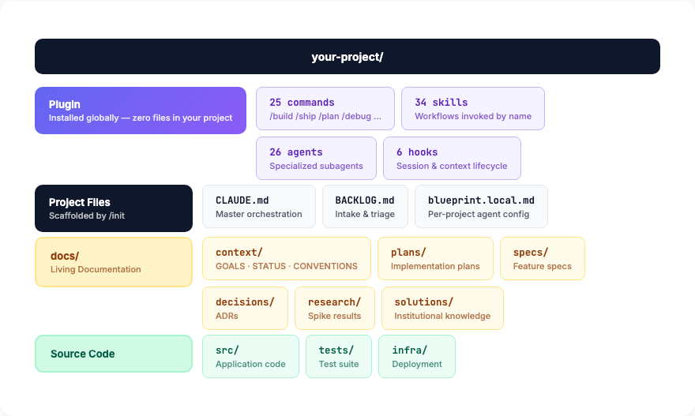
</p>

### Project structure

```
Plugin (installed globally, zero files in your project)
├── 26 commands          /planning, /ship, /build, /review-swarm, /orchestrate, /team, ...
├── 34 skills            TDD, wave-orchestration, swarms, iterative-refinement, ...
├── 26 agents            team-lead, reviewer, security, perf, ...
└── 6 hooks              session-start, context-monitor, prompt-guard, ship-loop + 2 Agent Teams

your-project/ (scaffolded by /start)
├── docs/
│   ├── context/        # GOALS.md · STATUS.md · CONVENTIONS.md
│   ├── plans/          # Implementation plans
│   ├── specs/          # Feature specifications
│   ├── decisions/      # Architecture Decision Records
│   ├── research/       # Spike results & evaluations
│   └── solutions/      # Institutional knowledge (created by /compound)
├── src/                # Your application code
├── tests/              # Your test suite
├── infra/              # Deployment & infrastructure
├── CLAUDE.md           # Master orchestration — Claude reads this first
├── BACKLOG.md          # Idea & bug capture inbox
└── blueprint.local.md  # Per-project agent config (gitignored)
```

### What each piece does

| Component | Purpose |
|-----------|---------|
| **CLAUDE.md** | Master configuration that Claude reads at session start. Contains behavioral rules, session continuity, agent team hierarchy, skill triggers, and project-specific learnings. |
| **Skills** | Workflow modules that activate at specific points — TDD, debugging, code review, wave orchestration, swarm coordination, knowledge compounding. They enforce quality gates automatically. |
| **Agents** | Specialized subprocesses dispatched for focused analysis — security audits, performance reviews, architecture evaluation. Organized into teams (review swarm, research swarm, execution waves). Each gets a fresh 200K context. |
| **Commands** | User-facing slash commands (`/planning`, `/review-swarm`, `/orchestrate`, `/compound`) that invoke the right skills with the right context. |
| **docs/context/** | Living project state — goals, current status, conventions, execution state. Updated every session by `/wrap`. |
| **docs/solutions/** | Institutional knowledge — solved problems documented by `/compound` and searched by `/planning` before future work. |
| **BACKLOG.md** | Quick-capture inbox for ideas, bugs, and tasks. Triaged by `/backlog` into prioritized work. |
| **blueprint.local.md** | Per-project agent configuration — choose which review/research agents are relevant for your tech stack. Gitignored so each developer can customize. |

## Workflow

<p align="center">
  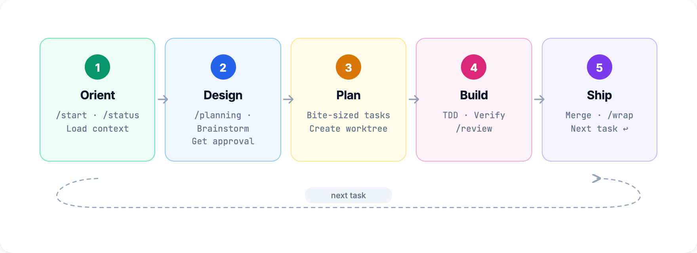
</p>

### The development loop

Every feature follows this flow:

<p align="center">
  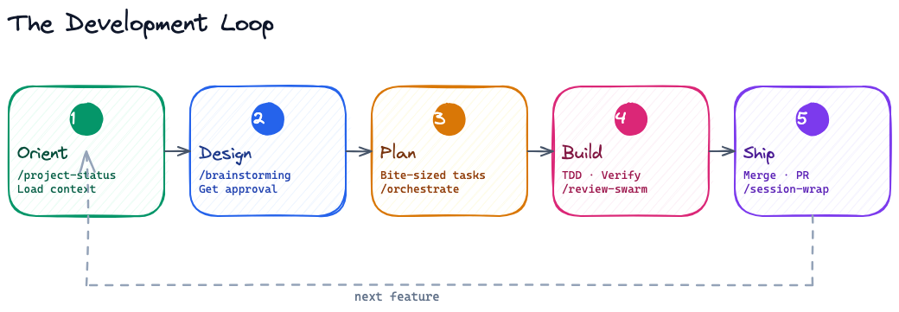
</p>

**1. Orient** — Load context with `/status` or set up with `/start`

**2. Design** — Brainstorm options with `/planning`. Present tradeoffs. Get human approval before any code is written.

**3. Plan** — Break approved design into bite-sized tasks (2-5 min each) with exact file paths, code snippets, and test strategies.

**4. Build** — Execute using TDD (red-green-refactor). Verify with evidence. Dispatch code review agents.

**5. Ship** — Merge the branch. Update all documentation with `/wrap`. Capture learnings for next session.

### Lightweight workflow for small changes

Not everything needs the full 5-step flow. Bug fixes with obvious root causes, typo fixes, config changes, and adding tests for existing behavior can use a shortcut:

<p align="center">
  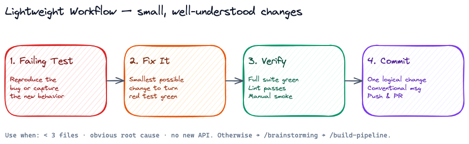
</p>

The boundary is clear: if you're touching 4+ files, adding a new API, or unsure of the approach, use the full workflow. See CLAUDE.md for the complete criteria.

### Autonomous pipeline: `/ship`

<p align="center">
  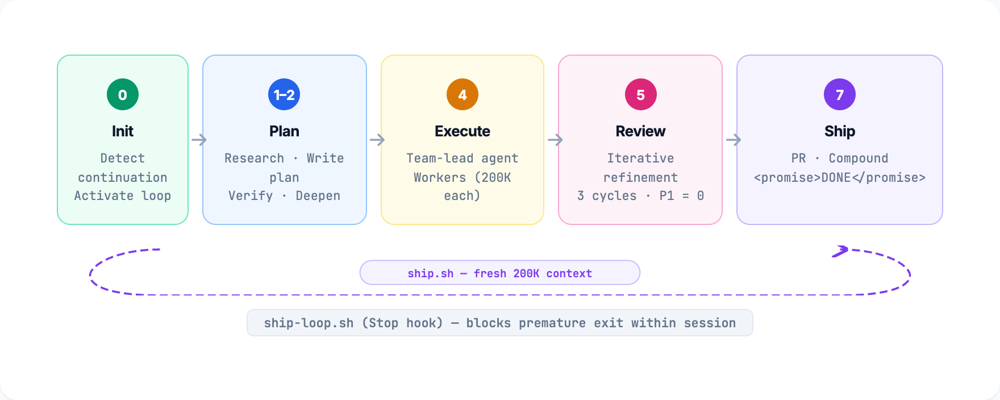
</p>

For well-defined features you want to fire and forget, `/ship` runs the entire development lifecycle autonomously — zero checkpoints, zero user input. It plans, researches, executes via a dedicated team-lead agent, iteratively reviews (3 cycles by default), and opens a PR.

```bash
# Inside Claude — interactive mode (single session)
> /ship add JWT authentication with refresh tokens

# From terminal — external loop mode (fresh 200K context per iteration)
./scripts/ship.sh "add JWT authentication with refresh tokens" --max 10
```

**Two loop mechanisms handle context exhaustion:**

| Mechanism | Where it runs | Context reset | Purpose |
|-----------|--------------|---------------|---------|
| **`ship-loop.sh`** (Stop hook) | Inside Claude session | No (same session) | Blocks premature exit — Claude gives up too early |
| **`scripts/ship.sh`** (bash loop) | Outside, in terminal | Yes (fresh process) | Handles context exhaustion — spawns fresh 200K per iteration |

The external loop (`ship.sh`) is inspired by [Ralph](https://github.com/snarktank/ralph) — each iteration is a brand new Claude process with clean context. State persists via git commits, plan files, and progress tracking. The inner Stop hook guards against Claude stopping before `<promise>DONE</promise>` is output within a single session.

**Pipeline comparison:**

| Pipeline | Checkpoints | Review | Best for |
|----------|-------------|--------|----------|
| `/build` | Between every stage | Single pass | Human-guided features |
| `/ship` (interactive) | None | 3 iterative cycles | Single-context fire-and-forget |
| `ship.sh` (external) | None | 3 iterative cycles | Large features, context exhaustion |
| `/quick` | None | None | Trivial changes (< 3 files) |

### Quality gates

<p align="center">
  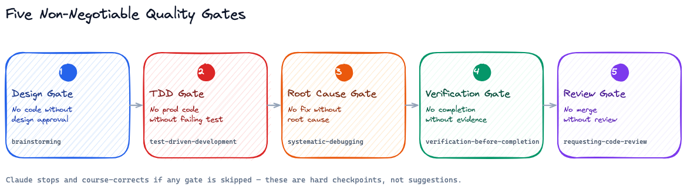
</p>

Five non-negotiable checkpoints enforce quality at every stage:

| Gate | Rule | Enforced By |
|------|------|-------------|
| **1** | No code without design approval | `brainstorming` skill |
| **2** | No production code without a failing test first | `test-driven-development` skill |
| **3** | No fix without root cause investigation | `systematic-debugging` skill |
| **4** | No completion claim without fresh verification evidence | `verification-before-completion` skill |
| **5** | No merge without code review | `requesting-code-review` skill |

These aren't suggestions — they're hard gates. Claude will stop and course-correct if any gate is skipped.

## Agent Teams & Swarms

Agents are organized into coordinated teams for multi-agent workflows. Four orchestration patterns are built in:

### Review Swarm (`/review-swarm`)

Dispatches 6-10 specialized reviewers in parallel, each analyzing the same code from a different angle. A findings-synthesizer merges all results into one prioritized report (P1/P2/P3).

<p align="center">
  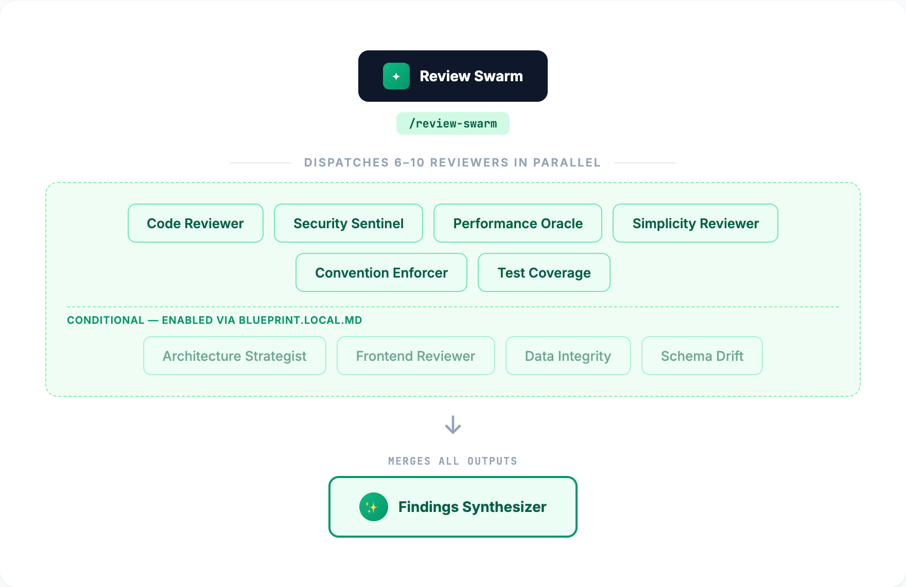
</p>

### Research Swarm (`/deep-research`)

Spawns 5 research agents in parallel before planning, then synthesizes findings into a unified research brief.

<p align="center">
  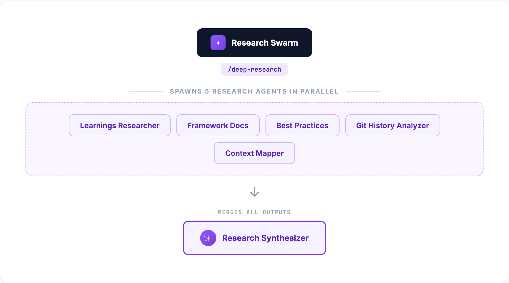
</p>

### Wave Orchestration (`/orchestrate`)

Groups plan tasks by dependency into waves. Independent tasks within each wave run in parallel; an integration-verifier validates between waves.

<p align="center">
  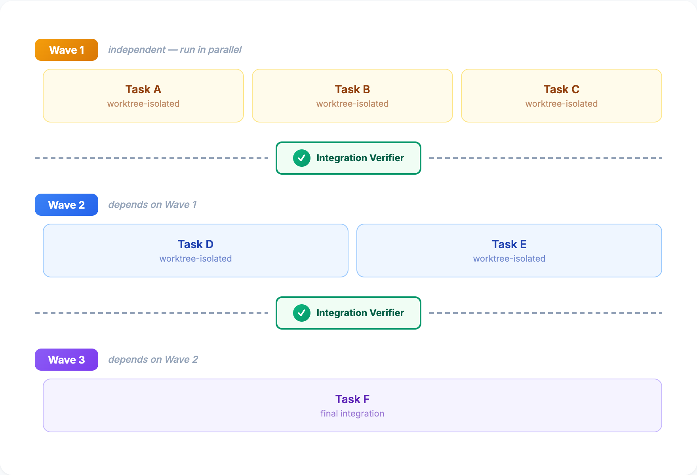
</p>

### Agent Teams (`/team`) — Experimental

For complex multi-file implementations where teammates need to discuss and coordinate, Agent Teams spawns fully independent Claude Code instances with a shared task list and messaging system.

<p align="center">
  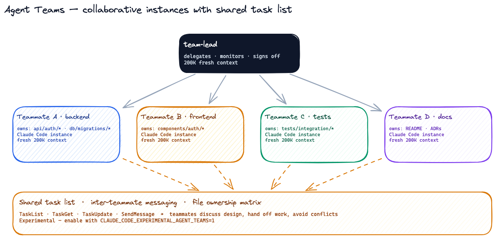
</p>

**When to use which:**

| Pattern | Best For | Key Feature |
|---------|----------|-------------|
| **Swarms** (`/review-swarm`, `/deep-research`) | Parallel analysis — same code, different lenses | Read-only, synthesizer merges outputs |
| **Waves** (`/orchestrate`) | Dependency-ordered implementation | Worktree isolation, integration verification |
| **Agent Teams** (`/team`) | Collaborative multi-file implementation | Shared task list, inter-teammate messaging |

Agent Teams is an experimental Claude Code feature. Enable it with `CLAUDE_CODE_EXPERIMENTAL_AGENT_TEAMS: "1"` in settings.json. The typical workflow combines all patterns: `/deep-research` (swarm) → `/planning` → `/team` (agent teams) → `/review-swarm` (swarm).

### Knowledge Loop (`/compound`)

Each solved problem becomes searchable institutional knowledge. Future `/planning` and `/deep-research` commands automatically consult past solutions.

<p align="center">
  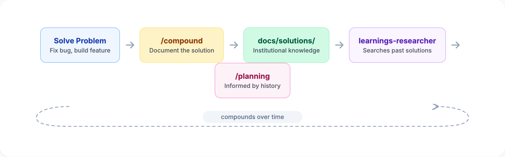
</p>

### Per-Project Configuration

Edit `blueprint.local.md` to enable/disable agents for your stack. No need for Rails reviewers on a Python project.

## Skills Reference

<p align="center">
  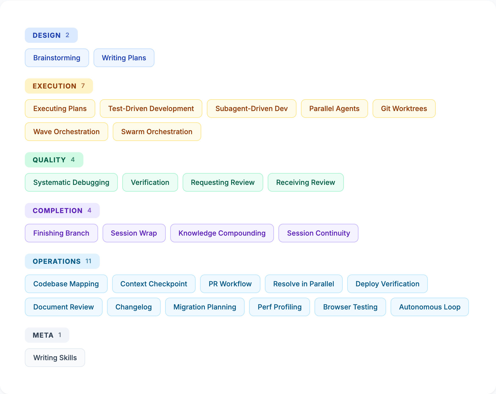
</p>

Skills are workflow modules that activate at specific development phases. They contain detailed instructions, flowcharts, and examples that guide Claude through each step.

### Design phase

| Skill | What it does | Trigger |
|-------|-------------|---------|
| [**brainstorming**](plugins/claude-code-blueprint/skills/brainstorming/) | Explores 3+ design options with tradeoff analysis before any creative work | `/planning` or before any new feature |
| [**writing-plans**](plugins/claude-code-blueprint/skills/writing-plans/) | Converts approved design into implementation plan with bite-sized tasks | After design approval |
| [**spike-exploration**](plugins/claude-code-blueprint/skills/spike-exploration/) | Timeboxed investigation to answer a specific technical question before committing to an approach | Significant technical uncertainty |
| [**scope-cutting**](plugins/claude-code-blueprint/skills/scope-cutting/) | Systematically separates must-haves from nice-to-haves using MoSCoW classification | Feature too large or deadline at risk |

### Execution phase

| Skill | What it does | Trigger |
|-------|-------------|---------|
| [**executing-plans**](plugins/claude-code-blueprint/skills/executing-plans/) | Executes plans in batches with review checkpoints. Tracks assumptions with `[cascading]` impact flags | Separate session from planning |
| [**test-driven-development**](plugins/claude-code-blueprint/skills/test-driven-development/) | Enforces red-green-refactor for all code changes | Before any code implementation |
| [**subagent-driven-development**](plugins/claude-code-blueprint/skills/subagent-driven-development/) | Dispatches fresh subagent per task with two-stage review | In-session plan execution |
| [**dispatching-parallel-agents**](plugins/claude-code-blueprint/skills/dispatching-parallel-agents/) | Runs independent investigations concurrently | 2+ independent failure domains |
| [**using-git-worktrees**](plugins/claude-code-blueprint/skills/using-git-worktrees/) | Creates isolated git workspace for feature work | Before major features |

### Quality phase

| Skill | What it does | Trigger |
|-------|-------------|---------|
| [**systematic-debugging**](plugins/claude-code-blueprint/skills/systematic-debugging/) | Root cause investigation before any fix is attempted. Step 0 error classification fast-paths syntax errors and quarantines flaky tests | Any bug or test failure |
| [**verification-before-completion**](plugins/claude-code-blueprint/skills/verification-before-completion/) | Requires fresh evidence before claiming work is done | Before any success claim |
| [**requesting-code-review**](plugins/claude-code-blueprint/skills/requesting-code-review/) | Dispatches code-reviewer agent for automated review | After completing a task |
| [**receiving-code-review**](plugins/claude-code-blueprint/skills/receiving-code-review/) | Evaluates review feedback technically, not defensively | When review feedback arrives |

### Completion phase

| Skill | What it does | Trigger |
|-------|-------------|---------|
| [**finishing-a-development-branch**](plugins/claude-code-blueprint/skills/finishing-a-development-branch/) | Structured merge workflow with options for squash, rebase, or merge | After all tests pass |
| [**session-wrap**](plugins/claude-code-blueprint/skills/session-wrap/) | Documents work done, updates all project docs, captures learnings. Regenerates from source of truth — never summarizes previous summaries | `/wrap` or end of session |

### Operations phase

| Skill | What it does | Trigger |
|-------|-------------|---------|
| [**codebase-mapping**](plugins/claude-code-blueprint/skills/codebase-mapping/) | Maps unfamiliar codebase into structured documentation | `/map` or before modifying unfamiliar code |
| [**context-checkpoint**](plugins/claude-code-blueprint/skills/context-checkpoint/) | Mid-session state capture — lighter than `/wrap` | `/pause` or before risky operations |
| [**pr-workflow**](plugins/claude-code-blueprint/skills/pr-workflow/) | End-to-end PR lifecycle — create, self-review, handle feedback | `/pr` or when creating pull requests |
| [**resolve-in-parallel**](plugins/claude-code-blueprint/skills/resolve-in-parallel/) | Batch-resolves independent items concurrently | 2+ independent items to fix |
| [**deployment-verification**](plugins/claude-code-blueprint/skills/deployment-verification/) | Go/no-go pre-deploy checklist across 8 areas | Before any production deployment |
| [**document-review**](plugins/claude-code-blueprint/skills/document-review/) | Structured three-pass critique (accuracy, clarity, completeness) | When reviewing specs, plans, or docs |
| [**changelog-generation**](plugins/claude-code-blueprint/skills/changelog-generation/) | Release notes from git history in Keep a Changelog format | `/changelog` or preparing a release |
| [**migration-planning**](plugins/claude-code-blueprint/skills/migration-planning/) | Safe migration plans with rollback procedures | Database/API/dependency migrations |
| [**performance-profiling**](plugins/claude-code-blueprint/skills/performance-profiling/) | Profile-driven investigation — measure before optimizing | When something is "slow" |
| [**browser-testing**](plugins/claude-code-blueprint/skills/browser-testing/) | Verify UI changes via Playwright MCP browser tools | After UI changes need visual verification |
| [**autonomous-loop**](plugins/claude-code-blueprint/skills/autonomous-loop/) | Iterate through plan tasks with retry, backoff, circuit breaker (3 no-progress / 5 same-error), degradation detection (rising difficulty, hot-file signals), and mandatory Reflection Gate before every retry (3-question self-check enforced by HARD-GATE) | Autonomous plan execution — "just do it all" |
| [**iterative-refinement**](plugins/claude-code-blueprint/skills/iterative-refinement/) | Review→fix→review cycles with 3 convergence modes (fast/deep/perfect), early exit on convergence | `/ship` Stage 5, `/build --iterate N` |
| [**dependency-management**](plugins/claude-code-blueprint/skills/dependency-management/) | Evaluates, adds, upgrades, and removes dependencies with safety gates | Adding, upgrading, or auditing dependencies |

### Orchestration phase

| Skill | What it does | Trigger |
|-------|-------------|---------|
| [**wave-orchestration**](plugins/claude-code-blueprint/skills/wave-orchestration/) | Groups tasks by dependency into waves, parallel within waves, integration verification between | `/orchestrate` or plans with mixed dependencies |
| [**swarm-orchestration**](plugins/claude-code-blueprint/skills/swarm-orchestration/) | Coordinates multiple specialized agents analyzing the same input in parallel | `/review-swarm`, `/deep-research`, or custom swarms |
| [**agent-teams**](plugins/claude-code-blueprint/skills/agent-teams/) | Collaborative multi-file implementation with shared task list and messaging (experimental) | `/team` or complex cross-layer features |
| [**knowledge-compounding**](plugins/claude-code-blueprint/skills/knowledge-compounding/) | Documents solved problems as searchable institutional knowledge in docs/solutions/ | `/compound` or after solving non-trivial problems |
| [**session-continuity**](plugins/claude-code-blueprint/skills/session-continuity/) | Manages STATE.md for execution tracking across session boundaries | `/pause`, `/resume`, or during wave orchestration |

### Meta

| Skill | What it does | Trigger |
|-------|-------------|---------|
| [**writing-skills**](plugins/claude-code-blueprint/skills/writing-skills/) | Creates and tests new skills using TDD for documentation | When creating new skills |

## Agents Reference

<p align="center">
  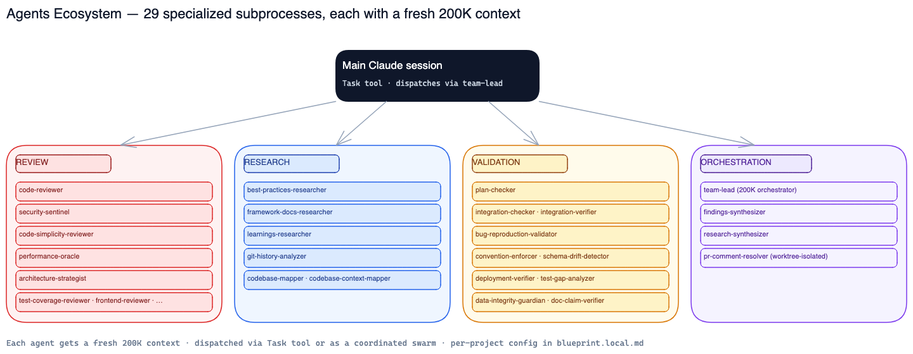
</p>

Agents are specialized subprocesses dispatched via Claude's Task tool. Each agent gets a fresh 200K-token context window focused entirely on its domain.

| Agent | Domain | When to dispatch |
|-------|--------|-----------------|
| [**code-reviewer**](plugins/claude-code-blueprint/agents/code-reviewer.md) | Standards, correctness, plan compliance | After completing a major step or before merge |
| [**architecture-strategist**](plugins/claude-code-blueprint/agents/architecture-strategist.md) | Structural patterns, service boundaries | When reviewing PRs, adding services, refactoring |
| [**security-sentinel**](plugins/claude-code-blueprint/agents/security-sentinel.md) | OWASP, auth flows, vulnerability scanning | Before deployment, after auth/payment/API work |
| [**code-simplicity-reviewer**](plugins/claude-code-blueprint/agents/code-simplicity-reviewer.md) | YAGNI violations, over-engineering | After implementation is complete |
| [**performance-oracle**](plugins/claude-code-blueprint/agents/performance-oracle.md) | Bottlenecks, N+1 queries, algorithmic complexity | After features are built, on performance concerns |
| [**best-practices-researcher**](plugins/claude-code-blueprint/agents/best-practices-researcher.md) | Industry standards, library documentation | When needing external guidance |
| [**git-history-analyzer**](plugins/claude-code-blueprint/agents/git-history-analyzer.md) | Code evolution, pattern archaeology | When understanding why code is the way it is |
| [**learnings-researcher**](plugins/claude-code-blueprint/agents/learnings-researcher.md) | Past solutions, decisions, patterns | Before planning — searches docs/ for prior art |
| [**plan-checker**](plugins/claude-code-blueprint/agents/plan-checker.md) | Plan validation, gap detection | After writing a plan, before execution |
| [**integration-checker**](plugins/claude-code-blueprint/agents/integration-checker.md) | Component wiring, connection validation | After implementation — verifies components connect |
| [**bug-reproduction-validator**](plugins/claude-code-blueprint/agents/bug-reproduction-validator.md) | Bug reproduction, fix verification | When debugging — validates repro steps and fixes |
| [**codebase-mapper**](plugins/claude-code-blueprint/agents/codebase-mapper.md) | Architecture, conventions, stack analysis | Onboarding to unfamiliar code or before modifying it |
| [**pr-comment-resolver**](plugins/claude-code-blueprint/agents/pr-comment-resolver.md) | Targeted PR comment resolution | Processing review feedback — one comment per agent |
| [**test-gap-analyzer**](plugins/claude-code-blueprint/agents/test-gap-analyzer.md) | Coverage gaps, test generation | Improving coverage or before major refactors |
| [**research-synthesizer**](plugins/claude-code-blueprint/agents/research-synthesizer.md) | Multi-agent output consolidation | After parallel research — unifies findings |
| [**deployment-verifier**](plugins/claude-code-blueprint/agents/deployment-verifier.md) | Deployment readiness verification | Before deploying — checks 8 critical areas |
| [**schema-drift-detector**](plugins/claude-code-blueprint/agents/schema-drift-detector.md) | Unrelated schema/migration changes | Reviewing PRs — catches scope creep in data layer |
| [**frontend-reviewer**](plugins/claude-code-blueprint/agents/frontend-reviewer.md) | UI/UX code quality review | Reviewing frontend code — a11y, responsive, perf |
| [**convention-enforcer**](plugins/claude-code-blueprint/agents/convention-enforcer.md) | CONVENTIONS.md compliance checking | Reviewing code against project standards |
| [**data-integrity-guardian**](plugins/claude-code-blueprint/agents/data-integrity-guardian.md) | Migration safety, transactions, rollback plans | PRs with migrations, schema changes, data transforms |
| [**test-coverage-reviewer**](plugins/claude-code-blueprint/agents/test-coverage-reviewer.md) | Test quality, assertion meaningfulness, edge cases | After implementation — verifies tests actually validate behavior |
| [**framework-docs-researcher**](plugins/claude-code-blueprint/agents/framework-docs-researcher.md) | Current framework docs for installed versions | Before planning features that use specific framework APIs |
| [**codebase-context-mapper**](plugins/claude-code-blueprint/agents/codebase-context-mapper.md) | Focused impact map for a specific change | Before planning — maps files and dependencies a change will touch |
| [**integration-verifier**](plugins/claude-code-blueprint/agents/integration-verifier.md) | Cross-task integration verification | After wave completion — ensures parallel implementations work together |
| [**findings-synthesizer**](plugins/claude-code-blueprint/agents/findings-synthesizer.md) | Review swarm output consolidation | After `/review-swarm` — de-duplicates and prioritizes all findings |
| [**team-lead**](plugins/claude-code-blueprint/agents/team-lead.md) | Dedicated orchestrator (200K fresh context) | Coordinates `/orchestrate` and `/team` — delegates to workers, monitors progress, reviews, signs off |

### How agents work

Agents run in isolation with their own 200K context window. They can be dispatched individually or as coordinated swarms:

**Single dispatch** — one agent, one focused job:
```
Main Session → Task("security-sentinel: audit auth endpoints") → findings → act on results
```

**Swarm dispatch** — multiple agents, same input, different lenses:

<p align="center">
  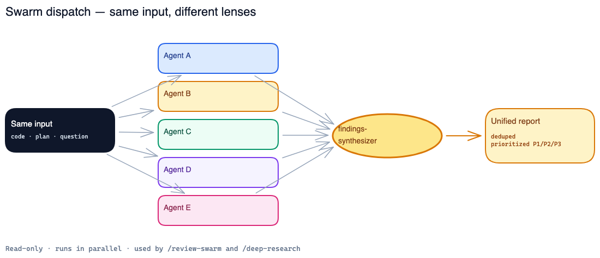
</p>

**Wave dispatch** — parallel within waves, worktree-isolated, sequential between:

<p align="center">
  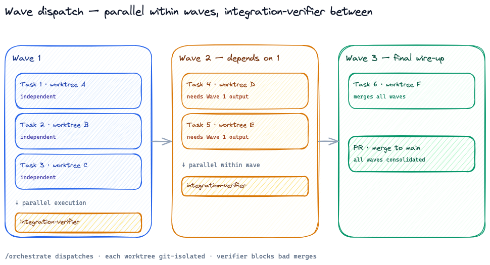
</p>

**Agent team dispatch** — collaborative instances with shared task list:

<p align="center">
  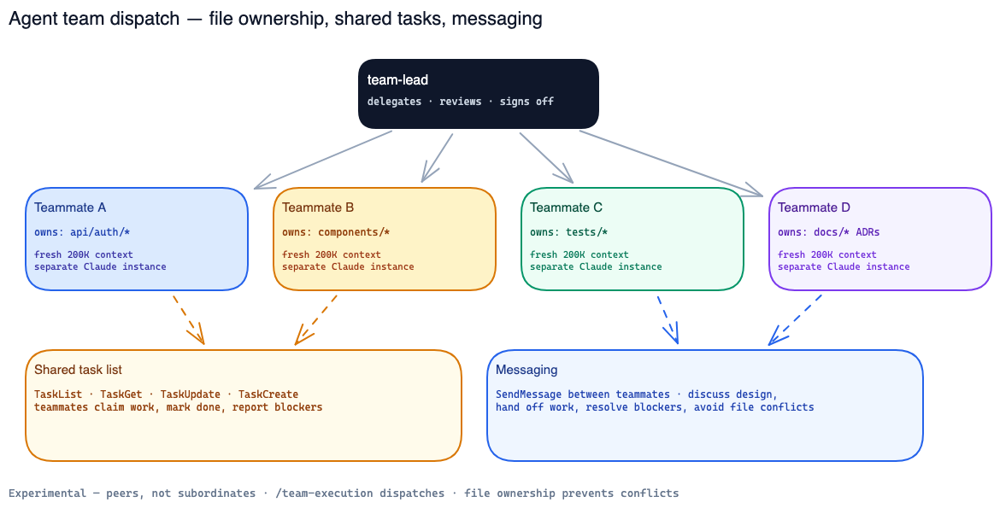
</p>

## Commands Reference

Commands are user-facing shortcuts that invoke the right skills with the right context.

| Command | What it does |
|---------|-------------|
| **`/start`** | Interactive project setup. Fills in CONVENTIONS.md, GOALS.md, STATUS.md through a guided conversation. |
| **`/planning`** | Brainstorming session. Explores design options, presents tradeoffs, gets approval, then creates implementation plan. |
| **`/build`** | Full-cycle supervised pipeline with checkpoints between every stage. Supports `--iterate N` for iterative review and `--team` for team-lead dispatch. |
| **`/ship`** | Fully autonomous pipeline — zero checkpoints, fire-and-forget. Plans, executes via team-lead, iteratively reviews (3 cycles), and opens a PR. |
| **`/discuss`** | Capture decisions before planning. Explores requirements, locks decisions that planners must honor. |
| **`/deepen`** | Enrich an existing plan with parallel research agents. Dispatches all configured researchers in parallel, then merges findings into the plan. |
| **`/review`** | Dispatches code-reviewer agent against your current changes. |
| **`/review-swarm`** | Multi-agent parallel review — dispatches 6-10 specialized reviewers, synthesizes findings into prioritized P1/P2/P3 report. |
| **`/deep-research`** | Multi-agent parallel research — spawns 5 research agents, synthesizes into unified brief for planning. |
| **`/compound`** | Document a solved problem for future reference. Creates searchable entry in docs/solutions/. |
| **`/orchestrate`** | Wave-based parallel execution — groups plan tasks by dependency, runs independent tasks in parallel per wave. |
| **`/team`** | Spawn an Agent Team for collaborative multi-file implementation with shared task list and messaging (experimental). |
| **`/status`** | Shows current project state, goal alignment, blockers, and suggests next actions. |
| **`/debug [issue]`** | Root cause investigation. Gathers evidence, forms hypotheses, tests them systematically. |
| **`/backlog`** | Triages inbox items in BACKLOG.md into prioritized tasks using GOALS.md context. |
| **`/wrap`** | End-of-session documentation. Updates CLAUDE.md session continuity, STATUS.md, and captures learnings. |
| **`/pr`** | Create, manage, or respond to pull requests. Full PR lifecycle. |
| **`/map`** | Map an unfamiliar codebase into structured documentation before modifying it. |
| **`/resume`** | Resume work from where the last session left off. Loads context and orients you. |
| **`/pause`** | Quick mid-session checkpoint. Captures state without full `/wrap`. |
| **`/quick`** | Fast-track a small, well-understood change with TDD and verification gates. |
| **`/changelog`** | Generate release notes from git history using Keep a Changelog format. |
| **`/add-tests`** | Analyze test coverage gaps and generate tests for untested code paths. |
| **`/health`** | Comprehensive project health check — build, tests, lint, deps, conventions, docs, backlog, git. |
| **`/migrate-to-plugin`** | Migrate v2.x in-project files to v3.0 plugin mode. Removes engine files, keeps project state. |
| **`/update`** | Update the blueprint plugin to the latest version from GitHub. Self-service — no reinstall needed. |

### Typical session flow

**Supervised (human in the loop):**
```bash
claude
> /resume                            # Reload context from last session
> /deep-research add OAuth2 login    # Research before planning (5 agents in parallel)
> /planning add OAuth2 login          # Design + plan based on research findings
> /orchestrate                       # Execute with wave-based parallelism
>   # OR: /team                      # Execute with collaborative Agent Team
> /review-swarm                      # Multi-agent review (6-10 reviewers in parallel)
> /compound OAuth2 session handling  # Document the solution for future reference
> /wrap                              # Document everything for next session
```

**Autonomous (fire and forget):**
```bash
# Inside Claude — single session
claude
> /ship add OAuth2 login with JWT refresh tokens --iterations 5

# From terminal — with context-exhaustion recovery
./scripts/ship.sh "add OAuth2 login with JWT refresh tokens" --max 10 --swarm
```

## Customization

### Adapting to your project

After installation, run `/start` to configure:

- **GOALS.md** — Your 3-5 project objectives and priority framework
- **CONVENTIONS.md** — Your tech stack, naming conventions, file structure patterns
- **STATUS.md** — Current project state, known issues, recent work

### Adding your own skills

In plugin mode, skills are provided by the plugin. To add project-specific skills, create them in your project's `.claude/skills/your-skill-name/SKILL.md` (local overrides take precedence). The plugin includes a `writing-skills` skill that uses TDD to create and test new skills:

```bash
claude
> Create a new skill for database migration workflows
# Claude will use the writing-skills skill to:
# 1. Write a failing test scenario
# 2. Create the skill
# 3. Verify it handles the test scenario correctly
```

### Adding your own agents

In plugin mode, agents are provided by the plugin. To add project-specific agents, create them in your project's `.claude/agents/your-agent-name.md`. Create a markdown file with YAML frontmatter and a system prompt:

```markdown
---
name: your-agent-name
description: "When to use this agent. Be specific so Claude knows when to delegate."
model: inherit
tools: [Read, Glob, Grep, Bash]
---

You are a [role] specializing in [domain].

## Process
1. [Step-by-step instructions]

## Output Format
[How findings should be structured]

## Rules
- [Operational guardrails]
```

**Key frontmatter fields:**

| Field | Purpose | Example |
|-------|---------|---------|
| `tools` | Restrict which tools the agent can use (principle of least privilege) | `[Read, Glob, Grep, Bash]` for read-only; add `Edit, Write` for agents that modify code |
| `model` | Override the model (`sonnet`, `opus`, `haiku`, or `inherit`) | `inherit` to use the session's model |
| `isolation` | Set to `worktree` for agents that modify files in parallel | Used by `pr-comment-resolver` |
| `maxTurns` | Limit agentic turns to prevent runaway token consumption | `20` for focused tasks |

### Adjusting quality gates

Quality gates are encoded in the skill files. To relax a gate (e.g., skip code review for docs-only changes), edit the corresponding skill's `SKILL.md` and add your exception criteria.

### Install options

```bash
# Plugin mode (default) — installs plugin for all projects
./install.sh

# Plugin + scaffold a specific project
./install.sh /path/to/project

# Scaffold only (plugin already installed)
./install.sh --scaffold /path/to/project

# Legacy mode — copy all files into project (v2.x behavior)
./install.sh --legacy /path/to/project

# Preview what would be installed
./install.sh --dry-run
```

## Documentation structure

The template includes **example docs** in each category so you can see the expected format immediately. Delete them when you start your project (they're clearly marked as examples).

| Example file | Shows you how to write |
|-------------|----------------------|
| `docs/decisions/001-example-project-structure.md` | Architecture Decision Records |
| `docs/plans/2026-03-04-example-user-auth.md` | Implementation plans with bite-sized tasks |
| `docs/specs/example-csv-export.md` | Feature specifications with acceptance criteria |
| `docs/research/example-jwt-refresh-strategies.md` | Research docs with findings and recommendations |

The `docs/` directory uses four categories, each with its own lifecycle:

| Directory | Contains | Lifecycle |
|-----------|----------|-----------|
| `docs/context/` | GOALS.md, STATUS.md, CONVENTIONS.md | Updated every session |
| `docs/plans/` | `YYYY-MM-DD-topic.md` implementation plans | Created per feature, archived when done |
| `docs/specs/` | `feature-name.md` specifications | Created before building, stable after approval |
| `docs/decisions/` | `NNN-kebab-case-title.md` ADRs | Created when choosing between options, permanent |
| `docs/research/` | Spike results, tool evaluations | Created during exploration, referenced later |
| `docs/solutions/` | Solved problems, institutional knowledge | Created by `/compound`, searched by `/planning` and `/deep-research` |

## How it works under the hood

### Context loading order

When Claude starts a session, it loads context in this order:

1. **CLAUDE.md** — Behavioral rules, session continuity, agent team hierarchy, skill/agent dispatch tables
2. **docs/context/STATUS.md** — What happened recently, what's in flight
3. **docs/context/STATE.md** — Execution state for resuming in-progress work (wave progress, task completion)
4. **docs/context/GOALS.md** — What we're trying to achieve
5. **docs/context/CONVENTIONS.md** — How we write code here
6. **BACKLOG.md** — What's waiting to be done
7. **docs/solutions/** — Institutional knowledge searched before planning
8. **blueprint.local.md** — Per-project agent configuration
9. **Skills** — Activated contextually based on what's happening
10. **Agents** — Dispatched on-demand for focused analysis (individually or as swarms)

### Context window management

Large features can exhaust Claude's context window. The template has layered defenses:

| Layer | Mechanism | What it does |
|-------|-----------|-------------|
| **Prevention** | Subagent isolation | Each agent gets fresh 200K context; main session only sees results |
| **Detection** | `context-monitor.js` (PostToolUse hook) | Warns at 150 tool calls, escalates at 200, detects analysis paralysis at 8+ consecutive reads |
| **Inner guard** | `ship-loop.sh` (Stop hook) | Blocks premature exit within a session — re-injects the prompt (max 5 retries) |
| **Outer loop** | `scripts/ship.sh` (bash) | Spawns fresh Claude process per iteration — true context reset (max 10, configurable) |
| **Circuit breakers** | `autonomous-loop` skill | Stops after 3 no-progress iterations or 5 identical errors. Degradation detection catches rising difficulty and hot-file churn before hard stalls. Mandatory Reflection Gate before every retry forces agents to verbalize what failed and confirm a different approach |

The inner guard and outer loop solve different problems: the Stop hook catches Claude quitting early (same session, growing context), while the external bash loop handles genuine context exhaustion (fresh 200K per iteration, state persists via git).

### Session continuity

The `Session Continuity` section in CLAUDE.md acts as a handoff note between sessions:

```markdown
## Session Continuity

**Last session:** 2026-03-04

**What was done:**
- Implemented JWT refresh token rotation
- Added rate limiting middleware
- Fixed Safari redirect loop (root cause: SameSite cookie attribute)

**What's remaining:**
- Integration tests for token refresh edge cases
- Load testing the rate limiter

**Start here:** Run the failing integration tests in tests/auth/refresh.test.ts

**Current state of the code:**
- Build: passing
- Tests: 2 failing (expected — the ones we need to write)
- Uncommitted changes: none
```

This is updated automatically by `/wrap` at the end of each session.

## Error recovery

CLAUDE.md includes built-in guidance for common failure scenarios:

| Situation | Recovery |
|-----------|----------|
| Test fails after code change | Don't iterate blindly — use `systematic-debugging` skill |
| Merge conflict | Read both sides, understand intent, then resolve |
| Broken build after dep update | Pin previous version, BACKLOG the upgrade |
| Corrupted worktree | Create fresh from main, cherry-pick completed commits |
| Agent returns bad results | Verify findings manually before acting |
| Lost uncommitted changes | Check `git stash list`, `git reflog`, `git fsck --lost-found` |

## FAQ

<details>
<summary><strong>Can I use this with an existing project?</strong></summary>

Yes. In plugin mode (default), the blueprint installs as a plugin — it adds zero files to your project. Run `/plugin marketplace add Ninety2UA/claude-code-blueprint` then `/plugin install claude-code-blueprint`, then `/start` in your project to scaffold the docs structure. Your existing code is never touched.
</details>

<details>
<summary><strong>Do I need all the skills?</strong></summary>

No. Skills activate contextually. If you never do TDD, the test-driven-development skill won't activate. You can also delete any skill directory you don't want. The template works with any subset.
</details>

<details>
<summary><strong>How do agents differ from skills?</strong></summary>

**Skills** are instructions for the main Claude session — they guide Claude's behavior during your conversation. **Agents** are separate subprocesses dispatched via the Task tool, each with their own 200K context window. Use agents for focused analysis that benefits from isolation (security audits, deep code reviews).
</details>

<details>
<summary><strong>Will this slow down Claude?</strong></summary>

CLAUDE.md adds minimal context. Skills and agents are loaded on-demand, not upfront. The template is designed to be lightweight — most of the intelligence is in the skill files which are only read when triggered.
</details>

<details>
<summary><strong>Can I use this with Claude Code in my IDE?</strong></summary>

Yes. The template works identically in VS Code, JetBrains, and the CLI. Slash commands, skills, and agents are all available in every environment.
</details>

<details>
<summary><strong>How do I update the blueprint?</strong></summary>

**Plugin mode (v3.0+):** Run `/plugin install claude-code-blueprint` again — it updates the cached plugin for all projects.

**Legacy mode (v2.x):** Use `--legacy` with `--force` to refresh in-project files.

Your project-specific files (CLAUDE.md, docs/, BACKLOG.md) are never touched.
</details>

<details>
<summary><strong>What are the example docs? Should I keep them?</strong></summary>

The template includes example files in `docs/decisions/`, `docs/plans/`, `docs/specs/`, and `docs/research/` showing the expected format for each document type. They're clearly marked as examples. Delete them when you start your own project — they're there to help you understand the structure.
</details>

<details>
<summary><strong>Do small bug fixes need the full brainstorm/plan flow?</strong></summary>

No. The template includes a **lightweight workflow** for small, well-understood changes (< 3 files, obvious root cause). Write a failing test, fix it, verify, commit. See the "Lightweight Workflow" section in CLAUDE.md for the full criteria.
</details>

<details>
<summary><strong>What are agent swarms and when should I use them?</strong></summary>

Agent swarms dispatch multiple specialized agents in parallel on the same input. `/review-swarm` runs 6-10 reviewers simultaneously (security, performance, code quality, etc.) and merges their findings. `/deep-research` runs 5 research agents in parallel before planning. Use swarms for significant changes — they consume more tokens but catch issues a single reviewer would miss. For small changes (< 50 lines), a single `/review` is usually sufficient.
</details>

<details>
<summary><strong>What is wave orchestration?</strong></summary>

Wave orchestration (`/orchestrate`) groups plan tasks by dependency. Independent tasks run in parallel within each "wave," while dependent tasks wait for their prerequisites. An integration-verifier checks that parallel implementations work together between waves. It's the sweet spot between fully sequential execution and fully parallel — maximizing speed without breaking dependency order.
</details>

<details>
<summary><strong>What is knowledge compounding?</strong></summary>

After solving a non-trivial problem, `/compound` saves it as a structured document in `docs/solutions/`. Future `/planning` and `/deep-research` commands automatically search this directory before starting new work. Over time, your project builds institutional knowledge that prevents repeated mistakes and informs better plans.
</details>

<details>
<summary><strong>What are Agent Teams and how do they differ from swarms?</strong></summary>

Agent Teams (`/team`) spawn fully independent Claude Code instances that collaborate through a shared task list and messaging. Unlike swarms (which are read-only subagents reporting analysis back to a controller), Agent Teams are peers that can discuss design decisions, divide file ownership, and coordinate in real time. Use swarms for parallel analysis (review, research) and Agent Teams for collaborative implementation. Agent Teams is an experimental feature — enable with `CLAUDE_CODE_EXPERIMENTAL_AGENT_TEAMS: "1"` in settings.json.
</details>

<details>
<summary><strong>What is /ship and when should I use it?</strong></summary>

`/ship` is the fully autonomous development pipeline — zero checkpoints, fire-and-forget. It plans, researches, executes via a dedicated team-lead agent, iteratively reviews (3 cycles by default), and opens a PR. Use it for well-defined features where you don't need to approve each stage. For large features that may exhaust context, use `scripts/ship.sh` from your terminal — it spawns a fresh Claude process per iteration so each run gets a clean 200K context window. State persists through git commits and plan files.
</details>

<details>
<summary><strong>How does context exhaustion recovery work?</strong></summary>

Two mechanisms work at different layers. **Inside** a session, the `ship-loop.sh` Stop hook blocks premature exit — if Claude tries to stop before `<promise>DONE</promise>` is output, the hook re-injects the prompt (max 5 retries, same context). **Outside** a session, `scripts/ship.sh` is a bash loop that spawns fresh Claude processes — each iteration gets a clean 200K context window, and state persists via git. The external loop is inspired by [Ralph](https://github.com/snarktank/ralph)'s approach to long-running agent loops.
</details>

<details>
<summary><strong>How do I configure which agents run for my project?</strong></summary>

Edit `blueprint.local.md` (gitignored, so each developer can customize). It has YAML frontmatter listing which review and research agents to dispatch. Comment out agents that aren't relevant to your stack — no point running a frontend-reviewer on a CLI tool.
</details>

## Contributing

Contributions are welcome. See [CONTRIBUTING.md](CONTRIBUTING.md) for guidelines.

If you've built a useful skill or agent, consider submitting it for inclusion in the template.

## License

MIT License. See [LICENSE](LICENSE) for details.

---

<p align="center">
  <sub>Built for use with <a href="https://claude.ai/claude-code">Claude Code</a> by Anthropic</sub>
</p>
