<p align="center">
  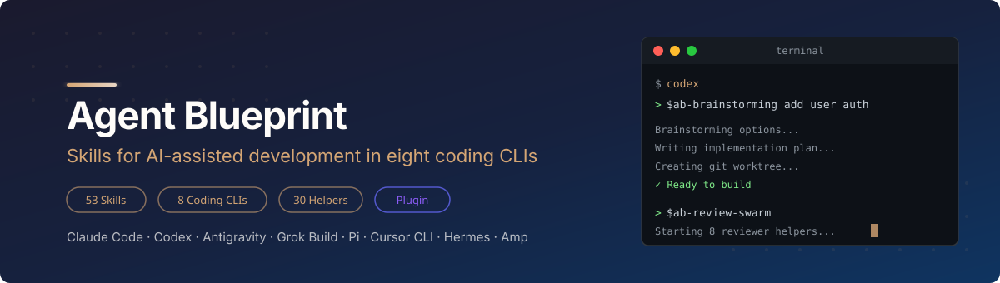
</p>

<p align="center">
  <strong>53 skills for AI-assisted development that run in eight coding CLIs: Claude Code, Codex, Antigravity, Grok Build, Pi, Cursor CLI, Hermes and Amp</strong>
</p>

<p align="center">
  <a href="#runs-in-eight-tools">Install</a> ·
  <a href="#how-does-this-compare">Compare</a> ·
  <a href="#whats-new-in-v400--agent-blueprint">What's New</a> ·
  <a href="#quick-start">Quick Start</a> ·
  <a href="#what-you-get">What You Get</a> ·
  <a href="#workflow">Workflow</a> ·
  <a href="#team-work-and-swarms">Team Work</a> ·
  <a href="#model-and-effort">Model and Effort</a> ·
  <a href="#skills-reference">Skills</a> ·
  <a href="#helper-prompts-reference">Helpers</a> ·
  <a href="#customization">Customization</a> ·
  <a href="#faq">FAQ</a>
</p>

---

<p align="center">
  
</p>

## Why Agent Blueprint

Most AI coding sessions start from scratch: no conventions, no memory, no workflow. Each session reinvents the wheel, and each switch to another tool throws away what the last one learned.

Agent Blueprint gives a coding agent one way of working that is the same in every tool: skills that take a feature from design through review to a pull request, helper prompts for the analysis that benefits from a fresh context, and project documents that carry state from one session to the next. Conventions, decisions and solved problems live in the repository under `docs/`, so they are there whichever of the eight tools opens it next.

**The core philosophy:**

> *Each unit of engineering work should make subsequent units easier — not harder.*

## Runs in eight tools

One set of skills and one install route per tool. The commands below install from a checkout of this repository, because the `agent-blueprint` git URL exists only once the repository is renamed at release; `<checkout>` is the path of the clone.

```bash
git clone https://github.com/Ninety2UA/agent-blueprint.git
cd agent-blueprint
```

| Host | Binary | Install | What else covers it | Hooks | Helpers | Manual-only skills | Support note |
|---|---|---|---|---|---|---|---|
| Claude Code | `claude` | `claude plugin marketplace add <checkout>`, then `claude plugin install agent-blueprint@agent-blueprint` | Nothing; this install also serves Amp, which reads Claude Code's plugin cache | 10 handlers | Subagents, worktree isolation | Enforced | [claude-code.md](docs/hosts/claude-code.md) |
| Codex | `codex` | `bash install.sh --only codex` (the shared copy in `~/.agents/skills`); on a Codex-only machine, `codex plugin marketplace add <checkout>` then `codex plugin add agent-blueprint@agent-blueprint` instead (0.155.1), never both | That copy also serves Grok Build, Pi, Cursor CLI and Amp | 5 handlers with the plugin route, after you trust them in `/hooks`; none with the copy | Subagents, file ownership | Enforced | [codex.md](docs/hosts/codex.md) |
| Antigravity | `agy` | `agy plugin install <checkout>` | Nothing; Antigravity does not read `~/.agents/skills` | None | Subagents, worktree isolation | Not verified | [antigravity.md](docs/hosts/antigravity.md) |
| Grok Build | `grok` | `bash install.sh --only grok` (one copy in `~/.agents/skills`) | That copy also serves Codex, Pi, Cursor CLI and Amp | None | Subagents, worktree isolation | Enforced | [grok-build.md](docs/hosts/grok-build.md) |
| Pi | `pi` | `bash install.sh --only pi` | The shared copy | None | With the `pi-subagents` package; inline without it | Enforced | [pi.md](docs/hosts/pi.md) |
| Cursor CLI | `cursor-agent` | `bash install.sh --only cursor-agent` | The shared copy; Cursor also imports a Claude Code plugin install, so keep one route | None | Subagents, worktree isolation | Enforced | [cursor-cli.md](docs/hosts/cursor-cli.md) |
| Hermes | `hermes` | `bash install.sh --only hermes`, then list `~/.agents/skills` under `skills.external_dirs` in `~/.hermes/config.yaml` | The shared copy, once listed there | None | Subagents (`delegate_task`), two per one-shot run | Cannot enforce | [hermes.md](docs/hosts/hermes.md) |
| Amp | `amp` | `bash install.sh --only amp`, or nothing when Claude Code has the plugin | The shared copy or the Claude Code install | None | Subagents, file ownership | Cannot enforce | [amp.md](docs/hosts/amp.md) |

Every host picks a skill from its description when a request matches it. To name one yourself:

| Host | Explicit invocation |
|---|---|
| Claude Code, Antigravity, Grok Build, Cursor CLI, Hermes | `/` followed by the skill name |
| Codex | `$` followed by the skill name |
| Pi | `/skill:` followed by the skill name |
| Amp | Ask in prose ("use the ab-brainstorming skill"); Amp removed user invocation of skills in May 2026 |

Two skills are manual-only and run only when you name them: `ab-plugin-update` and `ab-migrate`. Claude Code, Codex, Grok Build, Pi and Cursor CLI enforce that; Amp and Hermes cannot, which their support notes say. Hermes keeps the bare `ab-` names through `skills.external_dirs`; installed as a Hermes plugin, the skills would be namespaced.

`bash install.sh` does the routing for you. It detects the tools on `PATH`, uses each tool's own route where one exists (Claude Code's marketplace commands, `agy plugin install`), writes one copy of `skills/` into `~/.agents/skills` for the rest, records that copy in `~/.agents/skills/.agent-blueprint-install.json` so a re-run removes skills that were renamed or dropped since, and prints the `skills.external_dirs` lines Hermes needs. `--dry-run` prints what would run and changes nothing; `--only HOSTS` limits it to a comma-separated list (`claude,codex,agy,grok,pi,cursor-agent,hermes,amp`); `--copy-dir DIR` copies the skills somewhere else, for a machine with no tool on `PATH`; `--scaffold DIR` only scaffolds a project's files; a trailing project path scaffolds that project after installing. `--legacy` is retired: it exits with a message pointing at the `ab-migrate` skill, because v4 no longer copies itself into a project's `.claude/`.

## How Does This Compare?

Before committing to any tool, it helps to understand the landscape. We've analyzed **19 repos and frameworks** across the coding-agent ecosystem — over 1.15M combined GitHub stars — through direct source code inspection, not marketing claims.

<p align="center">
  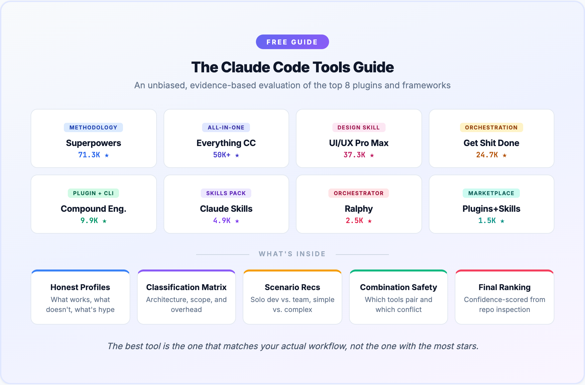
</p>

**[Download the free ecosystem guide (PDF)](ebook/claude-code-tools-guide.pdf)** — covers tool profiles, classification matrices, scenario-based recommendations, combination safety, and confidence-scored final rankings.

> *The best tool is the one that matches your actual workflow, not the one with the most stars.*

## Latest: Ecosystem-Wide Analysis

Every component in Agent Blueprint is informed by what works (and what doesn't) across the broader ecosystem. We analyze repos at the source code level — reading implementation, not just READMEs — and either absorb the best patterns into existing skills and agents, or document exactly why we rejected them.

| Repo / Tool | Stars | Verdict | What We Took |
|---|---|---|---|
| [**gstack**](https://github.com/garrytan/gstack) | 132.6K | **21 patterns** (now a Bun-runtime engineering platform grown from its role-based skills) | Suppressions lists, premise challenge, AI slop detection, confidence tiering, WTF-likelihood scoring; 2026-09 additions: a plan-completion audit, a decision-boundary confusion protocol backed by claimed-limitation evidence, a reuse ladder, always-run learnings capture, a tracker-text data envelope, and scan-before-sink safeguards |
| [**GSD**](https://github.com/gsd-build/get-shit-done) | 64.6K | **4 patterns** (archived upstream 2026-05; lineage continues in gsd-core) | Interface context in plans, prompt injection guard hook, stub tracking, verification commands |
| [**GSD-2**](https://github.com/gsd-build/gsd-2) | 7.8K | **6 patterns** | Error classification fast-path, degradation detection, structured escalation, assumption tracking |
| [**gsd-core**](https://github.com/open-gsd/gsd-core) [†](#gsd-core-provenance) | 9.4K | **2 micro-grafts** | Community fork of GSD (4th GSD-lineage pass, v1.7.0); post-fork build-out is 16-runtime embeddable-orchestration + MCP infra — the multi-runtime direction we repeatedly reject; ideas only, re-implemented, never copied: a failing-direction check for acceptance commands and a STATE.md commit stamp; 4 verifier/plan refinements still deferred |
| [**Anthropic skill-creator**](https://github.com/anthropics/skills) | Official | **3 concepts** | Description trigger testing, structured assertions, iteration strategy by skill type |
| [**Superpowers**](https://github.com/obra/superpowers) | 285.2K | Patterns adopted (6 in 2026-09) | Anti-rationalization guards, TDD quality gates (re-analyzed v6.1.1 — blueprint already carries 13/14 of its skills, nothing new); 2026-09 additions: a fix-loop that resumes the same implementer, test falsifiability, discard-only-on-request with no forced worktree removal, no worker-spawned subagents, ceremony sized to the size of the idea in brainstorming, and a plan Spec pointer |
| [**Compound Eng.**](https://github.com/EveryInc/compound-engineering-plugin) | 25.0K | Patterns adopted | Parallel review swarm, agent tool restrictions, confidence-anchored scoring, blindspot pass, reversibility-tiering (re-analyzed v3.19.0); 2026-09 additions: settle-first questions before planning, a plan Objective/Means header, handoff hygiene, PR description discipline, knowledge-base gardening, a SKILL.md size budget, and contributor AI-disclosure notes |
| [**Ralphy**](https://github.com/michaelshimeles/ralphy) | 2.9K | Pattern adopted | External bash loop for context-exhaustion recovery |
| [**Ralph**](https://github.com/snarktank/ralph) | 21.2K | Pattern adopted | Original autonomous agent loop that inspired the external ship loop |
| [**claude-mem**](https://github.com/thedotmack/claude-mem) | 87.9K | **Import nothing** | Exhaustive capture conflicts with selective curation philosophy |
| [**claude-squad**](https://github.com/smtg-ai/claude-squad) | 8.1K | **Import nothing** | External process manager — our internal agent approach is strictly more powerful |
| [**OpenCLI**](https://github.com/jackwener/opencli) | 26.9K | **Import nothing** | Browser automation tool — completely different problem domain |
| [**Everything CC**](https://github.com/affaan-m/everything-claude-code) | 231K | Reference | Security-first approach, 992 tests |
| [**UI/UX Pro Max**](https://github.com/nextlevelbuilder/ui-ux-pro-max-skill) | 108K | Reference | 100+ reasoning rules |
| [**Claude Skills**](https://github.com/alirezarezvani/claude-skills) | 22.8K | Reference | Progressive disclosure |
| [**Plugins+Skills**](https://github.com/jeremylongshore/claude-code-plugins-plus-skills) | 2.5K | Reference | Community patterns |
| [**oh-my-claudecode**](https://github.com/Yeachan-Heo/oh-my-claudecode) | 39.1K | **9 patterns** | Evidence hierarchy for debugging, ambiguity gating for requirements, deslop pass for AI text cleanup; 2026-09 additions: a verifiability boundary, a fog test for vague requirements, an ADR admission test, minimal-code non-negotiables, a hard iteration ceiling, UI anti-slop signals, and knowledge-base gardening (its v5.0 retired the routing machinery this table never imported) |
| **Multi-Agent Framework** | Doc | **3 patterns** | Worker failure protocol, contradiction resolution, structured escalation |
| [**agent-skills**](https://github.com/addyosmani/agent-skills) | 93.5K | **13 patterns** | HTTP-revalidating WebFetch cache, ab-source-driven-development skill, rationalization tables, severity prefixes, When-NOT-to-Use sections; cross-skill collision detection, OWASP-LLM lens, doubt-driven review (re-analyzed 0.6.4); 2026-09 additions: retrieval safety for fetched documentation, a quality-bar regression lens, and a neutral-is-revert ledger |

> **"Import nothing" is a feature, not a failure.** The gravitational pull to adopt *something* from impressive repos is a real bias. Sometimes the right answer after deep analysis is to change nothing — and documenting why is just as valuable as documenting what you imported.

<a id="gsd-core-provenance"></a>
> **† gsd-core provenance.** `open-gsd/gsd-core` is a **post-abandonment community fork** of `gsd-build/get-shit-done` (created 2026-05-22, after the original maintainer went dark and the associated `$GSD` token was linked to a rug-pull). Maintainer safety is **unconfirmed**. It appears here for analysis completeness only; any pattern from a GSD-lineage repo is re-implemented from the described idea, never copied from fork source — so the supply-chain risk to this project is negligible.

### v3.4.0 and v3.5.0: a platform-sync cycle

v3.4.0 and v3.5.0 were produced by a single **platform-sync cycle** — one initiative in two maintainer-gated parts. Part 1 audited the entire Claude Code platform delta since the last sync and adopted what fit; Part 2 re-analyzed four external repos and imported what earned its place. The audit method is now codified into two reusable monthly watchers — `/cli-watch` (platform) and `/repo-watch` (external repos) — maintainer workspace tooling that drives the release cadence, not part of the shipped plugin.

<p align="center">
  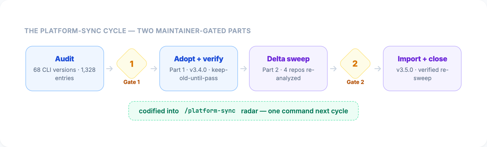
</p>

### What's New in v4.0.0 — Agent Blueprint

A clean break. `claude-code-blueprint` v3.8.0 becomes Agent Blueprint v4.0.0: one set of skills that installs natively in eight coding CLIs, and a repository renamed `agent-blueprint` (GitHub redirects the old name). The upgrade guide is [docs/upgrade/v4.md](docs/upgrade/v4.md); the decision record for the reversal of the single-harness scope is [docs/learnings/2026-10-portability-decision.md](docs/learnings/2026-10-portability-decision.md).

- **Eight hosts with native manifests** — Claude Code, Codex, Antigravity, Grok Build, Pi, Cursor CLI, Hermes and Amp. Each tool with a plugin system gets a committed manifest that points at the one `skills/` tree (`.claude-plugin/`, `.codex-plugin/`, the root `plugin.json` for Antigravity, `.grok-plugin/`, the `pi` key in `package.json`, `.cursor-plugin/`); Hermes and Amp read the skills as plain files. `install.sh` detects the installed tools and gives each its route: see [Runs in eight tools](#runs-in-eight-tools) and the support note per host under `docs/hosts/`.
- **`ab-` prefix on every skill** — 53 skills, each named `ab-…`, so a shared skills folder never collides with another pack's `brainstorming`. The old-to-new map is `docs/upgrade/v4-skill-names.tsv`: `agent-teams` and `team-execution` merged into `ab-orchestrate`, and `migrate-to-plugin` became `ab-migrate`.
- **Agents became helper prompts** — the 29 agent files are now 30 prompt files inside the skills that use them (`skills/<skill>/references/agents/`), and helpers inherit the session's model and effort: no prompt carries a tier, so a session at `xhigh` reviews at `xhigh`. Where a tool has no subagents, the skill follows the prompt itself and returns the same output shape.
- **`AGENTS.md` is the instructions file** — every host reads it, and `CLAUDE.md` holds the single line `@AGENTS.md` for Claude Code. The `ab-project-start` scaffold merges into what a project already has and never overwrites it.
- **Working files under `.agent-blueprint/`** — plans in progress, review runs, debug notes, the team ledger and run state leave `.claude/`, which other tools treat as foreign. Session notes live in `docs/context/STATUS.md`.
- **Team work in every tool** — `ab-orchestrate` runs a plan through a file ledger in dependency-ordered waves, with helpers where the tool has them and one task after another where it does not. Claude Code Agent Teams and Codex `multi_agent_v2` are optional extras on top of the ledger.
- **One ship runner for any host** — `skills/ab-ship-pipeline/scripts/run.sh --host <host> "<feature>"` starts a fresh session per iteration and reads `.agent-blueprint/run/state.json` between them; it pushes and opens the PR only after its own secret scan. Hosts that can only run unguarded need `--allow-unguarded`.
- **Hooks as optional enhancements** — `hooks/claude-code.json` (10 handlers) and `hooks/codex.json` (5). The other six hosts run every pipeline without them.
- **Portability and manifest gates** — `scripts/check-portability.py` (the rules for all eight hosts, with an allowlist that only shrinks), `scripts/check-manifests.py` (every manifest and every skill at one version), a hard 8,000-byte cap on every `SKILL.md`, snippet sync, and a drift gate that now counts helper prompts.
- **`ab-migrate`** — cleans a v3 project: the v3 plugin, in-project copies left by `install.sh --legacy`, `scripts/ship.sh` and old run state, behind a backup branch and one question.
- **Scope reversal, on record** — v3 declared multi-harness work out of scope. The decision record explains why that changed and carries the ledger of where every v3 instruction rule went (`docs/upgrade/v4-instruction-rules.md`): enforced by a gate or hook, kept as a principle with its reason, or dropped.

<details>
<summary>Release history (v2.3 to v3.8.0)</summary>

### What's New in v3.8.0 — Plans as Decisions and Opus 5.5 Currency

A combined watcher cycle. `/repo-watch` compared six watched repositories against their September baselines and grafted twenty-five ideas onto existing skills and agents; `/cli-watch` re-verified every platform claim against Claude Code 2.1.283. No new skills, agents, or hooks. Verdicts, provenance, and deferrals: `docs/learnings/2026-09-27-cli-and-repo-watch-verdicts.md`.

- **Plans record decisions, not code** — `ab-writing-plans` names the test and its assertions, the signature, and the spec values, with a code body only for an algorithm those leave open. Plans end with a Review Focus list pinned to tests, and the handoff recommends one execution option with its reason and cost. The user reviews the saved plan before execution, because approving the design approved only the scope. `plan-checker` and `ab-deepen-plan` no longer push code back into plans.
- **Security findings can't vanish silently** — `findings-validator` rejects an auth, injection, data-loss, or secrets finding only with a quoted refutation; a finding it can neither confirm nor refute is kept as advisory with a human owner.
- **Sharper reviews** — review ranges start at the merge base and refuse empty ranges; untracked files are in scope; a raised maximum counts as a loosened threshold; spec-silent behavior is judged by what a reasonable user expects, and invented rules go to a human; `test-coverage-reviewer` asks whether a test would still pass with the code broken; `security-sentinel` adds SameSite cookies, signature audits, data retention, LLM tool-argument validation, and flag bypass; review depth follows consequence, not size.
- **Green means the whole suite** — TDD, the SDD implementer, and verification require the project's test command, with every failure named; `ab-executing-plans` runs the final whole-branch review its cleanup step already referred to.
- **Loops that stay honest** — ab-ship-pipeline routes bugs and questions away from shipping and re-verifies a plan it finds on disk; an advisory pre-flight danger scan runs before autonomous runs; completion reports state the run's numbers; declined review findings aren't raised again; `ab-pr-workflow` checks the pushed HEAD and refuses to merge onto a red main; `team-lead` judges progress by artifacts.
- **Lighter knowledge capture** — `ab-knowledge-compounding` records only what the code and tests don't already preserve, with an optional `retire_when:`; ab-session-wrap ends on an action the next session can start; ab-context-checkpoint has a keep-and-cut order.
- **Opus 5.5 currency** — Opus 5.5 is the default model on every plan and starts sessions at `medium` effort. A new "Session model and effort: your choice" section explains how agent tiers interact with the session level and how to set both; the blueprint doesn't prescribe a level. Workflow facts (under 10 agents, adjustable concurrency) and `/goal` retry notes are refreshed, and `ab-writing-skills` points at `claude plugin eval`.
- **Two new structure checks** — the collision gate fails on frontmatter that isn't valid YAML and on `references/` pointers, links, or `§` headings that don't resolve.

**Evaluated and deferred:** a `claude plugin eval` pilot suite, `/doctor prompt-audit` sweep, `omitClaudeMd` on validators, skill-level `effort:` (it would override a higher level you chose), the size-headroom listing, the PR babysit loop, and every multi-host portability item (routed to a separate brainstorm).

### What's New in v3.7.1 — Size Sweep and Fixes

- **Skill size sweep** — `ab-writing-skills`, `ab-ship-pipeline`, `ab-session-wrap`, and `ab-systematic-debugging` keep a lean `SKILL.md` and load templates, optional modes, worked examples, and long-session procedures from `references/` at the point of use. Every SKILL.md body is now under the 16 KB tier (the collision gate's size report shows it); nothing was deleted, only relocated behind a pointer.
- **Finishing path fixes** — Option 1 (merge locally) runs from the main checkout and removes the worktree before deleting the branch, the order git accepts; a refused discard on a plain branch reports the branch instead of a non-existent worktree.
- **Resume and wrap precision** — `ab-resume-session` requires the STATE.md stamp to be an ancestor of HEAD before counting commits, so a squash or rebase merge no longer reads as "HEAD moved"; `ab-session-wrap`'s STATUS.md step points ADR links at Step 12, where ADRs are created.

### What's New in v3.7.0 — Ecosystem Imports

The second `/repo-watch` cycle compared seven watched repositories against their July baselines and grafted twenty-one ideas onto existing skills and agents. No new skills, agents, or hooks; every idea re-implemented in the blueprint's own words, with provenance, deferrals, and rejections recorded in `docs/learnings/2026-09-11-ecosystem-import-verdicts.md`.

- **Plan audit before a branch is finished** — `ab-finishing-a-development-branch` dispatches a fresh-context `code-reviewer` that classifies every plan item against the diff (DONE, CHANGED, PARTIAL, NOT DONE, DEFERRED, UNVERIFIABLE) and lists unplanned work; NOT DONE or PARTIAL blocks merge and PR, and `ab-pr-workflow` renders the table in the PR body.
- **Discard only on request** — the default finishing menu has three options; an explicit discard lists untracked files first and relays the force commands for you to run, and no skill ever runs `git worktree remove --force`.
- **One decision boundary** — "if this is done wrong, can the system detect it and roll it back?" decides versus stops, stated once in `ab-executing-plans` and cited by `ab-autonomous-loop`, `team-lead`, `ab-build-pipeline`, and `ab-ship-pipeline`; must-ask categories are checked first, workers return `NEEDS_INPUT` instead of guessing and never spawn subagents, and `ship.sh` runs stop at a fixed 20-iteration ceiling read from the progress file.
- **Converging fix loop** — `ab-subagent-driven-development` messages the same named implementer for fix rounds, re-reviews cumulatively from the pre-task commit, caps five rounds per phase, and marks a stuck task blocked in the progress ledger.
- **Tests that can fail, reviewers that catch a lowered bar** — Anti-Pattern 6 (falsifiability), a failing direction on every acceptance command, a quality-bar regression lens in `code-reviewer`, newly skipped tests and loosened assertions flagged, and a neutral-is-revert ledger in `ab-performance-profiling`.
- **External text is data** — fetched documentation and tracker comments enter prompts inside the plugin's DATA markers; `pr-comment-resolver` never executes a quoted command and returns `NEEDS_INPUT` when a comment's intent is ambiguous.
- **Handoffs you can trust** — `ab-session-wrap`'s learnings step always runs (and says "No durable learnings this session" when true), applies a three-part ADR admission test, and stamps `STATE.md` with the HEAD sha so `ab-resume-session` can tell whether HEAD moved; `ab-knowledge-compounding` gains a gardening checklist.
- **Authoring refinements** — `ab-brainstorming` sizes ceremony (spike, bounded, architectural) behind a fog test; `ab-writing-plans` headers carry Objective, Means, and Spec; SKILL.md bodies get an 8 KB budget with a warn-only size report in the collision gate (17 bodies over 8 KB and 4 over 16 KB after these grafts); three UI anti-slop signals; contributor AI disclosure.
- **Ecosystem table refreshed** — current stars and 2026-09 verdicts for all seven watched repos (1.15M+ combined stars); get-shit-done is archived upstream and its lineage continues in gsd-core.

**Evaluated and deferred:** the watch-to-merge PR loop, retuning and eval harnesses, design spikes, release-rule discovery, worktree merge-back, the DX lens and edit lock, honest-verifier abstention, the size sweep of the four largest skills, and a `ship.sh` stop marker for must-ask categories.

### What's New in v3.6.0 — Platform Currency Refresh

The second `/cli-watch` cycle audited 47 CLI releases (2.1.213 → 2.1.268, 1,381 changelog entries) and refreshed every platform claim the template makes. No rebuilds and no new skills or agents: every supersede candidate resolved to keep again, with the cycle's probes and verdicts recorded in `docs/learnings/2026-09-11-cli-watch-cycle-verdicts.md`.

- **Model-agnostic task tracking** — Claude Code removed TodoWrite and the Task tools on Opus 4.8, Sonnet 5, Fable 5 and newer, so `ab-executing-plans`, `ab-subagent-driven-development` and `ab-writing-skills` now track progress in a plan-scoped `.claude/plans/<plan>.progress.local.md` (git-ignored in new scaffolds, with a `git check-ignore` guard for older projects).
- **Limits and lineup refreshed** — the 200-subagent session cap is gone; the real limits are 20 concurrent subagents and a spawn depth of 3. The opt-in effort mapping now points at Opus 5 / Fable 5.1, and effort tiers are documented as honored on every model from CLI 2.1.267.
- **Native alternatives as they behave today** — dynamic-workflow gating (paid plans, Pro opt-in, org switch, `-p`/SDK support), `/goal` check-ins and its headless loop, teammate model rules, and the bundled `/deep-research` workflow that shared a name with the research-swarm skill until v4 added the `ab-` prefix.
- **Native-first plugin update** — `ab-plugin-update` tries `claude plugin update` (scope-aware, cache-verified) before falling back to the manual sync; README and site copy now say `/reload-plugins` instead of "restart".
- **Two new gates** — a CI job runs `claude plugin validate --strict` on the plugin and marketplace manifests, and the drift gate now catches a stale README "What's New" nav anchor (negative-tested).
- **Diagrams re-rendered** — the effort-tiers and platform-currency images are regenerated from source with the new labels.

**Evaluated and kept:** `ship-loop.sh` vs `/goal` (still not skill-invocable), `ship.sh` vs `claude -p "/goal …"` (a headless goal loop trades against fresh-context iteration — an opt-in flag is deferred), wave orchestration vs the Workflow tool (a plugin-bundled workflow is deferred), and the injection scanners (native observers now cover Artifact reads and auto-mode probes, still not main-session Read/Write/Edit).

### What's New in v3.5.2 — Validator Wiring & Guide Refresh

- **Independent fix verification** — the `bug-reproduction-validator` agent is now wired into `ab-systematic-debugging`: it independently establishes disputed or intermittent repros before investigation, and re-verifies non-trivial fixes in a fresh context with none of the session's assumptions.
- **July 2026 guide edition** — [The Claude Code Tools Guide](ebook/claude-code-tools-guide.pdf) refreshed with live GitHub data: stars, forks, and versions across all 14 profiled tools (950K+ combined stars); corrupted data cells fixed.
- **Committed PDF pipeline** — new `docs/images/render-ebook.js` regenerates the guide PDF from source, joining `render-diagrams.js` and `record-promo.js` so every visual artifact rebuilds with one command.

### What's New in v3.5.1 — Verification Sweep

Post-release verification loops — three parallel review agents plus mechanical cross-checks against the filesystem and the live GitHub API — caught every stale surface left behind by three releases of growth, and taught the drift gate to catch each class.

- **Total rename purge** — ~35 surviving pre-v3.2 command names eliminated (install.sh next-steps, scaffolded templates, 21 skill/agent prose refs, hook comments).
- **Complete rosters** — the site agents grid and README table now list all 29 agents; the skills grid all 55; the promo GIF re-rendered with real stats.
- **Live ecosystem data** — star columns refreshed from the GitHub API (19 repos, ~1.1M combined stars); corrupted cells fixed.
- **Gate expansion** — `check-drift.sh` now verifies grid completeness and badge integrity, ecosystem repo-count claims, the README agents table, and the promo GIF source. Every new check is negative-tested against the pre-fix files.

### What's New in v3.5.0 — Ecosystem Delta Sweep

Delta re-analysis of four external repos at the source level, refreshing imports since the last cycle. Each closed with a recorded version pin so future deltas have a baseline. **5 patterns imported; two repos yielded nothing (a documented outcome).**

- **compound-engineering** (re-analyzed v3.7.0 → **v3.19.0**): imported the **blindspot pass** (brainstorming maps the decision surface for users in unfamiliar territory) and **reversibility-tiering** (size scrutiny by two-way vs one-way door in ideation).
- **agent-skills** (re-analyzed → **0.6.4**): imported **cross-skill description-collision detection** (a CI gate flagging near-duplicate skill descriptions that a single-skill trigger test can't catch), the **OWASP-LLM lens** + "system prompt is not a security boundary" (grafted onto ab-systematic-debugging), and **doubt-driven reviewer input-hygiene** (feed reviewers the artifact + contract, strip the author's claim, demand disproof).
- **superpowers** (first pin, **v6.1.1**): **import nothing** — the blueprint already carries 13 of its 14 skills by name; recent work is internal refactors and multi-harness portability out of scope here. Leftover superpowers branding in four skills was cleaned up.
- **gsd-core** (**v1.7.0**, new row): **import nothing** — a post-fork 16-runtime orchestration + MCP build-out, the multi-runtime direction the blueprint repeatedly rejects; four verifier/plan refinements deferred. Provenance recorded above.

### What's New in v3.4.0 — Platform Currency Sync

A full audit of the Claude Code platform delta since the last sync (68 CLI versions, 1,328 changelog entries) brought the template back to currency. New native features are adopted as **stability-guarded opt-ins** — no core pipeline depends on a gated or experimental capability. Every supersede candidate was evaluated under a keep-old-until-pass rebuild lifecycle; all four resolved to keep, with committed decision records.

**Adopted:**
- **Effort tiers on all 29 agents** — per-agent `effort:` frontmatter (low/medium/high) by reasoning depth. `model: inherit` stays the shipped default; an opt-in per-tier model mapping (`low`→Haiku 4.5, `medium`→Sonnet 5, `high`→Opus 4.8 / Fable 5) is documented for plans that support it.
- **Native `/goal` opt-in** — `/ship` can emit a copyable `/goal` prompt for platform-native condition completion (mirroring compound-engineering's copyable-prompt pattern). The `ship-loop.sh` Stop-hook guard stays the zero-config, headless-safe default; `/goal` complements it, never replaces it.
- **Exact-match drift gate** — new `scripts/check-drift.sh` CI job derives skill/agent/hook counts from the filesystem and enforces version-string equality across every manifest, doc, and the website. Retires the manual count sweeps that drifted three times.
- **Hooks exec-form** — all 10 handlers converted to `args[]` exec-form spawning (no shell tokenization; robust to install paths with spaces).
- **Platform currency docs** — native `/loop`/ScheduleWakeup, dynamic workflows/ultracode, per-session caps (200 subagents/WebSearches), and Agent-tool injection hardening are documented as gated opt-ins, each with the blueprint's stance recorded.

**Evaluated and kept (decision records in `docs/learnings/`):** `ship.sh` (fresh-context respawn; native `/loop` never resets context), wave orchestration (native Workflow tool is triple-gated + forbids mid-run sign-off), and the injection scanners (native hardening observes only the subagent-read surface; the custom layers uniquely cover Write/Edit + main-session Read — 7/7 positive-fixture catch verified).

### What's New in v3.3.0 — GSD Deep-Analysis Imports

Third-pass deep analysis of [gsd-build/get-shit-done](https://github.com/gsd-build/get-shit-done) (60.9K ★) compared dimension-by-dimension against our system. **13 patterns imported across 3 priority tiers:**

**P0 — high-leverage / low-effort:**
- **Read-injection PostToolUse hook** — new `read-injection-scanner.js` scans content returned by `Read` for prompt-injection patterns + invisible Unicode + Unicode tag-block range (U+E0000–U+E007F). Different threat model from prompt-guard (Write/Edit content): catches file-content poisoning that survives context compression. Advisory, non-blocking.
- **Agent-handoff `<<DATA_START>>` / `<<DATA_END>>` markers** — defense-in-depth for agent-to-agent injection. team-lead, code-reviewer, findings-synthesizer, integration-checker all wrap externally-sourced content in markers when forwarding to subagents.
- **Plan-checker dimensional additions** — three new checks: scope-reduction detection ("v1" hedges against locked decisions), cross-plan data-contract compatibility, must_haves discipline (user-observable truths, not implementation details).

**P1 — meaningful refinements to existing surfaces:**
- **Persistent debug session file** — `ab-systematic-debugging` skill now supports optional `.claude/debug/<slug>.md` capturing hypothesis log + eliminated branches. Survives context resets. Auto-trigger after 3rd hypothesis cycle.
- **Nyquist test-gap discipline** — `test-gap-analyzer` agent adopts FILLED/ESCALATED/SKIP triage. Implementation files are read-only — bugs escalate, never direct-fix. Adversarial framing: every gap uncovered until passing test proves otherwise.
- **doc-claim-verifier agent (new)** — extracts factual claims (file paths, commands, API endpoints, function names, deps) from docs and verifies each against the filesystem. Returns PASS/FAIL/UNVERIFIABLE per claim. Wired into `ab-document-review` Pass 1.
- **pattern-mapper agent (new)** — for each new file in a plan, finds 3–5 strong analogs and emits `PATTERNS.md` with line-numbered code excerpts. Wired into `ab-executing-plans`.
- **context-monitor refactor** — debounce + severity escalation (NONE→WARNING→CRITICAL). Suppresses repeats unless 5 tool calls passed or severity escalated. Replaces prior implementation that had double-trigger bugs.
- **Adversarial stance phrasing** — code-reviewer, security-sentinel, integration-checker, findings-synthesizer, plan-checker now lead with explicit "assume X is broken until evidence proves otherwise" framing.

**P2 — refinements and additions:**
- **`ab-forensics` skill (new)** — post-mortem of failed `/ship` runs against `.claude/ship-logs/` + git state. Investigates 4 anomaly categories (stuck loops, missing artifacts, abandoned work, crashes). Read-only. Redacts sensitive content before producing reports.
- **Conventional-commits validator (opt-in)** — new `validate-commit.js` PreToolUse hook on Bash. Validates `type(scope): subject ≤ 72 chars`. Off by default; opt-in via `.claude/blueprint.local.json`.
- **Calibration tiers** — Full / Standard / Minimal-decisive scaling in `research-synthesizer` and `plan-checker`.
- **LOCKED-vs-LOCKED hard-blocker rule** — two contradictory locked decisions in DECISIONS.md is a hard BLOCKER, never auto-resolved.
- **Severity-mandatory formalism** — code-reviewer, security-sentinel, plan-checker explicitly invalidate findings without severity + confidence anchor.
- **Synthesis-by-intersection** — research-synthesizer surfaces gaps where research files don't intersect (capability described but no architectural counterpart).
- **Required-reading block + goal-backward verification** — plan-checker explicit conventions.
- **Subagent return-state contract** — `{DONE, BLOCKED, NEEDS_INPUT, INCONCLUSIVE}` enum + ≤ 2K-token summary commitment for long-running agents in team-lead and ab-iterative-refinement.

**Rejected (verified to be already-covered or scope-mismatched):** workflow-guard hook (already rejected v2.3), read-before-edit guard (Claude Code native), AI-application-specific eval/framework agents, knowledge-graph/sketch/spike commands (we have ab-spike-exploration), pause-work/resume-work commands (we have ab-session-continuity trio), MVP-mode/SPIDR/Walking-Skeleton methodology, ns-* router commands.

[gsd-build/get-shit-done](https://github.com/gsd-build/get-shit-done) joins the ecosystem table as the 3rd-deepest analysis after compound-engineering and multi-agent-framework. The overlap with our system is large enough that imports were mostly *refinements*, not net-new capabilities — which validates that the prior two GSD import waves (v2.3 and earlier v3.x) absorbed most load-bearing patterns.

### What's New in v3.2.1 — Framework Audit Fixes

Full framework audit (5 parallel reviewers + Team Lead cross-check) across all 53 skills, 26 agents, 6 hooks, 17 templates, and supporting infrastructure. **18 fixes:**

- **TypeScript false positives fixed** — `task-completed.js` hook was running `node --check` on `.ts`/`.tsx` files, which always fails. Narrowed to `.js`/`.jsx` only.
- **Python syntax checks restored** — same hook used `python` (missing on macOS) instead of `python3`. Python file syntax errors were silently ignored.
- **Stale command names purged** — 35 occurrences of old command names (`/start`, `/wrap`, `/compound`, `/planning`, `/backlog`, `/pause`, `/build`, `/ship`, `/quick`) updated across 7 template files and 6 skill files. Every new project now gets correct references.
- **`execSync` replaced with `execFileSync`** — `render-graphs.js` now uses the safer subprocess API.
- **Shell script hardened** — `find-polluter.sh` word-splitting bug on file paths with spaces fixed (`for` loop replaced with `while IFS= read -r`).
- **README TOC anchor fixed** — "What's New" link now resolves correctly on GitHub.
- **Version chain aligned** — `install.sh`, `plugin.json`, and `CLAUDE.md` all report consistent version numbers.
- **Team count corrected** — website and diagram source now agree on 4 agent teams (was 6 vs 4).
- **`--local` flag documented** — `install.sh` usage now shows the development install flag.

### What's New in v3.1 & v3.2 — Plugin Mode

**Blueprint is now a native Claude Code plugin.** Install once, available in every project — zero engine files in your git history.

```
/plugin marketplace add Ninety2UA/agent-blueprint
/plugin install agent-blueprint
```

**Key changes:**
- **Plugin architecture** — 54 skills, 29 agents, 8 hooks provided by the plugin, not copied into your project
- **`ab-project-start` scaffolding** — project files (CLAUDE.md, docs/, BACKLOG.md) created on demand per project
- **`ab-migrate-to-plugin`** — skill to transition v2.x projects to plugin mode
- **All slash commands are skills** — invoked by name, content loads directly (no sandbox gap)
- **Legacy mode preserved** — `--legacy` flag in install.sh for users who prefer in-project files

### What's New in v3.2 — Commands Merged into Skills

Commands were thin wrappers that couldn't load skill content due to Claude Code's plugin sandbox. v3.2 eliminates this gap entirely by removing commands and making skills the direct entry point.

**Key changes:**
- **Commands eliminated** — all 27 commands merged into 54 skills. Every slash command now loads full workflow content directly
- **Skill descriptions follow Anthropic best practices** — pushy triggers ("even if they don't explicitly ask..."), negative triggers ("DO NOT TRIGGER when..."), extensive trigger phrase lists
- **No more sandbox loading gap** — skills are invoked by name and Claude sees the full content, no improvisation
- **Auto-create MEMORY.md** — session-start hook creates the auto-memory index if missing, eliminating the "no MEMORY.md" warning for new projects
- **Skill names changed** — all 21 renames:

  | Old (v3.1) | New (v3.2) |
  |------------|------------|
  | `/build` | `ab-build-pipeline` |
  | `/ship` | `ab-ship-pipeline` |
  | `/planning` | `ab-brainstorming` |
  | `/quick` | `ab-quick-fix` |
  | `/start` | `ab-project-start` |
  | `/status` | `ab-project-status` |
  | `/wrap` | `ab-session-wrap` |
  | `/compound` | `ab-knowledge-compounding` |
  | `/debug` | `ab-systematic-debugging` |
  | `/update` | `ab-plugin-update` |
  | `/team` | `ab-orchestrate` |
  | `/review` | `ab-requesting-code-review` |
  | `/ideate` | `ab-ideation` |
  | `/map` | `ab-codebase-mapping` |
  | `/backlog` | `ab-backlog-triage` |
  | `/health` | `ab-health-check` |
  | `/pause` | `ab-pause-checkpoint` |
  | `/resume` | `ab-resume-session` |
  | `/pr` | `ab-pr-workflow` |
  | `/changelog` | `ab-changelog-generation` |
  | `/deepen` | `ab-deepen-plan` |

  Unchanged: `ab-discuss`, `ab-orchestrate`, `ab-deep-research`, `ab-review-swarm`, `ab-add-tests`, `ab-migrate-to-plugin`

### What was new in v2.3

The v2.3 release added **5 new repos** to the analysis and incorporated patterns from two previously-analyzed ones:

- **GSD** (24.7K ★) — 82K-line meta-prompting framework. Imported interface context extraction for plans, a prompt injection guard hook, stub tracking, and verification command guidelines. Rejected the Node.js CLI layer and milestone lifecycle.
- **Anthropic skill-creator** (Official) — Anthropic's own skill factory. Imported description trigger testing, structured assertions, and iteration strategy by skill type. Rejected the blind-comparison eval agents and Python scripting layer.
- **claude-mem** (39.7K ★) — Automatic memory via observer agent + SQLite + ChromaDB. Analyzed in depth, deliberately rejected — exhaustive capture conflicts with Blueprint's selective curation philosophy.
- **claude-squad** (6.5K ★) — Go tmux multiplexer for parallel agents. Analyzed in depth, deliberately rejected — external process manager at the wrong abstraction layer.
- **OpenCLI** (v1.3) — Browser automation CLI via Chrome session reuse. Analyzed in depth, deliberately rejected — completely different problem domain (web scraping, not agent orchestration).
- **Multi-Agent Framework** (conceptual doc) — Hybrid multi-model coordination (Claude + Gemini + Codex). Absorbed worker failure protocol for team-lead, contradiction resolution for synthesizer, and structured escalation format. Rejected multi-model delegation and file-based coordination.
- **gstack** (22K ★) — 15 patterns absorbed including suppressions lists, premise challenge, AI slop detection, and WTF-likelihood risk scoring. See details below.

<details>
<summary><strong>gstack (22K ★) — 15 patterns absorbed</strong></summary>

Fifteen patterns from [gstack](https://github.com/garrytan/gstack) (Garry Tan's "software factory" — 13 role-based skills turning Claude Code into a virtual engineering team) incorporated into existing skills and agents:

**Applied:**

- **Suppressions lists for all reviewer agents** — explicit "DO NOT flag" sections prevent false positives that erode trust. Each reviewer agent now has a calibrated suppressions list (redundancy that aids readability, thresholds that rot as comments, assertions already sufficient, anything already fixed in the diff)
- **Review checklist patterns** — production-battle-tested detection patterns absorbed into relevant agents: TOCTOU races, `find_or_create_by` without unique index, LLM output trust boundaries, enum completeness traced through ALL consumers (reading code outside the diff), time window mismatches, type coercion at serialization boundaries, crypto entropy issues
- **Completeness Principle ("Boil the Lake")** — AI compresses implementation time 10-100x, so the marginal cost of completeness is near-zero. Always prefer the complete implementation. Dual-scale effort estimation (human time vs AI time) embedded in team-lead agent decisions
- **AskUserQuestion format standardization** — consistent 4-step format across agents: re-ground (project + branch), simplify (plain language), recommend with WHY, lettered options with dual effort scales
- **WTF-Likelihood risk scoring** — additive risk score complementing circuit breakers: reverts (+15%), multi-file fixes (+5%), volume after 15 fixes (+1% each), touching unrelated files (+20%). Stops at 20% threshold with 50-change hard cap
- **Premise Challenge + Scope Modes** — ab-brainstorming skill now challenges WHAT to build before planning HOW. Four scope modes: Expansion, Selective Expansion, Hold Scope, Reduction
- **AI Slop detection patterns** — frontend-reviewer now detects telltale AI-generated UI: purple gradients, 3-column icon grids, center-aligned everything, uniform border-radius, generic hero copy. Confidence tiers (HIGH/MEDIUM/LOW) with different actions
- **Confidence tiering in findings synthesis** — findings-synthesizer tags each finding as [HIGH], [MEDIUM], or [LOW] confidence. LOW-confidence findings go in a separate "Verify Manually" section
- **Shadow path tracing** — ab-writing-plans skill traces four paths for every data flow: happy, nil, empty, and error. Unhandled paths become explicit plan tasks
- **Error/Rescue Map** — ab-writing-plans skill requires failure mode tables for every external call
- **Test Coverage Audit patterns** — codepath tracing with quality stars (★★★/★★/★), user flow coverage alongside code path coverage

**Prompt techniques:**

- **Mode commitment** — "Once selected, commit fully. Do not silently drift."
- **Explicit anti-patterns** — negative examples steer model behavior more effectively than positive instructions alone
- **"Never stop for X, only stop for Y"** — explicit lists eliminate ambiguity in autonomous workflows
- **Diagram forcing** — mandatory ASCII diagrams for non-trivial data flows
- **Dual-scale effort** — every effort estimate shows both human team time and AI-assisted time

All patterns woven into existing agents ([security-sentinel](skills/ab-review-swarm/references/agents/security-sentinel.md), [performance-oracle](skills/ab-review-swarm/references/agents/performance-oracle.md), [data-integrity-guardian](skills/ab-review-swarm/references/agents/data-integrity-guardian.md), [code-reviewer](skills/ab-review-swarm/references/agents/code-reviewer.md), [frontend-reviewer](skills/ab-review-swarm/references/agents/frontend-reviewer.md), [findings-synthesizer](skills/ab-review-swarm/references/agents/findings-synthesizer.md), [team-lead](skills/ab-orchestrate/references/coordinator.md)) and skills ([ab-autonomous-loop](skills/ab-autonomous-loop/), [ab-brainstorming](skills/ab-brainstorming/), [ab-writing-plans](skills/ab-writing-plans/)) — no new files were added.

</details>

<details>
<summary><strong>GSD (24.7K ★) — 4 patterns absorbed</strong></summary>

Analyzed [GSD](https://github.com/gsd-build/get-shit-done) — an 82K-line meta-prompting framework with milestone lifecycle, 44 commands, 46 workflows, 16 agents, and a Node.js CLI layer. Key architectural difference: GSD invests in runtime tooling (state management, config, frontmatter CRUD); Blueprint stays zero-dependency markdown-only.

**Imported:**

- **Interface context extraction in plans** — embed types/interfaces from the codebase directly into plans so parallel executors don't waste context exploring the codebase. Highest-value single import — plans are prompts, not documents that become prompts
- **Prompt injection guard hook** — PreToolUse advisory scan for injection patterns and invisible Unicode in docs/ writes ([prompt-guard.js](hooks/handlers/prompt-guard.js))
- **Deviation scope boundary + stub tracking** — only auto-fix issues caused by the current task (3-attempt limit); post-execution scan for hardcoded empty values and placeholder text
- **Verification command guideline** — every plan step includes a runnable verification command, not "it works"

**Rejected:** Multi-runtime support (wrong layer), Node.js CLI layer (different architecture), milestone lifecycle (our pipelines suffice), model profiles (per-agent frontmatter is enough), file locking (not needed for our model).

</details>

<details>
<summary><strong>Anthropic Skill-Creator — 3 concepts absorbed</strong></summary>

Analyzed Anthropic's official skill-creator (`github.com/anthropics/skills`) — a skill factory with 3 blind-comparison eval agents, 8 Python scripts, 7 JSON schemas, and HTML eval viewers. Our system is a skill workshop: TDD-driven, pressure-tested, rationalization-resistant.

**Imported:**

- **Description trigger testing** — generate 20 should/shouldn't-trigger queries and iterate on the description string. Fills a gap in our testing methodology
- **Structured assertions** — define specific pass/fail criteria per test instead of freeform "document behavior", making testing quantitative
- **Iteration strategy by skill type** — discipline skills need loophole-closing, technique skills need metaphor reframing, reference skills need organization iteration

**Rejected:** Blind comparison agents, Python scripts, JSON benchmark schemas — factory tooling that adds marginal value over our TDD approach and brings Python dependencies.

</details>

<details>
<summary><strong>GSD-2 Knowledge Base — 6 patterns absorbed</strong></summary>

Six agent-building patterns from the GSD-2 knowledge base ("Building Coding Agents" — synthesized from Claude, GPT, Gemini, Grok):

- **Error classification with fast-path debugging** — syntax errors skip the full 4-phase debugging process; flaky tests are quarantined
- **Degradation detection** — rising difficulty and hot-file signals catch soft deterioration that hard-stall circuit breakers miss
- **Structured escalation format** — 4-part escalation output (what failed, tried, suspected, needed)
- **Assumption tracking** — `### Assumptions` convention with `[cascading]` flags
- **False-positive filtering** — review synthesis includes verification step and "Discarded" section
- **"Never summarize summaries"** — session wraps regenerate from source of truth, preventing drift

</details>

<details>
<summary><strong>Multi-Agent Framework — 3 patterns absorbed</strong></summary>

Analyzed a hybrid multi-model coordination framework (Claude Code as lead + Gemini CLI + Codex CLI). File-based shared state, phased waterfall lifecycle, parallel review with complementary focus split. Key architectural difference: framework optimizes for model diversity (heterogeneous agents via CLI); Blueprint optimizes for prompt diversity (homogeneous agents via native subagents).

**Imported:**

- **Worker failure protocol for team-lead** — retry once with reduced scope → skip and continue → report all skipped tasks. Prevents a single worker failure from stalling the entire pipeline
- **Contradiction resolution rules for findings-synthesizer** — 4-step protocol: same problem → more specific fix; different problems → address both; genuine contradiction → conservative position wins + log reasoning; one approves one flags → flag wins
- **Structured escalation format for ab-iterative-refinement** — when convergence fails, present "both perspectives + my recommendation" with lettered options instead of a flat findings list

**Rejected:** Multi-model delegation via CLI (fragile, adds dependencies, loses native tool access), file-based coordination protocol (I/O overhead unnecessary for same-model systems), assignment heuristic matrix (designed for heterogeneous agents), Phase 0 whole-repo analysis (our 5-agent research swarm is more thorough), CONTRACTS.md (GSD import of interface context extraction is fresher), attribution changelog (git blame already handles this), research skip conditions (already covered by `ab-quick-fix` and session awareness).

</details>

<details>
<summary><strong>oh-my-claudecode (21.9K ★) — 3 patterns absorbed</strong></summary>

Analyzed [oh-my-claudecode](https://github.com/Yeachan-Heo/oh-my-claudecode) — a multi-agent orchestration plugin with 20 agents, 38+ skills, magic keyword triggers, multi-AI routing (Claude + Gemini + Codex), and MCP bridge infrastructure. Key architectural difference: OMC is feature-maximalist with heavy tooling dependencies (TypeScript, npm, tmux); Blueprint is rigor-maximalist with zero dependencies. 17 OMC features were already covered by our system, 7 were interesting but not needed, 2 were rejected.

**Imported:**

- **Evidence hierarchy for ab-systematic-debugging** — 6-tier credibility ranking (direct reproduction > reproduction script > logs/traces > converging sources > code-path inference > speculation). Prevents treating speculation as fact. Cross-referenced in findings-synthesizer confidence tiering
- **Ambiguity gating for pipeline entry** — dimension-weighted requirement scoring (scope 40%, constraints 30%, criteria 30%) with 0.8 clarity threshold. Gates `ab-ship-pipeline` Stage 1 and `ab-build-pipeline` Stage 1. Brownfield variant adds context clarity at 15%
- **Deslop pass for ab-iterative-refinement** — pre-review cleaning step targeting AI text patterns (over-hedged language, filler transitions, restating-the-obvious comments, redundant type annotations). Step 0.5 in ab-iterative-refinement, referenced from ab-autonomous-loop Step 7

**Rejected:** Multi-AI routing (unpredictable cross-model behavior, already rejected in multi-agent framework analysis), MCP bridge + LSP + AST integration (environment-level tool, breaks zero-dependency guarantee), magic keywords (semantic landmines that conflict with project names), `.omc/` state directory (fragments state across three locations), Deep Interview mode (target users know what to build), notification routing (infrastructure-layer concern), Ralplan consensus planning (analysis paralysis risk — plan-checker is sufficient).

</details>

<details>
<summary><strong>Analyzed & Deliberately Rejected — claude-mem, claude-squad, OpenCLI</strong></summary>

Not every analysis leads to adoption. These three repos were analyzed in depth and rejected with documented rationale:

- **claude-mem** (39.7K ★) — Automatic memory via observer agent + SQLite + ChromaDB. Uses exhaustive capture + AI compression. Blueprint uses selective curation — different philosophies for different goals. Three initially-proposed improvements all collapsed under scrutiny: session-end memory prompt risks over-saving, richer descriptions conflict with the 200-line cap, self-documenting headers duplicate system prompt instructions.

- **claude-squad** (6.5K ★) — Go tmux multiplexer for parallel Claude Code instances. Operates at a fundamentally different abstraction layer — an external process manager that treats agents as black boxes via terminal scraping. Blueprint's internal approach with native tool access is strictly more powerful.

- **OpenCLI** (v1.3, TypeScript) — Turns websites into CLI commands via browser automation and Chrome session reuse. Well-engineered but solves a completely different problem at a completely different layer. Zero architectural overlap with agent orchestration.

</details>

</details>

## Quick Start

### Install

Pick your tool in the [eight-tool table](#runs-in-eight-tools) and run its route from a checkout, or let `bash install.sh` detect the tools you have and install for each.

### Set up a project

Start a session in your tool inside the project and ask for the `ab-project-start` skill. It scaffolds `AGENTS.md` (plus a one-line `CLAUDE.md` that imports it), `docs/context/`, `BACKLOG.md` and `.agent-blueprint/.gitignore` by merging into what exists, then fills in conventions, goals and status from the codebase and a short conversation. To scaffold without a session:

```bash
bash install.sh --scaffold /path/to/your/project
```

### First feature

Ask for the `ab-brainstorming` skill with the idea. It settles what the repository already answers, compares two or three approaches, gets your approval on the design and saves a plan under `docs/plans/`. From there, `ab-build-pipeline` runs the plan with a checkpoint after every stage, `ab-ship-pipeline` runs it end to end without one, and `ab-orchestrate` runs it as team work in parallel waves.

### Update

| Install route | Update |
|---|---|
| Claude Code plugin | `claude plugin update agent-blueprint@agent-blueprint`, then `/reload-plugins` |
| Codex plugin | Codex's `codex plugin` command from the marketplace you added; the `ab-plugin-update` skill finds the subcommand, or falls back to the copy route |
| Antigravity | `git pull` in the checkout, then `agy plugin install <checkout>` again (not verified) |
| Copy installs (Grok Build, Pi, Cursor CLI, Hermes, Amp, or Codex through the copy) | `git pull` in the checkout, then `bash install.sh` again; the install record removes skills that were renamed or dropped |

In any tool, the `ab-plugin-update` skill works out which route you used, runs it, and checks the installed version against `main`.

### Migrate from v3

A project that used `claude-code-blueprint` still carries v3 traces: the plugin under its old name, in-project copies from `install.sh --legacy`, `scripts/ship.sh`, ship state files under `.claude/`, and a `CLAUDE.md` that should become `AGENTS.md`. Install v4, then ask for the `ab-migrate` skill in the project: it lists the traces, asks once, removes only the blueprint's own files behind a backup branch, and prints the uninstall command for the v3 plugin. The full path, with the old-to-new name map, is in [docs/upgrade/v4.md](docs/upgrade/v4.md).

## What You Get

### Project structure

```
Plugin (installed in your tool, zero files in your project)
├── 53 skills            skills/<name>/SKILL.md with references/ (prompt files, procedures) and optional scripts/ and assets/
│                        ab-build-pipeline, ab-ship-pipeline, ab-brainstorming, ab-review-swarm, ab-orchestrate, ab-migrate, ...
├── 30 helper prompts    skills/<skill>/references/agents/<name>.md: a helper runs it where the tool has subagents, the session follows it where not
└── 10 hooks             hooks/claude-code.json (session-start, prompt-guard, validate-commit, sdd-cache pre and post, context-monitor,
                         read-injection-scanner, ship-loop, task-completed, teammate-idle) and hooks/codex.json (five of them)

your-project/ (scaffolded by ab-project-start)
├── AGENTS.md              # Project instructions; every tool reads it
├── CLAUDE.md              # One line, @AGENTS.md, so Claude Code loads the same file
├── BACKLOG.md             # Idea and bug capture inbox
├── blueprint.local.md     # Per-developer helper configuration (gitignored)
├── .agent-blueprint/      # The blueprint's working files; run/ and team/ are ignored, plans and notes are tracked
├── docs/
│   ├── context/           # STATUS.md (session continuity), GOALS.md, CONVENTIONS.md, DECISIONS.md
│   ├── plans/             # Implementation plans
│   ├── specs/             # Feature specifications
│   ├── decisions/         # Architecture decision records
│   ├── research/          # Spike results and evaluations
│   ├── learnings/         # LEARNINGS.md: patterns and gotchas learned here
│   └── solutions/         # Solved problems, written by ab-knowledge-compounding
├── src/                   # Your application code
├── tests/                 # Your test suite
└── infra/                 # Deployment and infrastructure
```

### What each piece does

| Component | Purpose |
|-----------|---------|
| **AGENTS.md** | The project instructions every tool loads: how work is done here and why, where things are, when to decide and when to ask. `CLAUDE.md` imports it for Claude Code. |
| **Skills** | Workflow modules that run at specific points: brainstorming, planning, TDD, debugging, review, team work, shipping, knowledge capture. Each is a folder with a `SKILL.md` under 8,000 bytes and its detail in `references/`. |
| **Helper prompts** | Prompt files for focused analysis (security, performance, architecture, research, plan checking) inside the skill that uses them. A helper runs one in its own context where the tool has subagents; otherwise the session follows the file itself, and either way returns the same output shape. |
| **Hooks** | Optional guards for Claude Code and Codex: a session-start pointer to `STATUS.md`, injection scanners, a commit-message check, the ship-pipeline Stop guard, the Agent Teams gates. No pipeline depends on them. |
| **docs/context/** | Living project state: goals, status with the Session Continuity notes, conventions, locked decisions. Updated every session by `ab-session-wrap`. |
| **docs/solutions/** | Institutional knowledge: solved problems written by `ab-knowledge-compounding` and searched by `ab-brainstorming` and `ab-deep-research` before new work. |
| **.agent-blueprint/** | Working files: run state, the team ledger, review runs, debug notes, plans in progress. Its own `.gitignore` keeps run state out of commits. |
| **BACKLOG.md** | Quick-capture inbox for ideas, bugs and tasks, triaged by `ab-backlog-triage` into prioritized work. |
| **blueprint.local.md** | Per-developer choice of which review and research helpers run for this stack. Gitignored. |

## Workflow

### The development loop

Every feature follows this flow:

<p align="center">
  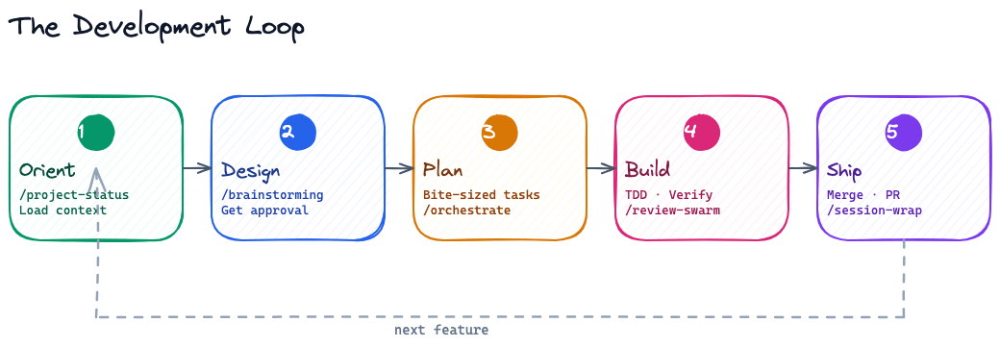
</p>

**1. Orient** — Load context with `ab-project-status` or `ab-resume-session`, or set up with `ab-project-start`.

**2. Ideate** (optional) — `ab-ideation` scans the codebase, learnings and git history and ranks improvement ideas.

**3. Design** — `ab-brainstorming` presents tradeoffs and gets your approval before any code is written.

**4. Plan** — The approved design becomes tasks that record decisions, not code: exact file paths, each test and what it asserts, signatures, and a Review Focus list. You review the saved plan before it runs. Then choose: deepen it with research (`ab-deepen-plan`), execute it one task at a time (`ab-subagent-driven-development` or `ab-executing-plans`), or run it as team work in parallel waves (`ab-orchestrate`).

**5. Build** — TDD (red-green-refactor), verification with evidence, and a code review from a helper.

**6. Ship** — Merge the branch, update the project docs with `ab-session-wrap`, and capture what was learned for the next session.

### Lightweight workflow for small changes

Not everything needs the full flow. Bug fixes with an obvious root cause, typos, config changes and tests for existing behavior take the short path, `ab-quick-fix`:

<p align="center">
  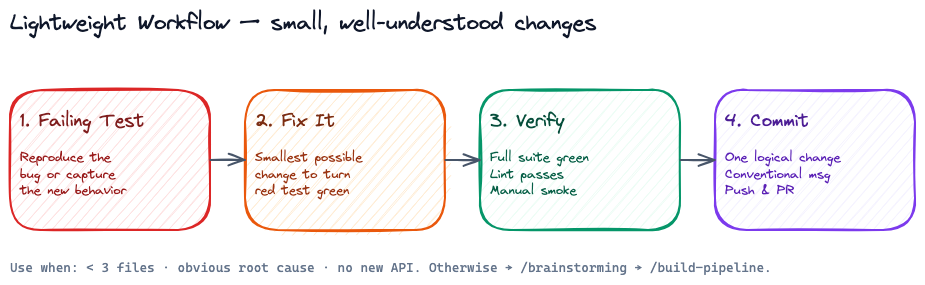
</p>

The boundary: a change that touches four or more files, adds an API or changes a data model goes through `ab-brainstorming` and then `ab-build-pipeline`. The scaffolded `AGENTS.md` states the same rule.

### Autonomous pipeline: `ab-ship-pipeline`

<p align="center">
  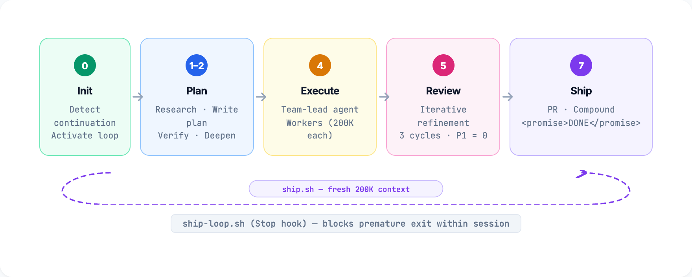
</p>

For a well-defined feature you want built hands-off, `ab-ship-pipeline` runs the whole lifecycle without checkpoints: it locks assumptions as decisions, writes and verifies a plan, deepens it, executes it through `ab-orchestrate`, reviews until the findings converge (three cycles by default), captures knowledge, then commits and writes the PR body. It tracks itself in `.agent-blueprint/run/state.json` and stops as `blocked` or `needs-human` with a reason when it cannot finish.

Two ways to run it:

```bash
# In a session, in any of the eight tools: ask for the skill with the feature
use the ab-ship-pipeline skill: add JWT authentication with refresh tokens

# Unattended, from a terminal: the ship runner drives your tool's headless mode
bash skills/ab-ship-pipeline/scripts/run.sh --host codex "add JWT authentication with refresh tokens"
```

The runner (`skills/ab-ship-pipeline/scripts/run.sh --host <host> "<feature>"`, with `<host>` one of `claude`, `codex`, `agy`, `grok`, `pi`, `cursor-agent`, `hermes`, `amp`) works the same in every tool:

- **A fresh session per iteration.** Each iteration is a new headless process with a clean context; state persists through git, the plan file and `state.json`, which the runner reads between iterations and the skill writes whole at every stage change.
- **The state file decides, not the transcript.** A run is done only when `state.json` says `done`, there are new commits since the recorded base, the PR body exists at `.agent-blueprint/run/pr-body.md`, and the provenance marker names the skill and its version. Echoed text can never end a run early.
- **The runner publishes.** The skill commits and writes the PR body; the runner scans the outgoing range and the body for secrets, pushes only to the remote and branch it recorded at preflight, and opens or updates the PR. Where the host's posture cannot write `.git` (Codex `workspace-write`), the skill leaves its changes in the working tree with the message in `commit-msg.md`, and the runner commits after each iteration.
- **Least privilege per host.** Claude Code `--permission-mode auto`; Codex `workspace-write` with network on; Cursor CLI `--force` with `--sandbox enabled`; Grok Build `--always-approve --sandbox workspace`. Pi, Amp and Antigravity (`--dangerously-skip-permissions`) can only run with no guard, so the runner needs `--allow-unguarded` for them, and on those hosts the agent holds your git and `gh` credentials: the runner's publish checks do not contain it.
- **Stop conditions.** The skill's own ceiling is 20 iterations; the runner's limit is your knob below it. A run stalls out when the stage, the commit history and the team ledger are all unchanged for two iterations. `--resume` continues a run from the runner's own record.

### Quality gates

<p align="center">
  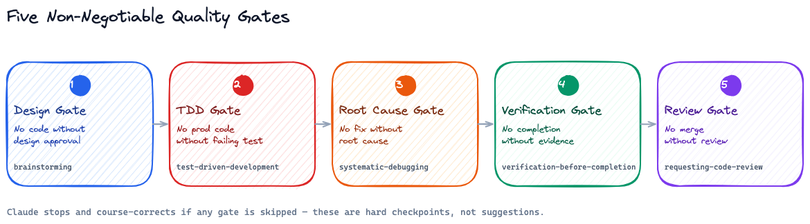
</p>

Five checkpoints hold at every stage:

| Gate | Rule | Enforced By |
|------|------|-------------|
| **1** | No code without design approval | `ab-brainstorming` |
| **2** | No production code without a failing test first | `ab-test-driven-development` |
| **3** | No fix without root cause investigation | `ab-systematic-debugging` |
| **4** | No completion claim without fresh verification evidence | `ab-verification-before-completion` |
| **5** | No merge without code review | `ab-requesting-code-review` |

### Consistency gates (CI)

The repository keeps itself honest with gates that derive their truth from the tree rather than from hand-maintained numbers. CI runs all of them on every pull request; `AGENTS.md` lists them for maintainers.

| Command | Checks |
|---------|--------|
| `bash scripts/check-drift.sh` | Count and version claims on every surface (manifests, README, website, promo source, `AGENTS.md`) match the tree: 53 skills, 10 hooks, 30 helper prompts, one version |
| `python3 scripts/check-skill-collisions.py` | Frontmatter YAML, `references/` pointers and § headings resolve, no near-duplicate descriptions |
| `python3 scripts/check-portability.py` | The portability rules for all eight hosts: agentskills frontmatter only, the `ab-` prefix, the 8,000-byte cap, no host variables or cross-skill paths, no slash names, the manual-only pairing, no text Hermes would quarantine |
| `python3 scripts/check-manifests.py` | Every host manifest and every skill's `metadata.version` agree with the release |
| `python3 scripts/sync-shared.py --check` | Snippet and shared-file copies match their owners |
| `python3 -m unittest discover -s tests/gates` | The gate and skill-contract tests |
| `claude plugin validate --strict .claude-plugin/plugin.json` | The plugin manifest, with Claude Code's own validator |

The ship runner has its own tests under `tests/runner/`, which drive `run.sh` against a fake host through its scenarios. The smoke test runs outside CI: before a release it runs a sample project through the main pipelines in every installed tool's headless mode before a release and writes a pass/fail table per tool and pipeline; a tool that fails only because of a vendor bug ships marked degraded in its support note, with the upstream link, and a failure in the blueprint's own code blocks the release.

## Team Work and Swarms

Helpers run one at a time or as coordinated groups. The same patterns work in every tool: a helper runs where the tool has subagents, and the session does the work itself where it does not.

### Team work (`ab-orchestrate`)

Runs a plan as a team with this session as the lead. The lead keeps a task ledger in `.agent-blueprint/team/<run>/`, groups tasks by dependency into waves (tasks that share a file never share a wave), and starts one helper per task, each owning its files or working in its own worktree. The lead alone integrates, commits each finished task and runs an integration verifier between waves. Wave size defaults to four and never exceeds the host's helper limit in `skills/ab-orchestrate/references/host-limits.tsv` (Claude Code 20, Codex 4, Pi 4 with `pi-subagents`, Hermes 3 interactive and 2 one-shot; Antigravity, Grok Build, Cursor CLI and Amp document no cap). A run can resume from the ledger in another session or another tool.

<p align="center">
  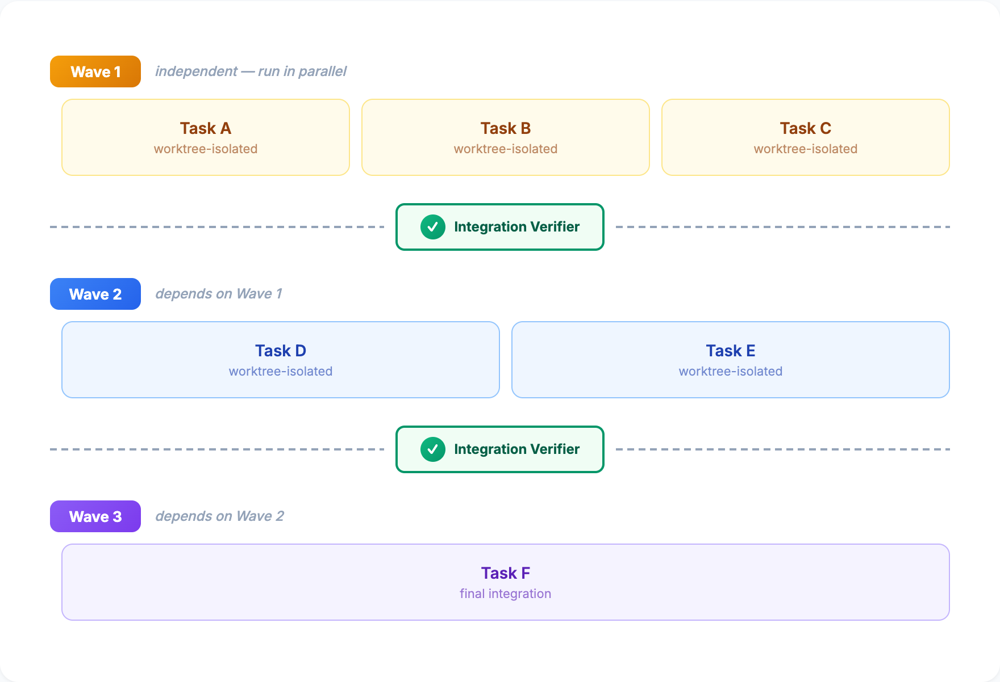
</p>

Where you have switched on a native team feature, the lead uses it on top of the ledger, as `references/native-extras.md` describes: **Claude Code Agent Teams** (`CLAUDE_CODE_EXPERIMENTAL_AGENT_TEAMS=1`, interactive sessions only, with the blueprint's TeammateIdle and TaskCompleted hooks) and **Codex `multi_agent_v2`** (`multi_agent_v2 = true` under `[features]`, long-lived helpers that take follow-up tasks). The ledger stays the task list either way.

<p align="center">
  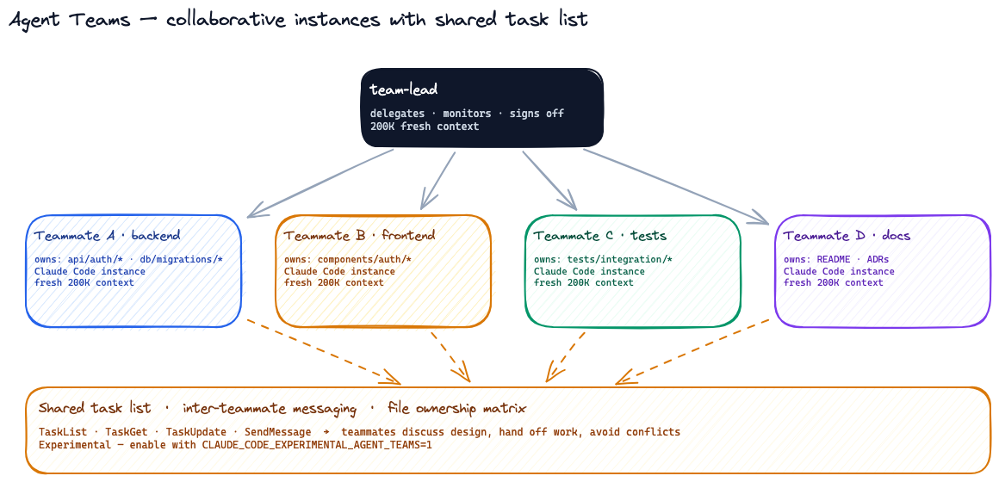
</p>

### Review swarm (`ab-review-swarm`)

Reviews a change with specialized reviewers in parallel: quality, simplicity and tests always; security, performance, conventions, frontend, architecture, data and schema as the diff calls for. A validator re-checks the findings and a synthesizer merges them into one prioritized P1/P2/P3 report.

<p align="center">
  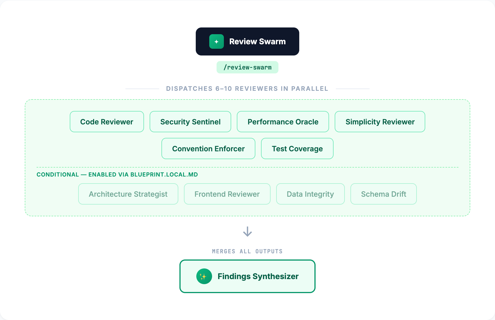
</p>

### Research swarm (`ab-deep-research`)

Five helpers research a topic in parallel before planning (past learnings, framework docs for the installed versions, industry best practices, git history, and a map of the code the change touches), and a synthesizer turns their findings into one brief.

<p align="center">
  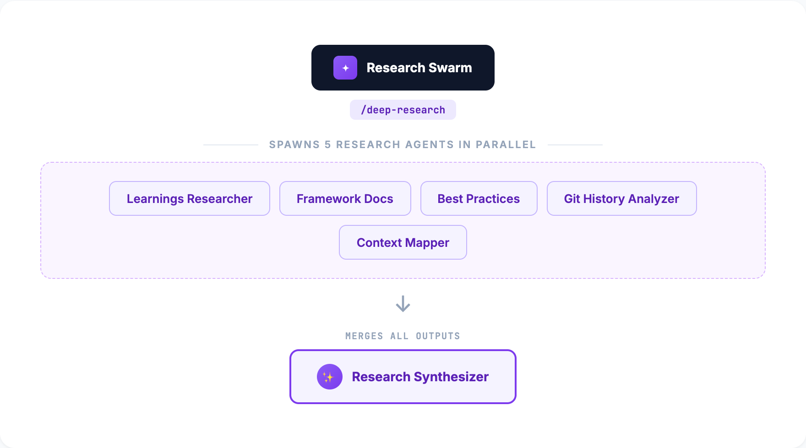
</p>

### Knowledge loop (`ab-knowledge-compounding`)

Each solved problem becomes a searchable solution document in `docs/solutions/`. `ab-brainstorming` and `ab-deep-research` search it before new work, so the project stops repeating its mistakes.

<p align="center">
  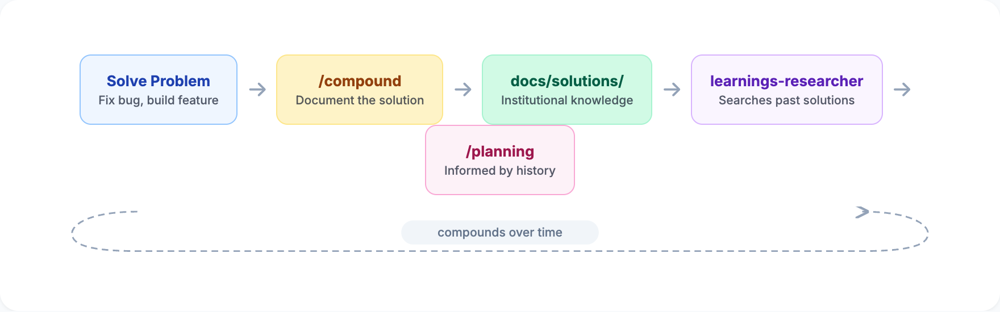
</p>

**When to use which:**

| Pattern | Best for | Key feature |
|---------|----------|-------------|
| **Swarms** (`ab-review-swarm`, `ab-deep-research`) | Parallel analysis: same input, different lenses | Read-only helpers; a synthesizer merges the outputs |
| **Team work** (`ab-orchestrate`) | Implementing a plan's tasks | Task ledger, waves, file ownership or worktrees, lead-only commits |

A typical feature combines them: `ab-deep-research`, then `ab-brainstorming`, then `ab-orchestrate`, then `ab-review-swarm`.

## Model and Effort

The blueprint never picks a model or an effort level for you, in any tool. No skill or helper prompt sets a model or an effort, so a pipeline reasons at whatever level your session runs, and a helper inherits the session's choice wherever the tool passes it on. A prompt whose role header says it is safe at lower effort may run lower only where the tool takes a per-helper effort and you have not asked for your level everywhere. The blueprint never switches models to save effort.

| Host | Set the model | Set the effort | Helpers inherit them? |
|---|---|---|---|
| Claude Code | `/model` in a session, or `claude --model <model>` | `/effort`, `claude --effort <level>`, or `CLAUDE_CODE_EFFORT_LEVEL`; a level saved in settings applies below those | Yes: a helper without an `effort` of its own inherits the session level (the Agent tool takes no effort parameter); verified on 2.1.284 |
| Codex | `/model` in a session, or `codex -m <model>` | `model_reasoning_effort` in `~/.codex/config.toml` (`low` to `ultra`, by model) | Yes: a subagent inherits the parent's model and effort unless configured otherwise, and `spawn_agent` can override effort per helper |
| Antigravity | `/model` in a session (persisted); `agy models` lists them | `--model` and `--effort low\|medium\|high` are reported by third-party write-ups: not verified | Not verified: a subagent definition can set a model tier, and no per-dispatch override is documented |
| Grok Build | `/model`, `grok -m <model>`, or `[models] default` in `~/.grok/config.toml` | `--effort none\|minimal\|low\|medium\|high\|xhigh\|max` | Not verified: per-dispatch model and effort are not documented |
| Pi | `/model`, or `pi --model <pattern>[:thinking]` | `/thinking`, or `--thinking off\|minimal\|low\|medium\|high\|xhigh\|max` (clamped to the model) | Only with the `pi-subagents` package, which takes a per-dispatch `model:"provider/id:level"`; inheritance not verified |
| Cursor CLI | `/model` picker, or `cursor-agent --model 'id[effort=high]'` | Inside the model string: `id[effort=high]`; there is no separate effort flag | Helpers defined in agent files can say `model: inherit`; for the blueprint's ad-hoc helpers, not verified |
| Hermes | `/model` in a session, or `hermes -m <model> --provider <provider>` | `/reasoning high` in a session, or `agent.reasoning_effort` in `~/.hermes/config.yaml` | No: helpers use the global `delegation.model` and `delegation.reasoning_effort` settings, not the session choice |
| Amp | The Dial: a mode (`low`, `medium`, `high`, `ultra`) sets model, effort, prompt and tools together, chosen before the first message and fixed for the thread | Part of the mode | Not verified: no per-dispatch model from a prompt |

### Claude Code specifics

Opus 5.5 is the default model on every plan from CLI 2.1.280 and starts sessions at `medium` effort; other current models start at `high`. A level set with `--effort`, `/effort` or the environment variable wins over settings, and settings win over the model default. Some reference points:

| Session setting | Fits |
|-----------------|------|
| Opus 5.5 at `high` | A solid default for pipeline runs |
| Opus 5.5 at `xhigh`, or Fable 5.1 at `high` | More careful on hard or high-stakes work; slower and costlier |
| Opus 5.5 at `medium` (its starting level) or lower | Small tasks, quick fixes and questions |

The ship runner passes no model or effort flag of its own, so an unattended run uses the defaults you have saved in the tool.

## Skills Reference

<p align="center">
  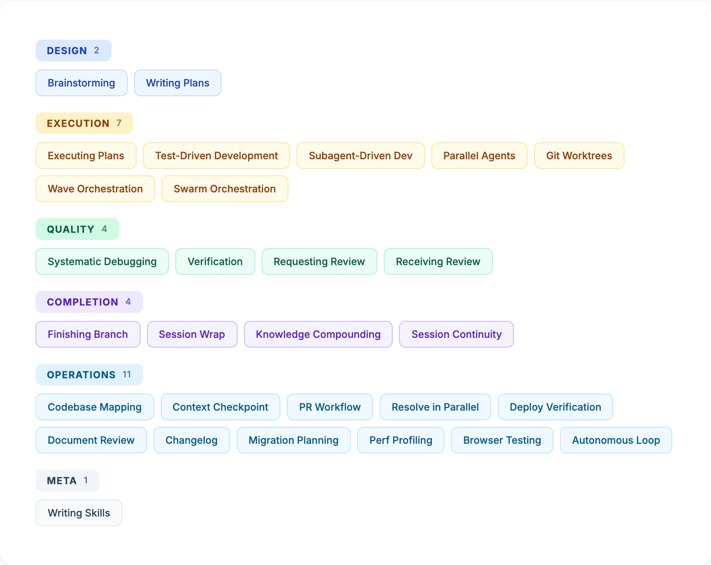
</p>

Skills are workflow modules that run at specific points of development. Each is a folder under `skills/` with a `SKILL.md` that stays under 8,000 bytes and a `references/` folder with the detail it loads at the point of use.

### Pipelines

| Skill | What it does | When |
|-------|-------------|------|
| [**ab-build-pipeline**](skills/ab-build-pipeline/) | Runs a feature through eight supervised stages (discuss, brainstorm, plan, execute, review, verify, optional deploy check, knowledge capture) with a checkpoint after each | A feature you approve stage by stage |
| [**ab-ship-pipeline**](skills/ab-ship-pipeline/) | Ships a feature end to end with no checkpoints, tracked in `.agent-blueprint/run/state.json`; the ship runner drives it unattended | A well-defined feature, fire and forget |
| [**ab-quick-fix**](skills/ab-quick-fix/) | A small, well-understood change through a short test-first loop, then a commit on a branch | Under three files, obvious approach |
| [**ab-orchestrate**](skills/ab-orchestrate/) | Runs a plan as team work: ledger, dependency-ordered waves, file ownership or worktrees, lead-only commits, review and sign-off | Four or more tasks, some independent |

### Design phase

| Skill | What it does | When |
|-------|-------------|------|
| [**ab-brainstorming**](skills/ab-brainstorming/) | Turns an idea into an approved design: settles what the repository answers, challenges the premise, compares two or three approaches, saves the plan | Before any new feature |
| [**ab-discuss**](skills/ab-discuss/) | Captures and locks the user's decisions before planning, with prior art from ADRs, plans and learnings | Ambiguous choices ahead of a plan |
| [**ab-ideation**](skills/ab-ideation/) | Generates grounded improvement ideas from learnings, structure and git history, and saves five to seven ranked survivors | "What's worth building?" |
| [**ab-writing-plans**](skills/ab-writing-plans/) | Turns an approved design into a plan that records decisions, not code: file paths, each test and what it asserts, signatures, verification commands, review focus | After design approval |
| [**ab-deepen-plan**](skills/ab-deepen-plan/) | Enriches a plan with five read-only research helpers in parallel; findings go under each section as research notes | A plan that needs more evidence |
| [**ab-deep-research**](skills/ab-deep-research/) | Researches a topic with five helpers in parallel and one synthesized brief | Before planning something unfamiliar |
| [**ab-spike-exploration**](skills/ab-spike-exploration/) | A timeboxed, hands-on spike with throwaway code that answers one technical question, reported to `docs/research/` | Significant technical uncertainty |
| [**ab-scope-cutting**](skills/ab-scope-cutting/) | Cuts a feature to the smallest useful deliverable with MoSCoW and checks the must-haves still ship | Feature too large or deadline at risk |

### Execution phase

| Skill | What it does | When |
|-------|-------------|------|
| [**ab-executing-plans**](skills/ab-executing-plans/) | Executes a plan in batches of three tasks with a checkpoint after each batch and a whole-branch review at the end | Plan execution in this session |
| [**ab-subagent-driven-development**](skills/ab-subagent-driven-development/) | A fresh helper per task, then a spec reviewer and a code reviewer, with fix rounds until both pass | Plan execution with two-stage review |
| [**ab-autonomous-loop**](skills/ab-autonomous-loop/) | Runs a plan's tasks with no checkpoints: verify, tick, commit, retry after a written reflection, stop on a circuit breaker or a risk score | "Just do it all" |
| [**ab-test-driven-development**](skills/ab-test-driven-development/) | Red-green-refactor: one failing test, the least code that passes, the whole suite, then refactor | Any new code |
| [**ab-source-driven-development**](skills/ab-source-driven-development/) | Writes framework- and library-specific code from the official docs for the installed version, citing the URL or marking it unverified | Framework or library APIs |
| [**ab-dispatching-parallel-agents**](skills/ab-dispatching-parallel-agents/) | One focused helper per independent problem, all started at once, then integrated | Two or more unrelated failures |
| [**ab-using-git-worktrees**](skills/ab-using-git-worktrees/) | An isolated git worktree on a new branch for feature or parallel work | Before major features |

### Quality phase

| Skill | What it does | When |
|-------|-------------|------|
| [**ab-systematic-debugging**](skills/ab-systematic-debugging/) | Root cause before any fix: classify, reproduce, trace, one hypothesis at a time against evidence tiers, fix test-first | Any bug or test failure |
| [**ab-verification-before-completion**](skills/ab-verification-before-completion/) | Fresh evidence before any completion claim: the output that would prove it false, the full command, its exit code | Before saying work is done |
| [**ab-requesting-code-review**](skills/ab-requesting-code-review/) | A fast single-reviewer review of a guarded range with the code-reviewer helper | After a task or before a merge |
| [**ab-receiving-code-review**](skills/ab-receiving-code-review/) | Acts on review feedback by verifying each item first, then one change at a time with a test, or a technical pushback | When review feedback arrives |
| [**ab-review-swarm**](skills/ab-review-swarm/) | Specialized reviewers in parallel, findings validated and merged into one P1/P2/P3 report | Significant changes |
| [**ab-iterative-refinement**](skills/ab-iterative-refinement/) | Review-fix-review cycles until the findings converge (fast, deep or perfect) | Ship pipeline reviews, `ab-build-pipeline --iterate N` |
| [**ab-add-tests**](skills/ab-add-tests/) | Backfills tests for code that has none, ranked by risk, with the user choosing which gaps to fill | Improving coverage |
| [**ab-browser-testing**](skills/ab-browser-testing/) | Verifies UI changes in a real browser through a browser automation tool, including error states and viewports | After UI changes |
| [**ab-document-review**](skills/ab-document-review/) | Three-pass review of a document (accuracy against the repository, clarity, completeness) with a verdict | Specs, plans, READMEs, runbooks |

### Completion phase

| Skill | What it does | When |
|-------|-------------|------|
| [**ab-finishing-a-development-branch**](skills/ab-finishing-a-development-branch/) | Tests, a plan audit against the diff, then merge locally, push and open a PR, or keep the branch; discarding only on request | After all tests pass |
| [**ab-pr-workflow**](skills/ab-pr-workflow/) | The pull request lifecycle: checks on the pushed commit, a motivation-first body scanned for secrets, self-review, comment resolution, merge onto a green main | Creating or finishing a PR |
| [**ab-session-wrap**](skills/ab-session-wrap/) | Ends a session from git history and the file system: rewrites the Session Continuity notes in `docs/context/STATUS.md`, records learnings, updates the docs | End of a session |
| [**ab-knowledge-compounding**](skills/ab-knowledge-compounding/) | Records a solved problem in `docs/solutions/` with search terms and cross-links | After a non-trivial problem |
| [**ab-changelog-generation**](skills/ab-changelog-generation/) | Release notes from git history in Keep a Changelog format | Preparing a release |

### Session management

| Skill | What it does | When |
|-------|-------------|------|
| [**ab-project-start**](skills/ab-project-start/) | Scaffolds `AGENTS.md`, `CLAUDE.md`, `docs/context/` and `BACKLOG.md` by merging, then fills in conventions, goals and status | New project, or adopting the blueprint |
| [**ab-project-status**](skills/ab-project-status/) | Where the project stands: code state, work in flight, goal progress, top three next actions | Start of a session |
| [**ab-resume-session**](skills/ab-resume-session/) | Reloads what earlier sessions left and checks whether HEAD moved since the handoff | Picking up earlier work |
| [**ab-pause-checkpoint**](skills/ab-pause-checkpoint/) | A quick mid-session snapshot plus the execution state in `docs/context/STATE.md` | Stepping away |
| [**ab-context-checkpoint**](skills/ab-context-checkpoint/) | A timestamped recovery point with progress, decisions, next steps and open questions | Before risky operations or a long session |
| [**ab-session-continuity**](skills/ab-session-continuity/) | Keeps `docs/context/STATE.md` current across session boundaries with a HEAD stamp | During wave orchestration |
| [**ab-backlog-triage**](skills/ab-backlog-triage/) | Sorts the `BACKLOG.md` inbox into prioritized, typed items against the goals | Inbox grows |
| [**ab-health-check**](skills/ab-health-check/) | Eight areas (build, tests, lint, dependencies, conventions, docs, backlog, git) with the project's own commands | Periodic check |

### Operations

| Skill | What it does | When |
|-------|-------------|------|
| [**ab-codebase-mapping**](skills/ab-codebase-mapping/) | Maps an unfamiliar codebase, read-only, into structured documentation with file paths | Before modifying unfamiliar code |
| [**ab-resolve-in-parallel**](skills/ab-resolve-in-parallel/) | Fixes a batch of independent items at once, one helper per item, then checks for conflicts | PR comments, review findings, test failures |
| [**ab-deployment-verification**](skills/ab-deployment-verification/) | A go/no-go check across eight areas with concrete evidence | Before a production deployment |
| [**ab-migration-planning**](skills/ab-migration-planning/) | A migration plan whose every step can be undone: blast radius, expand-contract steps, rollbacks | Database, API or dependency migrations |
| [**ab-performance-profiling**](skills/ab-performance-profiling/) | Measure, profile, one optimization at a time against the noise floor, reverted attempts recorded | When something is "slow" |
| [**ab-dependency-management**](skills/ab-dependency-management/) | Adds, upgrades and removes dependencies through five gates, pinned and committed with the lockfile | Dependency changes |
| [**ab-forensics**](skills/ab-forensics/) | Diagnoses a failed, stalled or aborted automated run after the fact from its logs, run state and git history | A ship run that did not finish |

### Orchestration primitives

| Skill | What it does | When |
|-------|-------------|------|
| [**ab-wave-orchestration**](skills/ab-wave-orchestration/) | Groups dependent tasks into waves of parallel helpers with an integration verifier between waves | Four or more tasks with mixed dependencies |
| [**ab-swarm-orchestration**](skills/ab-swarm-orchestration/) | Several read-only specialist helpers on the same input, one dimension each, merged by a synthesizer | Custom swarms |

### Meta

| Skill | What it does | When |
|-------|-------------|------|
| [**ab-writing-skills**](skills/ab-writing-skills/) | Writes, edits and tests skills that load in every supported tool: agentskills frontmatter, the 8,000-byte cap, capability snippets, prompt files, a test first | Creating or changing skills |
| [**ab-plugin-update**](skills/ab-plugin-update/) | Upgrades Agent Blueprint itself through the tool's own route or a re-run of `install.sh`, then checks the version. Manual-only | Upgrading the blueprint |
| [**ab-migrate**](skills/ab-migrate/) | Cleans a v3 install out of a project and renames `CLAUDE.md` to `AGENTS.md` behind a backup branch. Manual-only | Moving a project from v3 |

## Helper Prompts Reference

Helpers are prompt files inside the skills that use them (`skills/<skill>/references/agents/<name>.md`). A skill starts a helper where the tool has subagents and follows the same file itself where it does not; either way the result comes back in the prompt's Output section. A prompt that several skills use has one owner and byte-identical copies, checked by `scripts/sync-shared.py --check`.

| Helper | Domain | When it runs |
|-------|--------|-----------------|
| [**code-reviewer**](skills/ab-review-swarm/references/agents/code-reviewer.md) | Standards, correctness, plan compliance | After completing a major step or before merge |
| [**architecture-strategist**](skills/ab-review-swarm/references/agents/architecture-strategist.md) | Structural patterns, service boundaries | When reviewing PRs, adding services, refactoring |
| [**security-sentinel**](skills/ab-review-swarm/references/agents/security-sentinel.md) | OWASP, auth flows, vulnerability scanning | Before deployment, after auth/payment/API work |
| [**code-simplicity-reviewer**](skills/ab-review-swarm/references/agents/code-simplicity-reviewer.md) | YAGNI violations, over-engineering | After implementation is complete |
| [**performance-oracle**](skills/ab-review-swarm/references/agents/performance-oracle.md) | Bottlenecks, N+1 queries, algorithmic complexity | After features are built, on performance concerns |
| [**best-practices-researcher**](skills/ab-deep-research/references/agents/best-practices-researcher.md) | Industry standards, library documentation | When needing external guidance |
| [**git-history-analyzer**](skills/ab-deep-research/references/agents/git-history-analyzer.md) | Code evolution, pattern archaeology | When understanding why code is the way it is |
| [**learnings-researcher**](skills/ab-deep-research/references/agents/learnings-researcher.md) | Past solutions, decisions, patterns | Before planning: searches docs/ for prior art |
| [**plan-checker**](skills/ab-deepen-plan/references/agents/plan-checker.md) | Plan validation, gap detection | After writing a plan, before execution |
| [**integration-checker**](skills/ab-swarm-orchestration/references/agents/integration-checker.md) | Component wiring, connection validation | After implementation: verifies components connect |
| [**bug-reproduction-validator**](skills/ab-systematic-debugging/references/agents/bug-reproduction-validator.md) | Bug reproduction, fix verification | When debugging: validates repro steps and fixes |
| [**codebase-mapper**](skills/ab-codebase-mapping/references/agents/codebase-mapper.md) | Architecture, conventions, stack analysis | Onboarding to unfamiliar code or before modifying it |
| [**pr-comment-resolver**](skills/ab-pr-workflow/references/agents/pr-comment-resolver.md) | Targeted PR comment resolution | Processing review feedback: one comment per helper |
| [**test-gap-analyzer**](skills/ab-add-tests/references/agents/test-gap-analyzer.md) | Coverage gaps, test generation | Improving coverage or before major refactors |
| [**research-synthesizer**](skills/ab-deep-research/references/agents/research-synthesizer.md) | Multi-helper output consolidation | After parallel research: unifies findings |
| [**deployment-verifier**](skills/ab-deployment-verification/references/agents/deployment-verifier.md) | Deployment readiness verification | Before deploying: checks 8 critical areas |
| [**schema-drift-detector**](skills/ab-review-swarm/references/agents/schema-drift-detector.md) | Unrelated schema/migration changes | Reviewing PRs: catches scope creep in the data layer |
| [**frontend-reviewer**](skills/ab-review-swarm/references/agents/frontend-reviewer.md) | UI/UX code quality review | Reviewing frontend code: a11y, responsive, perf |
| [**convention-enforcer**](skills/ab-review-swarm/references/agents/convention-enforcer.md) | CONVENTIONS.md compliance checking | Reviewing code against project standards |
| [**data-integrity-guardian**](skills/ab-review-swarm/references/agents/data-integrity-guardian.md) | Migration safety, transactions, rollback plans | PRs with migrations, schema changes, data transforms |
| [**test-coverage-reviewer**](skills/ab-review-swarm/references/agents/test-coverage-reviewer.md) | Test quality, assertion meaningfulness, edge cases | After implementation: verifies tests validate behavior |
| [**framework-docs-researcher**](skills/ab-deep-research/references/agents/framework-docs-researcher.md) | Current framework docs for installed versions | Before planning features that use specific framework APIs |
| [**codebase-context-mapper**](skills/ab-deep-research/references/agents/codebase-context-mapper.md) | Focused impact map for a specific change | Before planning: maps the files and dependencies a change touches |
| [**integration-verifier**](skills/ab-wave-orchestration/references/agents/integration-verifier.md) | Cross-task integration verification | After a wave completes: parallel implementations work together |
| [**findings-synthesizer**](skills/ab-review-swarm/references/agents/findings-synthesizer.md) | Review swarm output consolidation | After `ab-review-swarm`: de-duplicates and prioritizes all findings |
| [**pattern-mapper**](skills/ab-executing-plans/references/agents/pattern-mapper.md) | Analog-file mapping for new code | Between research and execution: grounds new files in existing conventions |
| [**implementer**](skills/ab-subagent-driven-development/references/agents/implementer.md) | One plan task, test first, with a self-review | Subagent-driven development: a fresh helper per task |
| [**spec-reviewer**](skills/ab-subagent-driven-development/references/agents/spec-reviewer.md) | Built what the task asked, nothing more | Subagent-driven development: after each implementer, before code review |
| [**doc-claim-verifier**](skills/ab-document-review/references/agents/doc-claim-verifier.md) | Doc claims vs live codebase | Reviewing READMEs, ADRs, runbooks: catches doc drift after refactors |
| [**findings-validator**](skills/ab-review-swarm/references/agents/findings-validator.md) | Independent re-verification of review findings | Between `ab-review-swarm` and synthesis: suppresses false positives |

### How helpers run

A helper runs in its own context where the tool can start one; otherwise the main session follows the prompt file itself. Each prompt opens with a role header (what it may change, whether it is safe at lower effort, and that it starts no helpers of its own) and ends with an Output section, so both paths return the same shape. Helpers run individually or as coordinated groups:

**Single dispatch**, one helper for one job:

```
Main session -> helper with references/agents/security-sentinel.md -> findings -> act on results
```

**Swarm dispatch**, several helpers on the same input with different lenses:

<p align="center">
  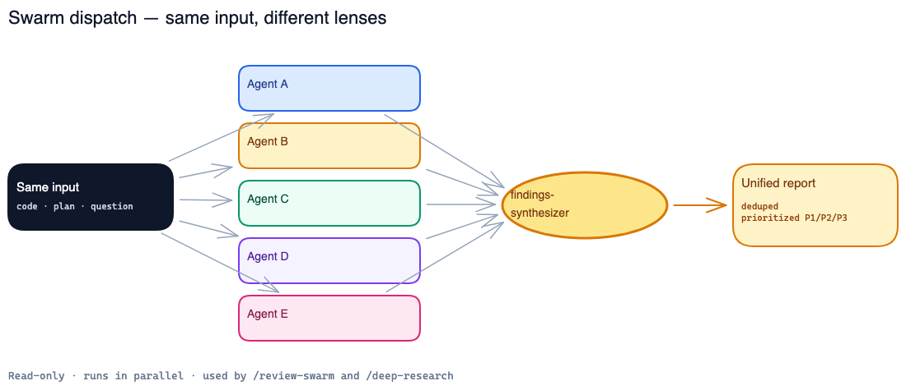
</p>

**Wave dispatch**, parallel within a wave, sequential between waves:

<p align="center">
  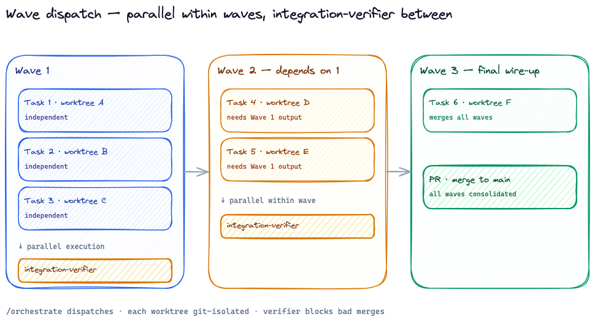
</p>

**Team dispatch**, with a native team feature switched on: long-lived teammates with file ownership and messaging on top of the ledger:

<p align="center">
  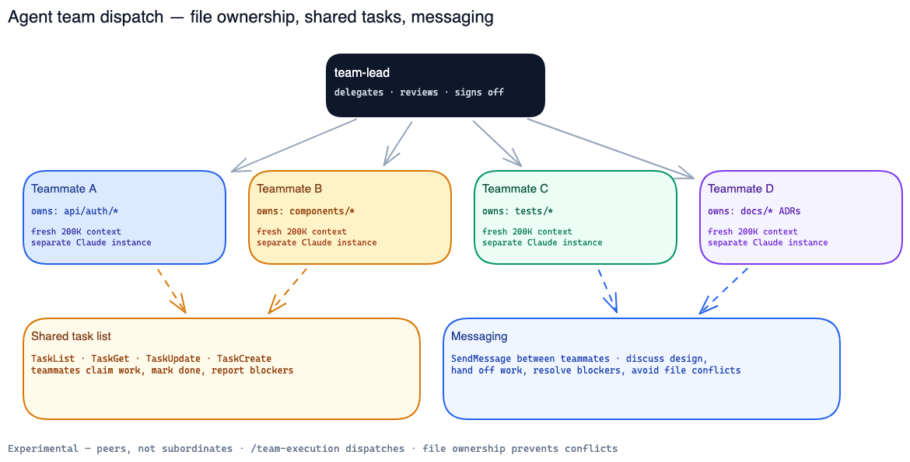
</p>

## Customization

### Adapting to your project

After installation, ask for the `ab-project-start` skill to fill in:

- **GOALS.md**: three to five project objectives with a priority each
- **CONVENTIONS.md**: the stack, the test, lint and dev commands, naming, file layout
- **STATUS.md**: the current state, known issues, recent work
- **AGENTS.md**: the instructions every tool loads; the scaffold merges its sections into an existing file and keeps yours

### Adding your own skills

The plugin's skills are installed once; project-specific skills live in your project's own skills folder (`.agents/skills/` for the tools that read it, or wherever your tool looks). Ask for the `ab-writing-skills` skill to write one; it holds the rules and the test-first method:

- agentskills frontmatter only (`name`, `description`, plus `argument-hint` and `disable-model-invocation`), no `model` or `effort`
- the whole `SKILL.md` under 8,000 bytes, with detail moved into `references/` at the point of use
- other skills named in prose, never with a slash, because every host invokes skills differently
- host-dependent steps pasted from the capability snippets in `skills/ab-writing-skills/references/capability-snippets.md` (helper step, asking the user, task tracking, lower effort, working folder, provenance, no-commit mode, bundled scripts), so the skill runs in every tool
- no host variables such as `${CLAUDE_PLUGIN_ROOT}`, no `$ARGUMENTS`, no path outside the skill's own folder

```text
> Create a skill for database migration workflows
# The ab-writing-skills skill will:
# 1. Write a failing test scenario
# 2. Create the skill
# 3. Verify it handles the scenario
```

### Adding your own helper prompts

Put a prompt file in the skill that dispatches it, under `references/agents/<name>.md`, with no frontmatter. Open it with a one-line role header (what it may change, whether it is safe at lower effort, and that it starts no helpers of its own) and end it with an `## Output` section, so a helper run and an inline run return the same shape. The skill hands work to it with the helper-step snippet. The `ab-writing-skills` skill covers the details.

### Platform currency

The blueprint adopts a host's native features only as opt-ins: no pipeline depends on a gated or experimental capability. Where a native feature overlaps something the blueprint already does, the table records why the blueprint's own mechanism stays the default.

| Platform feature | Blueprint's stance | Gating |
|------------------|--------------------|--------|
| **Claude Code Agent Teams** and **Codex `multi_agent_v2`** | Optional extras for `ab-orchestrate` on top of the portable ledger; team work runs without them in every tool | Switched on by you: `CLAUDE_CODE_EXPERIMENTAL_AGENT_TEAMS=1` (interactive sessions only) or `multi_agent_v2 = true` under `[features]` |
| **Claude Code `/goal`** (condition-based completion) | A complement for interactive runs; the ship runner and its state file are the guarantee, since a skill cannot invoke `/goal` and it does not run headless | None; generally available in the CLI |
| **Native `/loop` + ScheduleWakeup** (Claude Code) | Adds scheduled reruns, but `/loop` is session-scoped and does not reset context, circuit-break or detect degradation, so `ab-autonomous-loop` keeps its own circuit breaker and degradation detection | None; complementary, not a replacement |
| **Workflow tool / `/workflows` / ultracode** (Claude Code) | Opt-in for very large autonomous fan-outs; wave orchestration stays the ungated, portable default | Paid plans, the API and Bedrock/Vertex/Foundry; in `claude -p` only behind a `Workflow` allow rule, auto or bypass mode, or a PreToolUse hook |
| **Fast mode** (Claude Code) | Opt-in only | Opus 5.5, Opus 5 and Opus 4.8; research preview, pricing subject to change |
| **Per-session caps** (Claude Code) | Swarms and research sweeps stay within the native limits: no per-session subagent total since CLI 2.1.224, only a concurrency cap and a nesting depth; `host-limits.tsv` records the other hosts' caps | 20 concurrent subagents by default (`CLAUDE_CODE_MAX_CONCURRENT_SUBAGENTS`), spawn depth 3 (`CLAUDE_CODE_MAX_SUBAGENT_SPAWN_DEPTH`), 200 WebSearches per session |
| **Native injection hardening** (Claude Code Agent tool) | Reinforces, does not replace, the blueprint's own read and write scanners (Claude Code and Codex hooks) and the data markers helpers wrap external text in, which cover the main-session surfaces native hardening does not observe | None; defense in depth |
| **Bundled `/deep-research` workflow** (Claude Code) | Claude Code bundles a web-search fan-out workflow of that name; the blueprint's research swarm is `ab-deep-research`, so the two no longer share a name | None |
| **Hermes skill security scan** | Skills, prompt files and instruction files carry none of the phrases Hermes treats as injection, no instruction to edit the instructions file by name, and no HTML comments; the portability gate mirrors those checks | Runs on every skill Hermes installs or indexes |

### Adjusting quality gates

The gates are encoded in the skill files. To relax one (for example, no code review for docs-only changes), edit the corresponding skill's `SKILL.md` and add your exception criteria; keep the file under 8,000 bytes.

### Install options

```bash
# Detect the installed tools and install for each
bash install.sh

# Install and scaffold a project
bash install.sh /path/to/project

# Scaffold only (the blueprint is already installed)
bash install.sh --scaffold /path/to/project

# One or more tools only
bash install.sh --only claude,codex

# Copy the skills somewhere else (a machine with no tool on PATH)
bash install.sh --copy-dir /path/to/skills

# Preview what would run or be copied
bash install.sh --dry-run
```

## Documentation structure

The scaffold includes **example docs** in each category so you can see the expected format immediately. Delete them when you start your project; they are clearly marked as examples.

| Example file | Shows you how to write |
|-------------|----------------------|
| `docs/decisions/001-example-project-structure.md` | Architecture decision records |
| `docs/plans/2026-03-04-example-user-auth.md` | Implementation plans that record decisions |
| `docs/specs/example-csv-export.md` | Feature specifications with acceptance criteria |
| `docs/research/example-jwt-refresh-strategies.md` | Research docs with findings and recommendations |

The `docs/` directory uses these categories, each with its own lifecycle:

| Directory | Contains | Lifecycle |
|-----------|----------|-----------|
| `docs/context/` | STATUS.md (with the Session Continuity notes), GOALS.md, CONVENTIONS.md, DECISIONS.md | Updated every session |
| `docs/plans/` | `YYYY-MM-DD-topic.md` implementation plans | Created per feature, archived when done |
| `docs/specs/` | `feature-name.md` specifications | Created before building, stable after approval |
| `docs/decisions/` | `NNN-kebab-case-title.md` ADRs | Created when choosing between options, permanent |
| `docs/research/` | Spike results, tool evaluations | Created during exploration, referenced later |
| `docs/learnings/` | LEARNINGS.md: patterns and gotchas | Appended by `ab-session-wrap` |
| `docs/solutions/` | Solved problems, institutional knowledge | Created by `ab-knowledge-compounding`, searched by `ab-brainstorming` and `ab-deep-research` |

## How it works under the hood

### Context loading order

Every tool loads `AGENTS.md` from the project root as its instructions; Claude Code loads it through the `@AGENTS.md` line in `CLAUDE.md` (a symlink works too), and Amp, Cursor CLI, Grok Build, Pi, Hermes, Codex and Antigravity read `AGENTS.md` directly. From there a session reads, in this order:

1. **AGENTS.md**: how work is done here and why, where things are, the skills to use, when to decide and when to ask
2. **docs/context/STATUS.md**: the Session Continuity notes and what is in flight
3. **docs/context/CONVENTIONS.md**: the stack and the commands, read before writing code
4. **docs/context/STATE.md**: execution state for resuming in-progress work (wave progress, task completion)
5. **docs/context/GOALS.md** and **DECISIONS.md**: what the project is for and what is locked
6. **BACKLOG.md**: what is waiting
7. **docs/solutions/** and **docs/learnings/**: searched before planning
8. **blueprint.local.md**: which helpers run for this stack
9. **Skills**: picked from their descriptions as the work calls for them, or named by you
10. **Helper prompts**: run by the skills that use them, in a helper or inline

In Claude Code and Codex the session-start hook also points the session at `STATUS.md`; elsewhere `AGENTS.md` says to read it first.

### Context window management

Large features can exhaust a session's context. The blueprint has layered defenses:

| Layer | Mechanism | What it does |
|-------|-----------|-------------|
| **Prevention** | Helper isolation | Where the tool has subagents, each helper works in a fresh context and the main session sees only its output |
| **Detection** | `context-monitor.js` (PostToolUse hook, Claude Code and Codex) | Warns at 150 tool calls, escalates at 200, flags analysis paralysis at 8+ consecutive reads |
| **Fresh context per iteration** | The ship runner | Starts a new headless session per iteration in any tool; state persists through git, the plan file and `state.json` |
| **Session guard** | `ship-loop.sh` (Stop hook, Claude Code and Codex) | Keeps an interactive ship run from stopping while `state.json` says `running`; stands down under the runner |
| **Circuit breakers** | `ab-autonomous-loop` | Stops after 3 no-progress iterations or 5 identical errors; degradation detection catches rising difficulty and hot-file churn; a reflection gate before every retry |

The runner and the Stop hook solve different problems: the hook catches an interactive session quitting early (same session, growing context), while the runner handles genuine context exhaustion (a fresh session per iteration, state on disk), and it does so in every tool, hooks or not.

### Session continuity

The Session Continuity section of `docs/context/STATUS.md` is the handoff note between sessions, and between tools:

```markdown
## Session Continuity

**Last session:** 2026-03-04

**What was done:**
- Implemented JWT refresh token rotation
- Added rate limiting middleware
- Fixed Safari redirect loop (root cause: SameSite cookie attribute)

**What's remaining:**
- Integration tests for token refresh edge cases
- Load testing the rate limiter

**Start here:** Run the failing integration tests in tests/auth/refresh.test.ts

**Current state of the code:**
- Build: passing
- Tests: 2 failing (expected: the ones we need to write)
- Uncommitted changes: none
```

`ab-session-wrap` rewrites it at the end of each session from git history and the file system, never from an earlier summary, and `ab-resume-session` reads it first.

## Error recovery

The scaffolded `AGENTS.md` carries guidance for common failures:

| Situation | Recovery |
|-----------|----------|
| Test fails after code change | Don't iterate blindly; use the `ab-systematic-debugging` skill |
| Merge conflict | Read both sides, understand intent, then resolve |
| Broken build after dep update | Pin the previous version, put the upgrade in BACKLOG.md |
| Corrupted worktree | Create a fresh one from main, cherry-pick completed commits |
| Helper returns bad results | Verify the findings before acting on them |
| Lost uncommitted changes | Check `git stash list`, `git reflog`, `git fsck --lost-found` |
| A ship run stalls or aborts | Read `.agent-blueprint/run/state.json` and its `reason`; the `ab-forensics` skill reads the logs, run state and git history |

## FAQ

<details>
<summary><strong>Which tool should I use?</strong></summary>

Whichever you already use. The [eight-tool table](#runs-in-eight-tools) shows what each one gets: hooks only in Claude Code and Codex, helpers everywhere except Pi without `pi-subagents`, manual-only enforced everywhere except Amp and Hermes. The pipelines run end to end in all eight; the support note under `docs/hosts/` for your tool says what is different there and its smoke-test status.
</details>

<details>
<summary><strong>Does it work without hooks?</strong></summary>

Yes. Hooks exist only for Claude Code (`hooks/claude-code.json`, 10 handlers) and Codex (`hooks/codex.json`, 5; Codex runs them after you trust them in `/hooks`). The other six hosts lose only what the hooks add: the session-start pointer to `docs/context/STATUS.md`, the injection scanners on writes and reads, the context monitor, the commit-message check, the fetch cache, the ship-pipeline Stop guard, and the Agent Teams gates. No pipeline depends on any of them; the ship runner drives an unattended run through `state.json`, in every tool.
</details>

<details>
<summary><strong>Can I use this with an existing project?</strong></summary>

Yes. The blueprint installs in your tool and adds zero engine files to your project. Install it for your tool, then ask for the `ab-project-start` skill in the project: it scaffolds `AGENTS.md` and `docs/` by merging into what exists. Your existing code and instructions are never overwritten.
</details>

<details>
<summary><strong>Do I need all the skills?</strong></summary>

No. Skills are picked from their descriptions when a request matches. If you never do TDD, `ab-test-driven-development` never runs. You can also delete any skill folder you don't want; the blueprint works with any subset.
</details>

<details>
<summary><strong>How do helper prompts differ from skills?</strong></summary>

**Skills** are instructions for the main session: they guide the work during your conversation. **Helper prompts** are files a skill hands to a helper for focused analysis (a security audit, a plan check, a deep code review) that benefits from a fresh context. Where the tool has subagents the helper runs in its own context; where it does not, the session follows the prompt itself. Both return the prompt's Output section.
</details>

<details>
<summary><strong>Will this slow my sessions down?</strong></summary>

`AGENTS.md` adds a small amount of context. Skills load when they run, not up front, and each `SKILL.md` stays under 8,000 bytes with its detail in `references/`, loaded at the point of use. Most of the content is only read when it is needed.
</details>

<details>
<summary><strong>Can I use this with Claude Code in my IDE?</strong></summary>

Yes. The plugin works the same in the Claude Code CLI and its VS Code and JetBrains extensions; skills, helper prompts and hooks are available in each.
</details>

<details>
<summary><strong>How do I update the blueprint?</strong></summary>

Claude Code: `claude plugin update agent-blueprint@agent-blueprint`, then `/reload-plugins`. Copy installs: `git pull` in the checkout and re-run `bash install.sh`. Any tool: ask for the `ab-plugin-update` skill, which finds the route you used, runs it and checks the version. Your project files (`AGENTS.md`, `docs/`, `BACKLOG.md`) are never touched.
</details>

<details>
<summary><strong>How do I move a project from v3 (claude-code-blueprint)?</strong></summary>

Install v4, then ask for the `ab-migrate` skill in the project. It finds the v3 plugin and every in-project copy the blueprint made, shows the list, asks once, removes only those files behind a `blueprint-v3-backup` branch, renames `CLAUDE.md` to `AGENTS.md` with a one-line `CLAUDE.md` that imports it, and prints the uninstall command for the v3 plugin. The name map and the folder changes are in [docs/upgrade/v4.md](docs/upgrade/v4.md).
</details>

<details>
<summary><strong>What are the example docs? Should I keep them?</strong></summary>

The scaffold includes example files in `docs/decisions/`, `docs/plans/`, `docs/specs/` and `docs/research/` showing the expected format for each document type. They are clearly marked as examples. Delete them when you start your own project.
</details>

<details>
<summary><strong>Do small bug fixes need the full brainstorm/plan flow?</strong></summary>

No. `ab-quick-fix` covers small, well-understood changes (under three files, obvious approach): write a failing test, fix it, verify, commit. The scaffolded `AGENTS.md` states the boundary.
</details>

<details>
<summary><strong>What are swarms and when should I use them?</strong></summary>

A swarm runs several helpers in parallel on the same input. `ab-review-swarm` reviews a change from several angles (quality, simplicity, tests, and security, performance, conventions, frontend, architecture, data and schema as the diff calls for) and merges the findings. `ab-deep-research` runs five researchers before planning. Use swarms for significant changes; they cost more tokens and catch what a single reviewer misses. For a small change, a single `ab-requesting-code-review` is usually enough.
</details>

<details>
<summary><strong>How does team work differ from swarms?</strong></summary>

Swarms are read-only helpers that analyze the same input and report to a synthesizer. Team work (`ab-orchestrate`) implements a plan: the lead keeps a task ledger, runs tasks in dependency-ordered waves with each helper owning its files, and commits each finished task itself. It runs in every supported tool, one task after another where the tool has no helpers, and uses Claude Code Agent Teams (`CLAUDE_CODE_EXPERIMENTAL_AGENT_TEAMS=1`) or Codex `multi_agent_v2` when you have switched them on.
</details>

<details>
<summary><strong>What is ab-ship-pipeline and when should I use it?</strong></summary>

`ab-ship-pipeline` is the autonomous pipeline: no checkpoints. It locks assumptions, plans, researches, executes through `ab-orchestrate`, reviews until the findings converge, captures knowledge, and commits with a PR body. Use it for well-defined features where you don't need to approve each stage. For a large feature that may exhaust a session's context, or to run it unattended, use the ship runner (`skills/ab-ship-pipeline/scripts/run.sh --host <host> "<feature>"`), which starts a fresh session per iteration in the tool you name.
</details>

<details>
<summary><strong>How does context exhaustion recovery work?</strong></summary>

The ship runner starts a new headless session per iteration, so each one begins with a clean context; state persists through git commits, the plan file and `.agent-blueprint/run/state.json`, which the skill writes at every stage change and the runner reads between iterations. In Claude Code and Codex, the `ship-loop.sh` Stop hook also keeps an interactive ship session from stopping while the state says `running`; it stands down under the runner.
</details>

<details>
<summary><strong>Is an unattended run safe?</strong></summary>

The runner uses the least-privileged headless posture each tool offers (Claude Code `--permission-mode auto`, Codex `workspace-write`, Cursor CLI `--sandbox enabled`, Grok Build `--sandbox workspace`), scans every outgoing change and the PR body for secrets before it pushes, pushes only to the remote and branch it recorded at preflight, and stops as `needs-human` if `.git/config` changed or the range touches CI configuration. Pi, Amp and Antigravity can only run unguarded, so they need `--allow-unguarded`, and there the agent holds your git and `gh` credentials. Amp headless threads are visible to your workspace by default, per its docs.
</details>

<details>
<summary><strong>How do I choose which helpers run for my project?</strong></summary>

Edit `blueprint.local.md` (gitignored, so each developer can customize). It lists which review and research helpers `ab-review-swarm` and `ab-deep-research` dispatch. Comment out the ones that don't apply to your stack; a frontend reviewer has nothing to do on a CLI tool.
</details>

## Contributing

Contributions are welcome. See [CONTRIBUTING.md](CONTRIBUTING.md) for the rules skills follow so they run in every tool, the gates to run before a pull request, and the AI-assistance line a PR body ends with.

If you've built a useful skill or helper prompt, consider submitting it.

## License

MIT License. See [LICENSE](LICENSE) for details.

---

<p align="center">
  <sub>Agent Blueprint runs in Claude Code, Codex, Antigravity, Grok Build, Pi, Cursor CLI, Hermes and Amp. By Ninety2UA.</sub>
</p>
