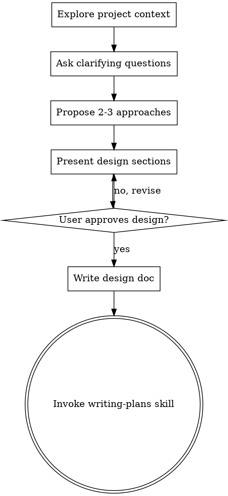

# Brainstorming Ideas Into Designs

## Overview

Help turn ideas into fully formed designs and specs through natural collaborative dialogue.

Start by understanding the current project context, then ask questions one at a time to refine the idea. Once you understand what you're building, present the design and get user approval.

<HARD-GATE>
Do NOT invoke any implementation skill, write any code, scaffold any project, or take any implementation action until you have presented a design and the user has approved it. This applies to EVERY project regardless of perceived simplicity.

Do NOT use Claude Code's native EnterPlanMode tool or enter plan mode. This skill IS the planning process — it replaces native plan mode with a structured brainstorming workflow. Stay in the normal conversation flow and follow the steps below.
</HARD-GATE>

## Exception: Lightweight Changes

If a change qualifies under the **Lightweight Workflow** defined in CLAUDE.md (bug fix with obvious root cause touching < 3 files, typo fix, adding a test for existing behavior), you may skip brainstorming and go directly to TDD. When in doubt, brainstorm anyway — the cost of a 2-minute design review is much lower than rework.

## Anti-Pattern: "This Is Too Simple To Need A Design"

For changes that DON'T qualify as lightweight: every project goes through this process. A todo list, a single-function utility, a config change — all of them. "Simple" projects are where unexamined assumptions cause the most wasted work. The design can be short (a few sentences for truly simple projects), but you MUST present it and get approval.

## Premise Challenge

Before diving into design options, challenge the premise of the request itself:

1. **Is this the right problem to solve?** Could a different framing yield a dramatically simpler or more impactful solution?
2. **What is the actual user/business outcome?** Is the request the most direct path to that outcome, or is it solving a proxy problem?
3. **What would happen if we did nothing?** Is this a real pain point or a hypothetical one?
4. **What existing code already partially solves this?** Map every sub-problem to existing code before proposing new code.

If the premise challenge reveals a better framing, present it to the user before proceeding to design options.

## Blindspot Pass

The rest of this skill assumes the user can evaluate the questions you ask. That assumption breaks when the user is working in unfamiliar territory — "I know nothing about X but need to…", a domain they have never shipped in, or a decision space where they cannot yet tell which choices matter. Asking decision questions first would force them to answer things they do not yet understand.

When the user signals unfamiliarity (or you detect it), run a blindspot pass **before** asking any decision questions:

1. **Map the decision surface** — enumerate the decisions this work actually requires, including the ones the user does not know they need to make. Where are the forks in the road?
2. **Surface the blind spots** — for each decision, name what the user would need to know to choose well, and flag the ones they are least likely to be aware of.
3. **Present the map, then ask** — show the decision surface and the blind spots first so the user learns the shape of the problem. Only then begin the one-at-a-time questions, now that the user can actually evaluate them.

This composes with the sections around it: run the **Premise Challenge** first (is this even the right problem?), then the blindspot pass (what does deciding well require?), then apply **Scope Modes** and proceed to questions. Skip it when the user is clearly fluent in the domain — the blindspot pass is for unfamiliar territory, not every session. In a non-interactive run (a pipeline stage, headless `-p`, no human to answer), don't stall waiting for answers: record the recommended defaults as explicit assumptions and proceed, so the pass informs the work instead of blocking it.

## Scope Modes

When presenting design options, the user can choose a scope posture. Default based on context:

| Mode | Default For | Posture |
|------|------------|---------|
| **Expansion** | Greenfield features | Propose the ambitious version. What's the 10x better product for 2x the effort? |
| **Selective Expansion** | Feature enhancements | Hold scope as baseline, but surface opportunities individually for cherry-picking |
| **Hold Scope** | Bug fixes, refactors | Maximum rigor on existing scope. No expansions surfaced. |
| **Reduction** | Overbuilt plans, tight deadlines | Cut to minimum viable. Be ruthless. |

If the user doesn't specify, infer from context and state your assumption. Once a mode is selected, **commit fully — do not silently drift toward a different mode.**

## Checklist

You MUST create a task for each of these items and complete them in order:

1. **Explore project context** — check files, docs, recent commits
2. **Ask clarifying questions** — one at a time, understand purpose/constraints/success criteria
3. **Propose 2-3 approaches** — with trade-offs and your recommendation
4. **Present design** — in sections scaled to their complexity, get user approval after each section
5. **Write design doc** — save to `docs/plans/YYYY-MM-DD-<topic>-design.md` and commit
6. **Transition to implementation** — invoke writing-plans skill to create implementation plan

## Process Flow

**The terminal state is invoking writing-plans.** Do NOT invoke any implementation skill directly. The ONLY skill you invoke after brainstorming is writing-plans.

## The Process

**Understanding the idea:**
- Check out the current project state first (files, docs, recent commits)
- Ask questions one at a time to refine the idea
- Prefer multiple choice questions when possible, but open-ended is fine too
- Only one question per message - if a topic needs more exploration, break it into multiple questions
- Focus on understanding: purpose, constraints, success criteria

**Exploring approaches:**
- Propose 2-3 different approaches with trade-offs
- Present options conversationally with your recommendation and reasoning
- Lead with your recommended option and explain why

**Presenting the design:**
- Once you believe you understand what you're building, present the design
- Scale each section to its complexity: a few sentences if straightforward, up to 200-300 words if nuanced
- Ask after each section whether it looks right so far
- Cover: architecture, components, data flow, error handling, testing
- Be ready to go back and clarify if something doesn't make sense

## After the Design

**Documentation:**
- Write the validated design to `docs/plans/YYYY-MM-DD-<topic>-design.md`
- Use elements-of-style:writing-clearly-and-concisely skill if available
- Commit the design document to git

**Implementation:**
- Invoke the writing-plans skill to create a detailed implementation plan
- Do NOT invoke any other skill. writing-plans is the next step.

## Key Principles

- **One question at a time** - Don't overwhelm with multiple questions
- **Multiple choice preferred** - Easier to answer than open-ended when possible
- **YAGNI ruthlessly** - Remove unnecessary features from all designs
- **Explore alternatives** - Always propose 2-3 approaches before settling
- **Incremental validation** - Present design, get approval before moving on
- **Be flexible** - Go back and clarify when something doesn't make sense

## Common Rationalizations

| Rationalization | Reality |
|---|---|
| "This is too simple to need a design" | Simple changes are where unexamined assumptions cause the most rework. A 2-minute design review costs less than the rework. |
| "I'll figure it out as I go" | Implementation without a design is just typing. The design surfaces dependencies and edge cases the keyboard won't. |
| "The user described it clearly, just build it" | Even clear requests carry implicit assumptions. The design surfaces them before code locks them in. |
| "Brainstorming will slow us down" | A 10-minute brainstorm prevents hours of wrong-direction work. Speed without direction is rework. |
| "I'll just propose one approach" | One option is a recommendation disguised as a decision. Two-to-three options give the user something to choose between. |
| "Premise challenge feels confrontational" | Challenging the premise *before* design is collaborative. Discovering at review that you solved the wrong problem is not. |
| "I can hold the design in my head" | Context windows compress, sessions end, teammates forget. The design doc is the artifact that survives all three. |
