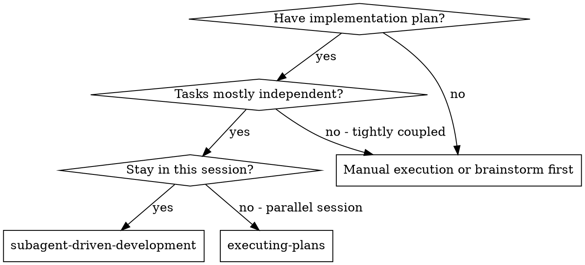
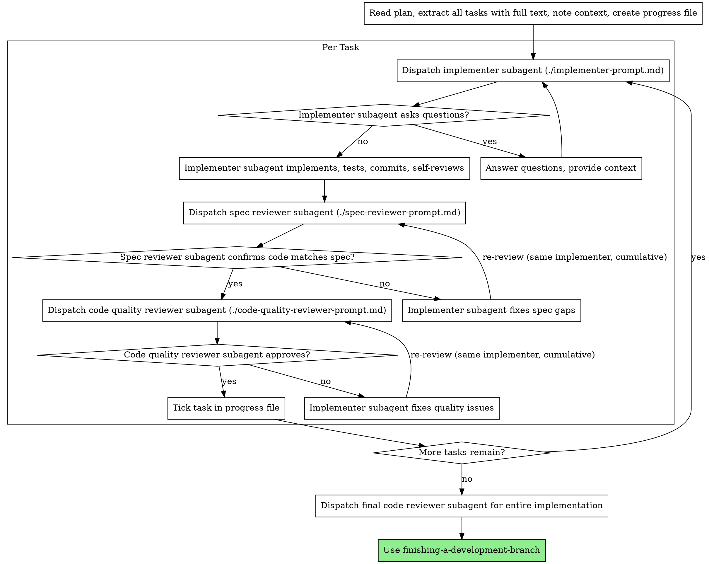

# Subagent-Driven Development

Execute plan by dispatching fresh subagent per task, with two-stage review after each: spec compliance review first, then code quality review.

**Core principle:** Fresh subagent per task + two-stage review (spec then quality) = high quality, fast iteration

## When to Use



**vs. Executing Plans (parallel session):**
- Same session (no context switch)
- Fresh subagent per task (no context pollution)
- Two-stage review after each task: spec compliance first, then code quality
- Faster iteration (no human-in-loop between tasks)

## The Process



A reviewer batches same-shape findings into one pass rather than reporting them one at a time — the implementer fixes the batch, not each instance separately.

## Progress File

The controller tracks tasks in `.claude/plans/<plan-basename>.progress.local.md` (`<plan-basename>` is the plan's filename without `.md`); native task-list tools are not the mechanism because current models do not have them:

- First line names the plan; one checkbox per task.
- If the file already exists, reuse it and its ticks instead of recreating it.
- At creation, run `git check-ignore -q` on it; if that fails, append `.claude/plans/*.progress.local.md` to the file named by `git rev-parse --git-path info/exclude`.
- Tick a task's box once its code quality reviewer approves.
- Delete it after the final code reviewer approves — before invoking finishing-a-development-branch, passing the plan path (`docs/plans/<plan-basename>.md`) so its plan audit reads this plan.
- An interrupted run leaves it in place; the STATE.md handoff (session-continuity) points at it.
- The session's native task list is the alternative only when the model offers one: Claude Code exposes its native task-list tools only on Claude 3.x, Opus 4.0–4.7, Sonnet 4.0–4.6 and Haiku 4.5 (CLI 2.1.233; verified on 2.1.268); `CLAUDE_CODE_ENABLE_TODO_TOOLS=1` restores them elsewhere.

```bash
plan=docs/plans/<plan-basename>.md
progress=".claude/plans/$(basename "$plan" .md).progress.local.md"
mkdir -p .claude/plans
if [ ! -f "$progress" ]; then   # an existing file keeps its ticks
  printf '# Progress: %s\n\n' "$plan" > "$progress"
  # then append one "- [ ] Task N: <title>" line per task in the plan
fi
git check-ignore -q "$progress" || {   # projects scaffolded before v3.6.0 lack the ignore rule
  if exclude="$(git rev-parse --git-path info/exclude 2>/dev/null)" && [ -n "$exclude" ]; then
    mkdir -p "$(dirname "$exclude")"
    echo '.claude/plans/*.progress.local.md' >> "$exclude"
  else
    echo "warning: not a git repository - add .claude/plans/*.progress.local.md to your ignore rules yourself" >&2
  fi
}
```

## Prompt Templates

- `./implementer-prompt.md` - Dispatch implementer subagent
- `./spec-reviewer-prompt.md` - Dispatch spec compliance reviewer subagent
- `./code-quality-reviewer-prompt.md` - Dispatch code quality reviewer subagent

## Example Workflow

```
You: I'm using Subagent-Driven Development to execute this plan.

[Read plan file once: docs/plans/feature-plan.md]
[Extract all 5 tasks with full text and context]
[Create .claude/plans/feature-plan.progress.local.md with one checkbox per task]

Task 1: Hook installation script

[Get Task 1 text and context (already extracted)]
[Dispatch implementation subagent with full task text + context]

Implementer: "Before I begin - should the hook be installed at user or system level?"

You: "User level (~/.claude/hooks/)"

Implementer: "Got it. Implementing now..."
[Later] Implementer:
  - Implemented install-hook command
  - Added tests, 5/5 passing
  - Self-review: Found I missed --force flag, added it
  - Committed

[Dispatch spec compliance reviewer]
Spec reviewer: ✅ Spec compliant - all requirements met, nothing extra

[Get git SHAs, dispatch code quality reviewer]
Code reviewer: Strengths: Good test coverage, clean. Issues: None. Approved.

[Mark Task 1 complete]

Task 2: Recovery modes

[Get Task 2 text and context (already extracted)]
[Dispatch implementation subagent with full task text + context]

Implementer: [No questions, proceeds]
Implementer:
  - Added verify/repair modes
  - 8/8 tests passing
  - Self-review: All good
  - Committed

[Dispatch spec compliance reviewer]
Spec reviewer: ❌ Issues:
  - Missing: Progress reporting (spec says "report every 100 items")
  - Extra: Added --json flag (not requested)

[Implementer fixes issues]
Implementer: Removed --json flag, added progress reporting

[Spec reviewer reviews again]
Spec reviewer: ✅ Spec compliant now

[Dispatch code quality reviewer]
Code reviewer: Strengths: Solid. Issues (Important): Magic number (100)

[Implementer fixes]
Implementer: Extracted PROGRESS_INTERVAL constant

[Code reviewer reviews again]
Code reviewer: ✅ Approved

[Mark Task 2 complete]

...

[After all tasks]
[Dispatch final code-reviewer]
Final reviewer: All requirements met, ready to merge

[Final reviewer approved: delete .claude/plans/feature-plan.progress.local.md]

Done!
```

## Advantages

**vs. Manual execution:**
- Subagents follow TDD naturally
- Fresh context per task (no confusion)
- Parallel-safe (subagents don't interfere)
- Subagent can ask questions (before AND during work)

**vs. Executing Plans:**
- Same session (no handoff)
- Continuous progress (no waiting)
- Review checkpoints automatic

**Efficiency gains:**
- No file reading overhead (controller provides full text)
- Controller curates exactly what context is needed
- Subagent gets complete information upfront
- Questions surfaced before work begins (not after)

**Quality gates:**
- Self-review catches issues before handoff
- Two-stage review: spec compliance, then code quality
- Review loops ensure fixes actually work
- Spec compliance prevents over/under-building
- Code quality ensures implementation is well-built

**Cost:**
- More subagent invocations (implementer + 2 reviewers per task)
- Controller does more prep work (extracting all tasks upfront)
- Review loops add iterations
- But catches issues early (cheaper than debugging later)

## Red Flags

**Never:**
- Start implementation on main/master branch without explicit user consent
- Skip reviews (spec compliance OR code quality)
- Proceed with unfixed issues
- Dispatch multiple implementation subagents in parallel (conflicts)
- Make subagent read plan file (provide full text instead)
- Skip scene-setting context (subagent needs to understand where task fits)
- Ignore subagent questions (answer before letting them proceed)
- Accept "close enough" on spec compliance (spec reviewer found issues = not done)
- Skip review loops (reviewer found issues = implementer fixes = review again)
- Let implementer self-review replace actual review (both are needed)
- **Start code quality review before spec compliance is ✅** (wrong order)
- Move to next task while either review has open issues

**If subagent asks questions:**
- Answer clearly and completely
- Provide additional context if needed
- Don't rush them into implementation

**If reviewer finds issues:**
- Continue the same implementer, not a new one — in Claude Code, spawn it with a unique name (e.g. `implementer-task-3`) and resume it by sending it a message addressed to that name
- Batch same-shape findings into one message rather than sending them one at a time
- If the harness cannot resume it, or no reply arrives within your wait window, re-dispatch a fresh implementer carrying the prior report and all findings
- Reviewer re-reviews the cumulative range from the pre-task commit (BASE pinned) — not just the latest fix
- Five rounds per review phase (spec compliance, then quality); on the fifth, mark the task blocked in the progress file with `— BLOCKED: <reason>` and escalate
- Don't skip the re-review

**If subagent fails task:**
- Dispatch fix subagent with specific instructions
- Don't try to fix manually (context pollution)

## Integration

**Required workflow skills:**
- **using-git-worktrees** - REQUIRED: Set up isolated workspace before starting
- **writing-plans** - Creates the plan this skill executes
- **requesting-code-review** - Code review template for reviewer subagents
- **finishing-a-development-branch** - Complete development after all tasks

**Subagents should use:**
- **test-driven-development** - Subagents follow TDD for each task

**Alternative workflow:**
- **executing-plans** - Use for parallel session instead of same-session execution
