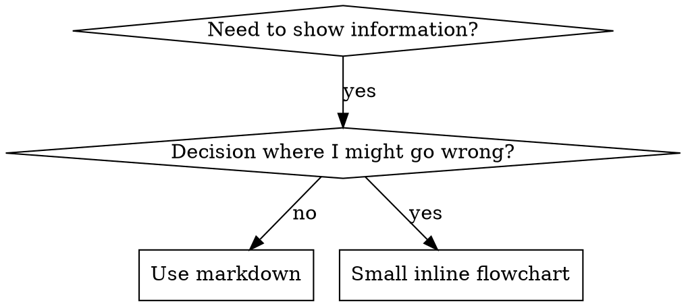

# writing-skills — flowcharts, examples, scripts, file layouts

Loaded on demand from `SKILL.md`; nothing here is needed on every invocation.

## Flowchart Usage



**Use flowcharts ONLY for:**
- Non-obvious decision points
- Process loops where you might stop too early
- "When to use A vs B" decisions

**Never use flowcharts for:**
- Reference material → Tables, lists
- Code examples → Markdown blocks
- Linear instructions → Numbered lists
- Labels without semantic meaning (step1, helper2)

See `graphviz-conventions.dot` in the skill directory (one level up) for graphviz style rules.

**Visualizing for your human partner:** Use `render-graphs.js` in the skill directory (one level up) to render a skill's flowcharts to SVG:
```bash
./render-graphs.js ../some-skill           # Each diagram separately
./render-graphs.js ../some-skill --combine # All diagrams in one SVG
```

## Code Examples

**One excellent example beats many mediocre ones**

Choose most relevant language:
- Testing techniques → TypeScript/JavaScript
- System debugging → Shell/Python
- Data processing → Python

**Good example:**
- Complete and runnable
- Well-commented explaining WHY
- From real scenario
- Shows pattern clearly
- Ready to adapt (not generic template)

**Don't:**
- Implement in 5+ languages
- Create fill-in-the-blank templates
- Write contrived examples

You're good at porting - one great example is enough.

## Script-First Skill Architecture

When a skill processes large datasets (session transcripts, log files, configuration inventories, JSONL output), having the model do the processing is a token-expensive anti-pattern. Moving data processing into a bundled script and having the model present results cuts tokens by 60-75%.

**The pattern:**

```
skills/<skill-name>/
  SKILL.md              # Instructions: run script, present output
  scripts/
    process.py          # Does ALL data processing, outputs JSON
```

1. **Script does all mechanical work.** Reading files, parsing structured formats, applying classification rules (regex, keyword lists), normalizing results, computing counts. Outputs pre-classified JSON to stdout.
2. **SKILL.md instructs presentation only.** Run the script, read the JSON, format it for the user. Explicitly prohibit re-classifying, re-parsing, or loading reference files.
3. **Single source of truth for rules.** Classification logic lives exclusively in the script. The SKILL.md references the script's output categories as given facts but does not define them.

**Apply when** the skill meets ANY of:
- Processes more than ~50 items or reads files larger than a few KB
- Classification rules are deterministic (regex, keyword lists, lookup tables)
- Input data follows a consistent schema (JSONL, CSV, structured logs)
- The skill runs frequently or feeds into further analysis

**Do NOT apply when:**
- The skill's core value is the model's judgment (code review, architectural analysis)
- Input is unstructured natural language
- The dataset is small enough that processing costs are negligible

### Anti-patterns

- **Instruction-only optimization** — Adding "don't do X" to SKILL.md without providing a script alternative. The model finds other token-expensive paths to the same result.
- **Hybrid classification** — Script classifies some items and the model classifies the rest. This still loads context. Go all-in on the script. Items the script can't classify should be dropped as "unclassified," not handed to the model.
- **Dual rule definitions** — Classification rules in BOTH the script AND SKILL.md. They drift apart, the model may override the script's decisions, and tokens are wasted on re-evaluation. One source of truth.

### Prefer Python over bash for multi-step scripts

When a script orchestrates 2+ external CLI tools or needs retry logic, **Python beats bash**:

- Bash `set -euo pipefail` becomes a footgun when you need controlled failure paths — `url=$(curl ...)` exits the entire script before retry logic runs.
- Bash 3.2 (default on macOS) lacks negative array indexing, can't spawn shell builtins from non-shell test runners, and integer-math edge cases recur.
- Python's `subprocess` model makes error handling explicit and testable: `result = subprocess.run(cmd, check=False); if result.returncode != 0: retry()`.

Bash is still the right choice for simple sequential scripts with no error recovery, one-liner wrappers around a single tool, or git hooks where the only failure mode is "abort the pipeline."

## File Organization

### Self-Contained Skill
```
defense-in-depth/
  SKILL.md    # Everything inline
```
When: All content fits, no heavy reference needed

### Skill with Reusable Tool
```
condition-based-waiting/
  SKILL.md    # Overview + patterns
  example.ts  # Working helpers to adapt
```
When: Tool is reusable code, not just narrative

### Skill with Heavy Reference
```
pptx/
  SKILL.md       # Overview + workflows
  pptxgenjs.md   # 600 lines API reference
  ooxml.md       # 500 lines XML structure
  scripts/       # Executable tools
```
When: Reference material too large for inline

## Directory Structure

```
skills/
  skill-name/
    SKILL.md              # Main reference (required)
    supporting-file.*     # Only if needed
```

**Flat namespace** - all skills in one searchable namespace

**Separate files for:**
1. **Heavy reference** (100+ lines) - API docs, comprehensive syntax
2. **Reusable tools** - Scripts, utilities, templates

**Keep inline:**
- Principles and concepts
- Code patterns (< 50 lines)
- Everything else

## Load-bearing rules of thumb

**Rules of thumb:**

| Pattern | Belongs in |
|---------|-----------|
| **Per-option routing for an interactive menu the skill renders** | **Inline** (SKILL.md) — the bare per-option action lives here, even if the elaborate sub-flow stays in a reference |
| **Always-executed step in this phase** | **Inline** — references are for branches the agent enters only sometimes |
| **Conditional sub-flow that only fires under specific signals** | **Reference** — load-on-demand is appropriate |
| **Heavy reference material (API docs, syntax, comprehensive examples)** | **Reference** — too large for inline |
| **Sub-flow used in a minority of invocations** | **Reference** — extracts >50 lines from skill body, saves tokens on every other invocation |

## Authoring checklist before extracting a block

**Authoring checklist before extracting a block to a reference:**

- [ ] Is the block always executed when this phase is reached? If yes, lean toward inlining.
- [ ] Does the block carry routing for an interactive menu? If yes, the bare per-option action belongs inline.
- [ ] Could an agent that skips the reference still complete the skill correctly? If no, the content is load-bearing — inline it.
- [ ] Is the language platform-explicit? Name the primitive (Skill tool) and the argument shape.

## Anti-Patterns

### ❌ Narrative Example
"In session 2025-10-03, we found empty projectDir caused..."
**Why bad:** Too specific, not reusable

### ❌ Multi-Language Dilution
example-js.js, example-py.py, example-go.go
**Why bad:** Mediocre quality, maintenance burden

### ❌ Code in Flowcharts
```dot
step1 [label="import fs"];
step2 [label="read file"];
```
**Why bad:** Can't copy-paste, hard to read

### ❌ Generic Labels
helper1, helper2, step3, pattern4
**Why bad:** Labels should have semantic meaning
