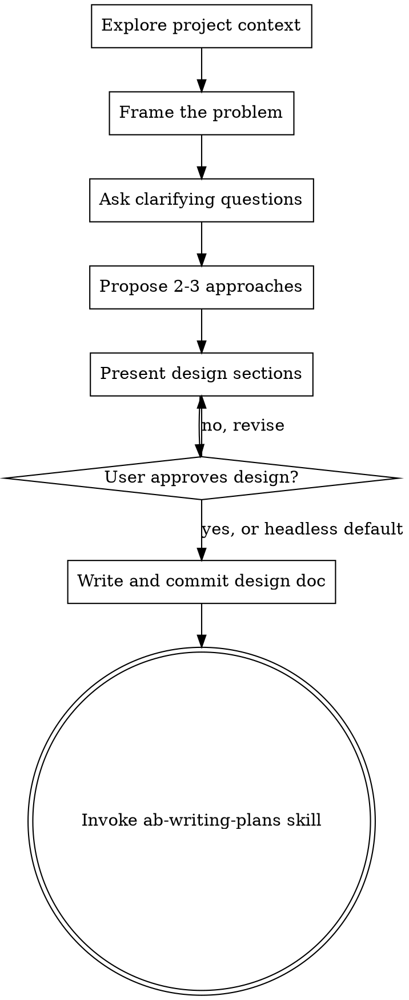

# Dialogue and design

Loaded on demand from SKILL.md when you want the flow of steps 1 to 7 as a diagram, or the principles behind them.

## Process Flow

The terminal state is invoking ab-writing-plans. No implementation skill runs directly from here, because the plan is what gets reviewed before anything executes.

## Key Principles

- **Settle first, then one at a time.** Resolve what the repository and context already answer before asking anything; ask what's left one question at a time, with the narrow exception of batching the genuinely residual questions once. A user asked what the code already says stops trusting the questions.
- **Multiple choice preferred.** It is easier to answer than an open question, though open-ended is fine when the choices are not yet known.
- **YAGNI.** Remove unnecessary features from every design; each one costs build, test and upkeep.
- **Explore alternatives.** Propose two or three approaches before settling, so the user chooses rather than rubber-stamps.
- **Incremental validation.** Present the design a section at a time and get approval before moving on, so a wrong turn costs one section, not the whole design.
- **Be flexible.** Go back and clarify when something doesn't make sense.
- **Headless fallback.** In a pipeline stage or headless run with no one to answer, don't stall: take each question's named default, record it as an explicit assumption, and proceed.
