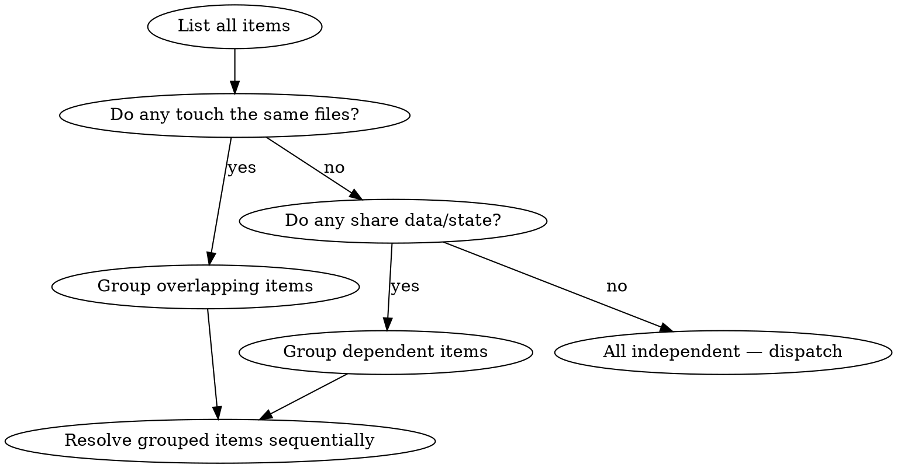

# Resolve guide

Loaded on demand from SKILL.md when you want the independence check as a graph, or to check a batch against common mistakes.

## Independence graph

## Common Mistakes

**Assuming independence without checking** — Two items that look independent might both modify the same utility function. Check file overlap before starting helpers, since the collision only shows up after both fixes land.

**Too many agents at once** — Diminishing returns past 4-5 parallel agents. If you have 10+ items, batch them into groups of 4-5.

**Skipping integration testing** — Individual fixes can pass their own tests but break something when combined. Run the full suite after integration, because only the combined run shows the interaction.

**Not constraining agent scope** — Tell each agent exactly which files it can modify. Without constraints, agents may make "helpful" changes outside their scope that conflict with other agents.
