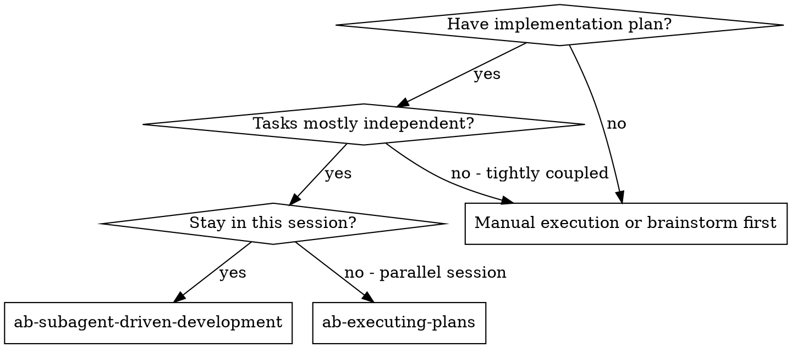
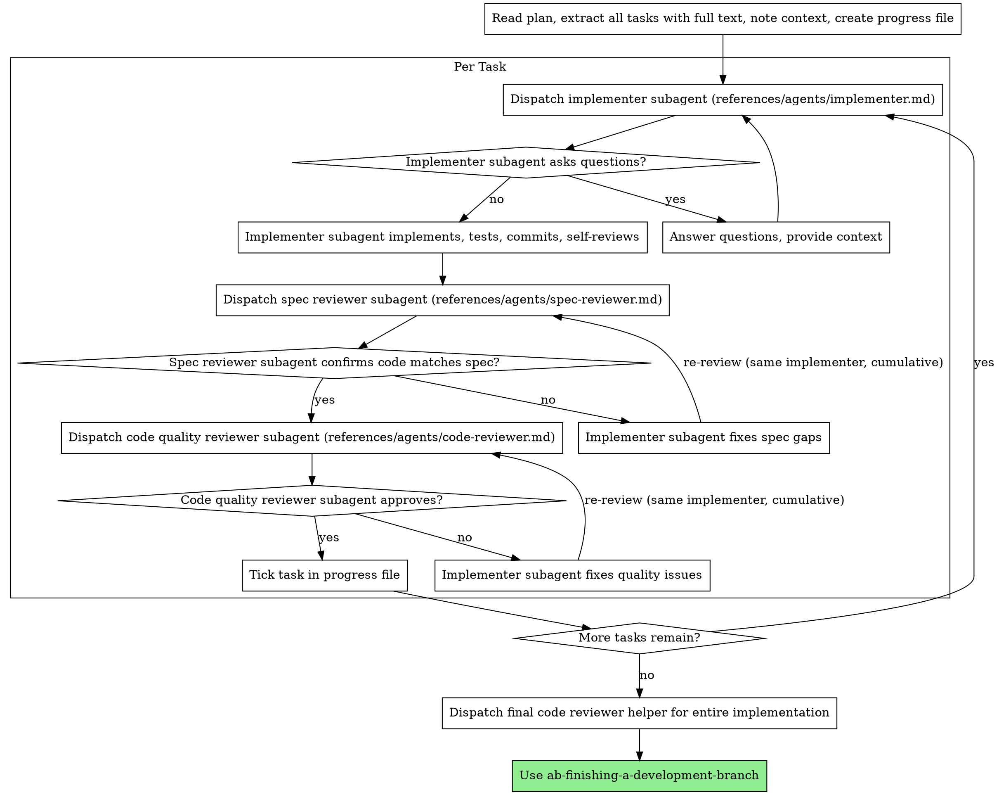

# Flowcharts

Loaded on demand from SKILL.md when you want the when-to-use decision or the per-task loop as a diagram.

## When to Use

```dot
digraph when_to_use {
    "Have implementation plan?" [shape=diamond];
    "Tasks mostly independent?" [shape=diamond];
    "Stay in this session?" [shape=diamond];
    "ab-subagent-driven-development" [shape=box];
    "ab-executing-plans" [shape=box];
    "Manual execution or brainstorm first" [shape=box];

    "Have implementation plan?" -> "Tasks mostly independent?" [label="yes"];
    "Have implementation plan?" -> "Manual execution or brainstorm first" [label="no"];
    "Tasks mostly independent?" -> "Stay in this session?" [label="yes"];
    "Tasks mostly independent?" -> "Manual execution or brainstorm first" [label="no - tightly coupled"];
    "Stay in this session?" -> "ab-subagent-driven-development" [label="yes"];
    "Stay in this session?" -> "ab-executing-plans" [label="no - parallel session"];
}
```

## The Process

```dot
digraph process {
    rankdir=TB;

    subgraph cluster_per_task {
        label="Per Task";
        "Dispatch implementer subagent (references/agents/implementer.md)" [shape=box];
        "Implementer subagent asks questions?" [shape=diamond];
        "Answer questions, provide context" [shape=box];
        "Implementer subagent implements, tests, commits, self-reviews" [shape=box];
        "Dispatch spec reviewer subagent (references/agents/spec-reviewer.md)" [shape=box];
        "Spec reviewer subagent confirms code matches spec?" [shape=diamond];
        "Implementer subagent fixes spec gaps" [shape=box];
        "Dispatch code quality reviewer subagent (references/agents/code-reviewer.md)" [shape=box];
        "Code quality reviewer subagent approves?" [shape=diamond];
        "Implementer subagent fixes quality issues" [shape=box];
        "Tick task in progress file" [shape=box];
    }

    "Read plan, extract all tasks with full text, note context, create progress file" [shape=box];
    "More tasks remain?" [shape=diamond];
    "Dispatch final code reviewer helper for entire implementation" [shape=box];
    "Use ab-finishing-a-development-branch" [shape=box style=filled fillcolor=lightgreen];

    "Read plan, extract all tasks with full text, note context, create progress file" -> "Dispatch implementer subagent (references/agents/implementer.md)";
    "Dispatch implementer subagent (references/agents/implementer.md)" -> "Implementer subagent asks questions?";
    "Implementer subagent asks questions?" -> "Answer questions, provide context" [label="yes"];
    "Answer questions, provide context" -> "Dispatch implementer subagent (references/agents/implementer.md)";
    "Implementer subagent asks questions?" -> "Implementer subagent implements, tests, commits, self-reviews" [label="no"];
    "Implementer subagent implements, tests, commits, self-reviews" -> "Dispatch spec reviewer subagent (references/agents/spec-reviewer.md)";
    "Dispatch spec reviewer subagent (references/agents/spec-reviewer.md)" -> "Spec reviewer subagent confirms code matches spec?";
    "Spec reviewer subagent confirms code matches spec?" -> "Implementer subagent fixes spec gaps" [label="no"];
    "Implementer subagent fixes spec gaps" -> "Dispatch spec reviewer subagent (references/agents/spec-reviewer.md)" [label="re-review (same implementer, cumulative)"];
    "Spec reviewer subagent confirms code matches spec?" -> "Dispatch code quality reviewer subagent (references/agents/code-reviewer.md)" [label="yes"];
    "Dispatch code quality reviewer subagent (references/agents/code-reviewer.md)" -> "Code quality reviewer subagent approves?";
    "Code quality reviewer subagent approves?" -> "Implementer subagent fixes quality issues" [label="no"];
    "Implementer subagent fixes quality issues" -> "Dispatch code quality reviewer subagent (references/agents/code-reviewer.md)" [label="re-review (same implementer, cumulative)"];
    "Code quality reviewer subagent approves?" -> "Tick task in progress file" [label="yes"];
    "Tick task in progress file" -> "More tasks remain?";
    "More tasks remain?" -> "Dispatch implementer subagent (references/agents/implementer.md)" [label="yes"];
    "More tasks remain?" -> "Dispatch final code reviewer helper for entire implementation" [label="no"];
    "Dispatch final code reviewer helper for entire implementation" -> "Use ab-finishing-a-development-branch";
}
```
